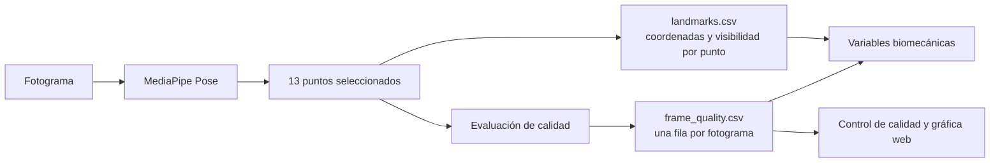
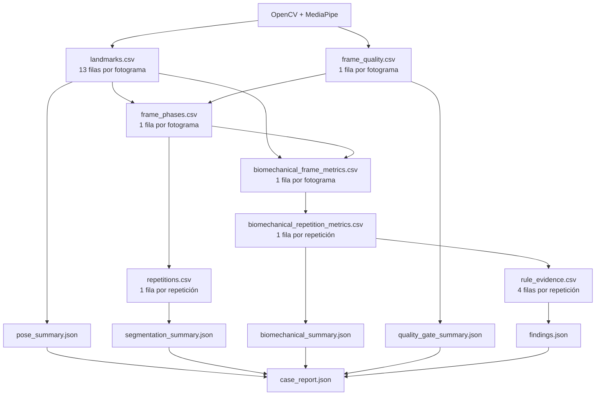

# Análisis trazable del caso `dev_valgo_izq_002`

## 1. Propósito

Este documento explica cómo el sistema transforma un video frontal de sentadilla bilateral en resultados interpretables. El recorrido se concentra en las fases 2, 3, 4 y 5 de `plan_desarrollo_tecnico_sentadilla.md`:

1. extracción y control de puntos anatómicos clave;
2. segmentación temporal de las repeticiones;
3. cálculo de variables biomecánicas observables;
4. aplicación de reglas y umbrales interpretables.

El objetivo no es presentar el sistema como una caja negra, sino mostrar la cadena de evidencia completa:

```text
video -> fotogramas -> puntos 2D -> calidad -> fases -> fórmulas
      -> variables por repetición -> reglas -> compensaciones observables
```

El archivo analizado es:

`data/sentadilla_bilateral/raw/dev_valgo_izq_002.mp4`

La denominación del archivo representa el patrón intentado durante la grabación. No se utiliza como entrada del algoritmo ni garantiza que el sistema deba encontrar dicho patrón.

## 2. Resumen del caso

| Elemento | Resultado |
|---|---:|
| Resolución | 478 x 850 px |
| Duración | 27.54 s |
| Frecuencia | 24.04 fotogramas/s |
| Fotogramas | 662 |
| Puntos anatómicos seleccionados | 13 por fotograma |
| Filas de `landmarks.csv` | 8 606 |
| Fotogramas con pose | 662, 100 % |
| Fotogramas válidos | 662, 100 % |
| Promedio de puntos detectados | 13 de 13 |
| Visibilidad crítica mínima observada | 0.9217 |
| Repeticiones detectadas | 3 |
| Repeticiones aptas | 1, 2 y 3 |
| Conjunto de reglas | `0.2.0-provisional` |
| Decisiones finales | 12: cuatro por repetición |

El caso es útil porque no presenta solamente el patrón intentado de valgo izquierdo. La tercera repetición también supera los umbrales provisionales de inclinación del tronco y desplazamiento de pelvis, por lo que demuestra el comportamiento multietiqueta del sistema.

### Evidencias visuales del caso

- [Video overlay con pose y calidad](/D:/sistema-biomecanico/data/sentadilla_bilateral/outputs/dev_valgo_izq_002/overlay.mp4)
- [Gráfica de calidad de pose](/D:/sistema-biomecanico/data/sentadilla_bilateral/outputs/dev_valgo_izq_002/pose_quality.png)
- [Gráfica de segmentación temporal](/D:/sistema-biomecanico/data/sentadilla_bilateral/outputs/dev_valgo_izq_002/segmentation.png)
- [Gráfica de variables biomecánicas](/D:/sistema-biomecanico/data/sentadilla_bilateral/outputs/dev_valgo_izq_002/biomechanical_metrics.png)
- [Máxima profundidad de la repetición 1](/D:/sistema-biomecanico/data/sentadilla_bilateral/outputs/dev_valgo_izq_002/rep_01_maxima_profundidad.png)
- [Máxima profundidad de la repetición 2](/D:/sistema-biomecanico/data/sentadilla_bilateral/outputs/dev_valgo_izq_002/rep_02_maxima_profundidad.png)
- [Máxima profundidad de la repetición 3](/D:/sistema-biomecanico/data/sentadilla_bilateral/outputs/dev_valgo_izq_002/rep_03_maxima_profundidad.png)

## 3. Flujo general


---

## 4. Fase 2: extracción de pose 2D

### 4.1. Lectura del video

OpenCV abre el archivo, consulta sus metadatos técnicos y decodifica secuencialmente cada fotograma. `CAP_PROP_FRAME_COUNT` entrega la cantidad declarada por el contenedor o el backend de video; no se calcula multiplicando duración por frecuencia. Durante el procesamiento, `VideoCapture.read()` intenta recuperar cada imagen y el contador `processed_frames` aumenta únicamente cuando la decodificación devuelve un fotograma. Para este caso, OpenCV declaró 662 fotogramas y los 662 pudieron decodificarse.

Antes de enviar la imagen a MediaPipe:

1. OpenCV entrega una matriz de píxeles en orden de canales BGR, que es su convención habitual.
2. El sistema aplica `cv2.cvtColor(frame_bgr, cv2.COLOR_BGR2RGB)` porque MediaPipe interpreta la imagen en orden RGB. Esta conversión no mejora ni evalúa la imagen: evita intercambiar los canales rojo y azul antes de la inferencia.
3. MediaPipe Pose procesa la secuencia con seguimiento temporal (`static_image_mode=False`). Después de detectar la pose inicialmente, el modelo intenta seguirla entre fotogramas y vuelve a ejecutar la detección cuando pierde el seguimiento.
4. Se conservan las coordenadas estimadas y su visibilidad.

La configuración actual utiliza:

- `static_image_mode=False`;
- `model_complexity=1`;
- suavizado temporal de puntos activado;
- confianza mínima de detección de 0.50;
- confianza mínima de seguimiento de 0.50.

Por tanto, OpenCV realiza la inspección y decodificación técnica, pero no calcula la visibilidad ni decide la validez anatómica. Esa decisión se construye después de MediaPipe mediante reglas explícitas del sistema.

La documentación oficial de OpenCV define `CAP_PROP_FRAME_COUNT` como la cantidad de fotogramas del archivo y `VideoCapture.read()` como la operación que captura, decodifica y devuelve el siguiente fotograma. Google define `visibility` como la estimación de si un punto es visible o está ocluido, y diferencia este atributo de `presence`. Estas fuentes respaldan la interpretación técnica de los campos, no los umbrales operativos propios del prototipo ([OpenCV Video I/O](https://docs.opencv.org/4.12.0/d4/d15/group__videoio__flags__base.html); [OpenCV VideoCapture](https://docs.opencv.org/3.3.0/d8/dfe/classcv_1_1VideoCapture.html); [MediaPipe Landmark](https://ai.google.dev/edge/api/mediapipe/python/mp/tasks/components/containers/Landmark)).

### 4.2. De 33 puntos a 13 puntos relevantes

MediaPipe Pose estima 33 puntos corporales. El sistema no necesita todos para la sentadilla frontal, por lo que selecciona:

| Punto | Índice MediaPipe | Uso principal |
|---|---:|---|
| Nariz | 0 | Referencia complementaria y anonimización |
| Hombros | 11, 12 | Eje superior y centro del tronco |
| Caderas | 23, 24 | Centro de pelvis y segmentación |
| Rodillas | 25, 26 | Alineación frontal |
| Tobillos | 27, 28 | Centro de apoyo y eje de pierna |
| Talones | 29, 30 | Referencia distal del pie |
| Puntas de los pies | 31, 32 | Referencia distal alternativa |

`landmarks.csv` contiene una fila por punto y fotograma:

```text
frame_index,timestamp_seconds,landmark,x,y,z,visibility,presence
```

En este caso:

```text
662 fotogramas x 13 puntos = 8 606 filas
```

### 4.3. Significado de las coordenadas

- `x`: posición horizontal normalizada. `0` es el borde izquierdo y `1` el derecho.
- `y`: posición vertical normalizada. `0` es la parte superior y `1` la inferior.
- `z`: estimación relativa de profundidad de MediaPipe. No se utiliza en las fórmulas 2D de esta tesis.
- `visibility`: estimación del modelo sobre la visibilidad del punto.
- `presence`: campo conservado por el contrato, pero no utilizado actualmente para decidir la calidad.

Una coordenada normalizada permite trabajar independientemente de que el video mida 478, 720 o 1080 píxeles de ancho. Para dibujar el punto en la imagen se realiza:

```text
x_px = x_normalizado x ancho_video
y_px = y_normalizado x alto_video
```

### 4.4. ¿Cuándo se considera válido un fotograma?

El umbral operativo de visibilidad es `0.50`. La **visibilidad crítica mínima** de un fotograma es el menor valor de visibilidad efectiva entre ocho puntos centrales:

```text
v_crítica(f) = mín(v_HI, v_HD, v_CI, v_CD, v_RI, v_RD, v_TI, v_TD)
```

No es un promedio. Representa el eslabón más débil de la estructura central: aunque siete puntos tengan visibilidad alta, un solo hombro, cadera, rodilla o tobillo por debajo de `0.50` impide considerar válido el fotograma.

Un fotograma es válido cuando:

- ambos hombros, caderas, rodillas y tobillos poseen coordenadas `x` e `y` finitas y alcanzan visibilidad de al menos 0.50;
- existe al menos una referencia distal utilizable por cada lado: talón o punta del pie;
- MediaPipe devuelve la estructura completa de pose.

El campo `detected_keypoints` cuenta cuántos de los 13 puntos seleccionados poseen coordenadas 2D finitas y visibilidad igual o superior a 0.50. No cuenta los 33 puntos completos de MediaPipe. La nariz forma parte de este conteo descriptivo, pero no es obligatoria para validar el fotograma.

La evaluación se organiza en tres capas:

| Capa | Responsable | Pregunta que responde |
|---|---|---|
| Lectura técnica | OpenCV | ¿El archivo declara metadatos coherentes y el fotograma puede decodificarse? |
| Estimación de pose | MediaPipe | ¿Qué coordenadas, visibilidad y presencia estima para los puntos corporales? |
| Regla analítica | Sistema propuesto | ¿La combinación de puntos estimados permite usar el fotograma y la repetición en los cálculos? |

#### Fórmulas de los indicadores

Sea `F_meta` la cantidad de fotogramas declarada por OpenCV, `F_dec` la cantidad realmente decodificada y `F_val` la cantidad que cumple la regla de pose:

```text
Fotogramas procesados correctamente (%) = 100 × F_dec / F_meta
Porcentaje global de fotogramas válidos = 100 × F_val / F_dec
Calidad global recomendada = porcentaje global de fotogramas válidos ≥ 95 %
```

La tercera expresión no es otro promedio: es la comparación del mismo porcentaje global con un umbral más exigente de recomendación. El mínimo de aceptación global es `90 %`; entre `90 %` y `95 %` el caso puede seguir siendo analizable, pero queda marcado para revisión.

Para una repetición delimitada entre los fotogramas `a` y `b`:

```text
Fotogramas válidos de la repetición (%) =
100 × Σ valid_for_analysis(f) / (b - a + 1)
```

donde `valid_for_analysis(f)` vale `1` si el fotograma es válido y `0` en caso contrario. La repetición requiere al menos `80 %` de fotogramas válidos y, adicionalmente, el fotograma de máxima profundidad debe ser válido. El `90 %` por repetición es una recomendación que genera advertencia, no una exclusión.

El promedio de puntos detectados cumple una función diferente:

```text
Promedio de puntos detectados = Σ detected_keypoints(f) / F_dec
```

Este promedio describe cobertura general de los 13 puntos, pero no sustituye la regla estructural. Un fotograma con 12 puntos puede ser válido si falta la nariz, o inválido si falta una rodilla.

### 4.5. Resultado de calidad del caso

| Indicador | Resultado | Criterio |
|---|---:|---:|
| Fotogramas procesados | 100 % | ≥ 99 % |
| Fotogramas válidos | 100 % | ≥ 90 % |
| Calidad global recomendada | 100 % | ≥ 95 % |
| Puntos detectados | 13 de 13 en todos los fotogramas | Umbral individual 0.50 |
| Visibilidad crítica mínima | 0.9217 | ≥ 0.50 |

En los fotogramas de máxima profundidad:

| Repetición | Fotograma | Tiempo | Visibilidad crítica mínima |
|---|---:|---:|---:|
| 1 | 199 | 8.279 s | 0.9676 |
| 2 | 388 | 16.141 s | 0.9271 |
| 3 | 592 | 24.628 s | 0.9244 |

El overlay utiliza:

- esqueleto verde: fotograma válido;
- esqueleto naranja: fotograma que requiere revisión;
- panel con fotograma, estado, puntos detectados y visibilidad mínima;
- pixelado facial para preservar anonimato.

### 4.6. ¿Cómo se demuestra que los puntos fueron detectados correctamente?

La respuesta rigurosa es que la visibilidad de MediaPipe no demuestra por sí sola exactitud anatómica. Indica que el modelo considera el punto visible y estable, pero no es una medida de error contra una coordenada real.

La tesis dispone de cuatro niveles de corroboración:

1. **Disponibilidad:** el modelo produjo los puntos requeridos.
2. **Calidad automática:** visibilidad, continuidad y reglas de validez.
3. **Auditoría visual:** el overlay permite verificar que los puntos siguen hombros, caderas, rodillas y tobillos.
4. **Validación funcional:** la clasificación final se compara con evaluación experta.

Si se quisiera demostrar precisión geométrica de los puntos, se necesitaría un conjunto adicional de fotogramas anotados manualmente o un sistema de referencia y calcular error de posición. Ese experimento no forma parte actualmente del alcance principal, que evalúa la detección final de compensaciones.

### 4.7. Archivos de esta fase

| Archivo | Origen | Función |
|---|---|---|
| `landmarks.csv` | MediaPipe por cada fotograma | Coordenadas fuente |
| `frame_quality.csv` | Reglas de visibilidad | Calidad por fotograma |
| `pose_summary.json` | Agregación de los CSV | Resumen para API e interfaz |
| `overlay.mp4` | OpenCV + puntos MediaPipe | Auditoría técnica visual |
| `review.mp4` | Video anonimizado sin resultados | Revisión experta sin sesgo |
| `pose_quality.png` | Serie de calidad | Evidencia gráfica |

### 4.8. Fundamento, decisiones operativas y validación pendiente

La estimación de pose sí cuenta con respaldo técnico directo. Bazarevsky et al. describen BlazePose como una arquitectura que estima 33 puntos corporales y está orientada a seguimiento en tiempo real de una persona, incluyendo aplicaciones de actividad física. El artículo también explica que el modelo produce coordenadas y una estimación de visibilidad por punto. Esta fuente respalda la selección de MediaPipe Pose como extractor de datos, pero no convierte automáticamente cada coordenada estimada en una referencia anatómica exacta ([BlazePose, 2020](https://arxiv.org/abs/2006.10204)).

También existen estudios que han evaluado sistemas sin marcadores durante sentadillas bilaterales y tareas relacionadas. Ota et al. compararon sistemas de análisis basados en seguimiento de pose durante sentadilla bilateral, mientras que Pereira et al. propusieron una canalización bidimensional para cuantificar cinemática de miembros inferiores durante sentadillas. Estos antecedentes respaldan la viabilidad del enfoque general, no la exactitud particular de cada fotograma de este sistema ([Ota et al., 2020](https://doi.org/10.1016/j.gaitpost.2020.05.027); [Pereira et al., 2026](https://doi.org/10.3390/biomechanics6010001)).

Debe distinguirse lo siguiente:

| Elemento | Naturaleza | Alcance de la justificación |
|---|---|---|
| Uso de MediaPipe Pose y 33 puntos | Modelo preentrenado respaldado por su publicación técnica | Permite obtener estimaciones de pose desde video monocular |
| Selección de 13 puntos | Decisión de diseño de esta tesis | Conserva las referencias necesarias para tronco, pelvis, rodillas, tobillos y pies |
| Ocho puntos críticos: hombros, caderas, rodillas y tobillos bilaterales | Regla estructural propia | Exige continuidad de los segmentos principales usados en las fórmulas |
| Talón o punta del pie por cada lado | Regla distal complementaria propia | Evita declarar válido un fotograma sin una referencia observable del pie |
| Umbral de visibilidad `0.50` | Parámetro operativo provisional | Filtra estimaciones de baja confianza, pero no es un límite clínico ni prueba error posicional |
| 90 %, 95 %, 80 % y 90 % de fotogramas válidos | Política de calidad del prototipo | Determina aptitud, advertencia o exclusión; requiere corroboración con el conjunto final |

Por tanto, la fase 2 no necesita un artículo para justificar cada operación de OpenCV. Sí necesita citar el modelo de estimación de pose, antecedentes de validación sin marcadores y declarar que los umbrales de calidad son decisiones operativas configurables. La comprobación final debe incluir auditoría visual de los overlays y registro de fallos; una validación geométrica independiente exigiría anotaciones manuales o un sistema de referencia, lo cual constituye otro experimento.

---

## 5. Fase 3: segmentación temporal

### 5.1. Señal utilizada

La sentadilla se segmenta mediante la coordenada vertical del punto medio de ambas caderas:

```text
hip_midpoint_y = (y_cadera_izquierda + y_cadera_derecha) / 2
```

En coordenadas de imagen, `y` aumenta hacia abajo. Por ello, cuando la persona desciende, `hip_midpoint_y` aumenta. La máxima profundidad aparece como un máximo local de la señal.

El punto medio se utiliza por tres razones:

1. resume ambos lados de la pelvis en una sola señal temporal;
2. reduce la dependencia de pequeñas oscilaciones aisladas de una sola cadera;
3. representa de forma directa el descenso y ascenso global observables desde la vista frontal.

No debe confundirse con el centro de masa corporal. Es un **proxy cinemático bidimensional de la posición vertical de la pelvis**. Si la cámara se mueve, la persona rota de forma importante o una cadera se estima incorrectamente, la señal también puede alterarse.

El uso del punto medio de caderas y de su desplazamiento vertical tiene precedentes en sistemas de detección de sentadillas basados en pose. Por ejemplo, Cheng et al. definen la coordenada vertical de la cadera como el promedio de ambas caderas y utilizan su desplazamiento para identificar una postura de sentadilla. Otros trabajos de conteo de ejercicio muestran que las series temporales derivadas del esqueleto pueden usarse para localizar repeticiones ([Cheng et al., 2026](https://doi.org/10.3390/s26020729); [Hsu et al., 2023](https://pmc.ncbi.nlm.nih.gov/articles/PMC10692053/)). Estos antecedentes respaldan el principio, pero no determinan los parámetros exactos usados aquí.

### 5.2. Limpieza de la señal

Una explicación ampliada, con gráficos obtenidos de los casos reales, ejemplos numéricos y la relación con el error de doble pico, se encuentra en [Explicación visual de la limpieza, prominencia y separación de repeticiones](explicacion_visual_limpieza_prominencia_segmentacion.md).

El sistema:

1. interpola pérdidas aisladas;
2. completa extremos si fuera necesario;
3. aplica una mediana móvil;
4. aplica un promedio móvil.

La ventana es aproximadamente:

```text
24.04 fotogramas/s x 0.20 s ≈ 5 fotogramas
```

Esta combinación reduce pequeñas vibraciones de los landmarks sin eliminar el ciclo principal de la sentadilla.

La interpolación se aplica únicamente a la señal temporal `hip_midpoint_y`, no a las coordenadas utilizadas para calcular tronco, pelvis o rodillas. El sistema conserva todos los índices decodificados; si en un fotograma falta una o ambas caderas, el punto medio queda como `NaN` y la serie interpola el hueco para mantener continuidad temporal. Ese fotograma sigue teniendo `valid_for_analysis=False`.

Por ello, la interpolación puede ayudar a localizar un ciclo pese a una pérdida aislada, pero no fabrica evidencia biomecánica. No convierte un intervalo prolongado sin detección en evidencia válida: la puerta de calidad sigue utilizando `valid_for_analysis` para decidir si una repetición es elegible.

En MediaPipe no debe asumirse que una coordenada `NaN` vendrá acompañada necesariamente de visibilidad `0`. Son salidas diferentes. El sistema comprueba ambas condiciones: una coordenada `x` o `y` no finita vuelve inutilizable el punto aunque su visibilidad declarada fuera alta.

El caso crítico de máxima profundidad está protegido por dos reglas complementarias:

1. la segmentación puede localizar el máximo sobre la señal interpolada y suavizada;
2. la repetición solo se admite para análisis si el fotograma original de máxima profundidad cumple la regla de validez.

Si dicho fotograma es inválido, las variables de ese instante se enmascaran como `NaN` y la repetición queda excluida. Los porcentajes globales altos no compensan esta pérdida puntual.

La mediana móvil y el promedio móvil cumplen funciones diferentes:

- la mediana reduce picos breves producidos por estimaciones atípicas;
- el promedio suaviza pequeñas variaciones restantes y facilita localizar máximos estables;
- la ventana centrada evita introducir deliberadamente un retraso hacia el pasado o el futuro.

La ventana de `0.20 s` es una decisión operativa. A `24.037884 fps` se convierte en cinco fotogramas:

```text
ventana_suavizado = redondear(24.037884 x 0.20) = 5 fotogramas
```

No es una duración biomecánica universal. Se eligió para reducir vibración sin deformar visualmente los ciclos del lote piloto y debe conservarse versionada.

### 5.3. Detección de máximos de profundidad

Los máximos candidatos deben cumplir una prominencia mínima:

```text
prominencia_mínima = max(0.03, rango_señal x 0.18)
```

El rango empleado es robusto frente a valores extremos:

```text
rango_señal = percentil_95(señal_suavizada) - percentil_05(señal_suavizada)
```

Un punto `p` es candidato cuando es un máximo local respecto de sus vecinos. Su prominencia local se calcula como:

```text
prominencia(p) = señal(p) - max(mínimo_izquierdo, mínimo_derecho)
```

Los mínimos izquierdo y derecho se buscan dentro de una ventana de tres segundos alrededor del candidato. El uso del mayor de ambos mínimos exige que el máximo se eleve suficientemente respecto del reposo en los dos lados del ciclo; así se reduce la posibilidad de contar una oscilación o pausa breve como una repetición completa.

La prominencia no es una fórmula biomecánica. Es una propiedad de una señal que permite diferenciar máximos relevantes de pequeñas variaciones. La documentación oficial de SciPy describe precisamente el uso de máximos locales, distancia y prominencia para seleccionar picos en señales unidimensionales y recomienda suavizar señales ruidosas antes de buscarlos ([SciPy `find_peaks`](https://docs.scipy.org/doc/scipy/reference/generated/scipy.signal.find_peaks.html)). La implementación de esta tesis es propia y equivalente en concepto; no llama directamente a `scipy.signal.find_peaks`.

Además:

- se revisa una ventana de aproximadamente 3 segundos;
- dos máximos deben estar separados al menos 2 segundos;
- una repetición no puede extenderse más de 10 segundos;
- si el rango vertical global es menor de 0.04, no se reconoce una sentadilla suficiente.

Después de la supresión por distancia, la versión vigente aplica una validación adicional entre máximos consecutivos. Calcula cuánto descendió la señal desde el menor de ambos picos hasta el valle intermedio:

```text
recuperación = min(señal[pico_1], señal[pico_2])
               - min(señal entre ambos picos)
```

Si esa recuperación es menor que la prominencia mínima, no se considera que la persona haya retornado suficientemente hacia la posición alta y ambos candidatos se fusionan, conservando el más profundo. Esta regla resolvió el caso `dev_case_1784949757322`, en el que una pausa en profundidad separada por `2.002 s` produjo dos candidatos, pero la recuperación intermedia fue únicamente `0.000204`, muy inferior al mínimo de `0.03`.

La función de cada parámetro es la siguiente:

| Parámetro | Valor actual | Función | Naturaleza |
|---|---:|---|---|
| Ventana de prominencia | 3 s | Comparar el pico con reposos cercanos | Heurística temporal del prototipo |
| Distancia mínima entre picos | 2 s | Evitar doble conteo dentro de un mismo ciclo | Heurística temporal del prototipo |
| Duración máxima de repetición | 10 s | Limitar la búsqueda de reposos alrededor del pico | Heurística temporal del prototipo |
| Rango mínimo | 0.04 | Rechazar señales con desplazamiento vertical insuficiente | Heurística geométrica normalizada |
| Prominencia mínima absoluta | 0.03 | Evitar que una señal casi plana produzca repeticiones | Heurística geométrica normalizada |
| Prominencia relativa | 18 % del rango robusto | Adaptar el filtro a la amplitud del video | Heurística adaptativa |

Existen antecedentes que utilizan detección de picos y prominencia sobre señales verticales para aislar repeticiones de sentadilla. Un estudio piloto de función física empleó la señal vertical del centro de masa y fijó prominencia y distancia mínima después de una fase empírica de ajuste. Esto respalda la estrategia general y, al mismo tiempo, confirma que los parámetros deben calibrarse para cada señal y protocolo, no copiarse como valores universales ([Sobrino-Santos et al., 2025](https://doi.org/10.3390/technologies13060225)).

En `dev_valgo_izq_002` se obtuvieron:

```text
P05 = 0.56297968
P95 = 0.73769672
rango robusto = 0.17471703
18 % del rango = 0.03144907
prominencia mínima = max(0.03, 0.03144907) = 0.03144907
```

Las prominencias seleccionadas fueron `0.06266419`, `0.06623311` y `0.08786859`; las tres superaron el límite adaptativo. Después se aplica supresión de máximos cercanos: si dos candidatos están separados por menos de 48 fotogramas, se conserva primero el de mayor profundidad.

### 5.4. Inicio y final de cada repetición

Para cada máxima profundidad se buscan los valles de reposo anteriores y posteriores. El inicio y el final se fijan cuando la señal cruza aproximadamente el 15 % de la amplitud entre reposo y profundidad:

```text
nivel_inicio = valle_inicial + 0.15 x (pico - valle_inicial)
nivel_final  = valle_final   + 0.15 x (pico - valle_final)
```

El 15 % funciona como una banda de histéresis temporal: evita fijar el inicio o cierre por una fluctuación mínima alrededor del reposo. No equivale al inicio fisiológico exacto del movimiento ni a un umbral clínico. Es la definición operacional del evento para este sistema.

El procedimiento concreto es:

1. encontrar el valle anterior al pico, que representa la posición alta previa;
2. encontrar el valle posterior, que representa el retorno a una posición alta;
3. calcular el nivel del 15 % a cada lado;
4. definir el inicio como el último fotograma previo al pico que aún está por debajo o en el nivel izquierdo;
5. definir el final como el primer fotograma posterior al pico que vuelve a estar por debajo o en el nivel derecho.

Las etiquetas se asignan por posición temporal, no mediante un clasificador entrenado:

```text
antes del inicio                         -> reposo
inicio <= fotograma < máxima profundidad -> descenso
fotograma de máxima profundidad          -> maxima_profundidad
máxima profundidad < fotograma < final   -> ascenso
fotograma final                          -> cierre
después del final                        -> reposo
```

Las fases quedan etiquetadas como:

- `reposo`;
- `descenso`;
- `maxima_profundidad`;
- `ascenso`;
- `cierre`.

Ejemplo de la repetición 3:

| Evento | Fotograma | Tiempo | `hip_midpoint_y` suavizado |
|---|---:|---:|---:|
| Valle anterior | 437 | 18.179 s | 0.56246482 |
| Nivel izquierdo del 15 % | - | - | 0.58925487 |
| Inicio detectado | 474 | 19.719 s | 0.58869786 |
| Máxima profundidad | 592 | 24.628 s | 0.74106515 |
| Nivel derecho del 15 % | - | - | 0.58159474 |
| Final detectado | 621 | 25.834 s | 0.58144502 |
| Valle posterior | 655 | 27.248 s | 0.55345291 |

Este ejemplo permite reconstruir la decisión desde el CSV y comprobar que el etiquetado no proviene del nombre del video ni de una evaluación humana previa.

### 5.5. Resultado temporal

| Repetición | Inicio | Máxima profundidad | Final | Descenso | Ascenso | Total |
|---|---:|---:|---:|---:|---:|---:|
| 1 | 1.165 s | 8.279 s | 9.277 s | 7.114 s | 0.998 s | 8.112 s |
| 2 | 11.274 s | 16.141 s | 17.098 s | 4.867 s | 0.957 s | 5.824 s |
| 3 | 19.719 s | 24.628 s | 25.834 s | 4.909 s | 1.206 s | 6.115 s |

La primera repetición tiene un descenso considerablemente más largo. Esto no invalida automáticamente la detección, pero es una característica que debe poder verificarse visualmente en la curva y el video.

### 5.6. Puerta de calidad posterior

La segmentación se cruza con `frame_quality.csv`.

Para este caso:

- se detectaron tres repeticiones, cuando el mínimo actual es una;
- cada repetición posee 100 % de fotogramas válidos;
- los tres fotogramas de máxima profundidad son válidos;
- las repeticiones 1, 2 y 3 son aptas.

Una repetición inválida puede excluirse sin descartar necesariamente las demás. Las variables y reglas solo se aplican a las repeticiones elegibles.

### 5.7. Archivos de esta fase

| Archivo | Granularidad | Función |
|---|---|---|
| `frame_phases.csv` | Una fila por fotograma | Señal, fase y repetición |
| `repetitions.csv` | Una fila por repetición | Inicio, profundidad, final y duración |
| `segmentation_summary.json` | Resumen del caso | Contrato para API |
| `segmentation.png` | Gráfica | Corroboración visual |
| `rep_XX_inicio_descenso.png` | Evento | Evidencia visual |
| `rep_XX_maxima_profundidad.png` | Evento | Fotograma usado en reglas |
| `rep_XX_final_ascenso.png` | Evento | Evidencia del cierre |

### 5.8. Qué está respaldado y qué debe validarse

| Componente | Respaldo disponible | Validación requerida en la tesis |
|---|---|---|
| Serie temporal derivada de pose | Literatura sobre conteo de ejercicios y desplazamiento vertical de cadera | Verificar que la curva corresponda visualmente al movimiento |
| Punto medio de caderas | Precedentes técnicos para representar descenso de pelvis | Confirmar robustez bajo el protocolo frontal definido |
| Suavizado antes de detectar picos | Fundamento estándar de procesamiento de señales | Revisar que no desplace materialmente los eventos |
| Máximos locales y prominencia | Fundamento algorítmico documentado | Evaluar conteo correcto de repeticiones |
| Ventanas de 0.20 s, 3 s, 2 s y 10 s | Decisiones de ingeniería del prototipo | Ajustar con lote de desarrollo y congelar antes de evaluación final |
| 18 %, 0.03, 0.04 y cruce del 15 % | Heurísticas propias normalizadas | Comparar con anotaciones manuales de eventos |
| Etiquetas de fase | Definición operacional determinista | Medir error de inicio, profundidad y final en fotogramas o segundos |

La validación experta de las compensaciones de la fase 5 no valida automáticamente esta segmentación. Para demostrar específicamente la fase 3 conviene construir una submuestra anotada manualmente y reportar:

- exactitud del número de repeticiones por video;
- error absoluto del fotograma de máxima profundidad;
- error absoluto de inicio y final en fotogramas o segundos;
- frecuencia de sobresegmentación y subsegmentación;
- porcentaje de repeticiones excluidas por calidad.

La calibración de parámetros debe realizarse con videos de desarrollo. Después, los parámetros deben quedar congelados antes de evaluar el desempeño final, para evitar ajustar el algoritmo sobre los mismos casos usados para reportar resultados.

---

## 6. Fase 4: variables biomecánicas observables

### 6.1. Separación entre medición y clasificación

Esta fase calcula números. Todavía no decide si existe una compensación.

La entrada es:

- coordenadas de `landmarks.csv`;
- fase y repetición de `frame_phases.csv`;
- validez por fotograma.

La salida principal es:

- una serie temporal por fotograma;
- un resumen por repetición en máxima profundidad.

### 6.2. Convenciones

- La captura es anterior dentro del plano frontal.
- `x` aumenta hacia la derecha de la imagen.
- La derecha de la imagen corresponde al lado anatómico izquierdo.
- Tronco y pelvis positivos indican dirección anatómica izquierda.
- Tronco y pelvis negativos indican dirección anatómica derecha.
- Rodilla positiva indica desviación medial.
- Rodilla negativa indica desviación lateral.
- Las distancias se expresan respecto al ancho inicial de hombros.

### 6.3. Referencia de escala

El sistema calcula el ancho de hombros en los fotogramas válidos de reposo y utiliza su mediana:

```text
W0 = mediana(|x_hombro_izquierdo - x_hombro_derecho|)
```

Para este caso:

```text
W0 = 0.258264 del ancho de la imagen
   ≈ 123.45 píxeles en un video de 478 px
```

Esta normalización evita que una distancia horizontal dependa directamente de la resolución, del tamaño aparente de la persona o de su distancia a la cámara.

Aunque MediaPipe entrega `x` e `y` normalizados entre 0 y 1 respecto de la
imagen, esas coordenadas todavía dependen del encuadre. Un desplazamiento de
`0.05` ocupa el 5 % del ancho de la imagen, pero no representa la misma
proporción corporal si una persona aparece muy cerca y otra muy lejos. Dividir
entre `W0` cambia la pregunta de «¿qué fracción de la imagen se desplazó?» a
«¿qué fracción del ancho aparente inicial de hombros se desplazó?».

Por ejemplo, un desplazamiento horizontal de `0.02` equivale a:

```text
persona A: 100 x 0.02 / 0.20 = 10 % de W0
persona B: 100 x 0.02 / 0.40 =  5 % de W0
```

El factor `100` solo convierte una razón adimensional en porcentaje. No
representa probabilidad, confianza ni porcentaje de lesión. Se eligió el ancho
inicial de hombros porque en vista frontal es una referencia bilateral visible,
relativamente estable y disponible en el mismo modelo de pose. La mediana de
varios fotogramas iniciales reduce la influencia de un fotograma atípico. Esta
normalización no corrige rotación fuera del plano, perspectiva intensa ni
diferencias antropométricas completas; únicamente reduce el efecto de escala
aparente y resolución.

### 6.4. Inclinación lateral del tronco

Se calculan los puntos medios de hombros `S` y pelvis `P`:

```text
S = (hombro_izquierdo + hombro_derecho) / 2
P = (cadera_izquierda + cadera_derecha) / 2
```

La inclinación respecto de la vertical es:

```text
theta_tronco = atan2(Sx - Px, Py - Sy)
```

Se expresa en grados porque describe la orientación de un eje corporal. El ángulo ya es independiente de la escala de la imagen.

La fórmula se puede desarrollar a partir del vector que va desde la pelvis
hacia los hombros:

```text
v_tronco = S - P
componente horizontal = Sx - Px
componente vertical hacia arriba = Py - Sy
```

En coordenadas de imagen, `y` aumenta hacia abajo; por eso la componente hacia
arriba se escribe `Py - Sy`. Si se utilizara una pendiente convencional:

```text
pendiente respecto de la vertical = (Sx - Px) / (Py - Sy)
theta = arctan(pendiente)
```

El sistema usa `atan2(componente_horizontal, componente_vertical)` porque
conserva el signo, distingue correctamente los cuadrantes y evita una división
explícita cuando la componente vertical se aproxima a cero. El resultado no
necesita dividirse entre `W0`: al formar una razón entre dos longitudes del
mismo vector, la escala ya se cancela. Si ambas componentes se duplicaran por
acercar la cámara, el ángulo permanecería igual.

El nombre de la variable determina qué propiedad geométrica se pretende medir:

- **inclinación lateral del tronco**: orientación del eje pelvis-hombros; se
  expresa como ángulo;
- **desplazamiento lateral del tronco**: traslación del centro de hombros o de
  otro referente respecto de la base de apoyo; sería una distancia normalizada;
- **inclinación lateral de la pelvis**: oblicuidad de la línea que une ambas
  caderas respecto de la horizontal; sería otro ángulo;
- **desplazamiento lateral de pelvis**: traslación del centro pélvico respecto
  de la base de apoyo; es la variable implementada.

Por tanto, pelvis y tronco sí podrían medirse con la otra estrategia, pero no
serían la misma variable ni responderían la misma pregunta. Una pelvis puede
trasladarse lateralmente sin que la línea entre sus caderas se incline, y puede
inclinarse sin que su centro se desplace de manera importante.

### 6.5. Desplazamiento lateral de pelvis

Se calcula el centro de ambos tobillos `A`:

```text
A = (tobillo_izquierdo + tobillo_derecho) / 2
offset_pelvis = Px - Ax
```

El sistema resta el offset mediano del reposo:

```text
desplazamiento_pelvis =
    100 x (offset_pelvis - offset_inicial) / W0
```

Para este caso:

```text
offset_inicial = 0.006611
```

El resultado se expresa como porcentaje del ancho inicial de hombros porque es una distancia, no un ángulo.

La resta del `offset_inicial` también es esencial. `Px - Ax` puede ser distinto
de cero desde el reposo por postura inicial, pequeñas diferencias de encuadre o
ruido de pose. Sin corregir esa línea base, el sistema atribuiría a la sentadilla
un desplazamiento que ya existía antes de comenzar:

```text
delta_pelvis = offset_actual - offset_inicial
pelvis_pct = 100 x delta_pelvis / W0
```

Se usa el centro de los tobillos porque aproxima el centro horizontal de una
base de apoyo distal y relativamente estable durante la sentadilla. Las
rodillas no son una referencia adecuada para esta variable: se desplazan
durante el ejercicio y, además, su comportamiento es precisamente una de las
salidas que se quiere evaluar. Usarlas como origen introduciría una referencia
móvil y circular: un valgo o una desviación de rodilla podría aparentar un
desplazamiento pélvico aunque la pelvis no hubiera cambiado respecto de los
tobillos.

Esto no significa que los tobillos describan toda la mecánica del pie. Son el
referente distal disponible y reproducible en MediaPipe para esta aproximación
2D. El sistema no estima presiones plantares ni el centro real de presión.

### 6.6. Alineación cadera-rodilla-tobillo

El valgo requiere dos cálculos, uno por rodilla.

Para cada lado se construye primero una línea de referencia entre cadera `H` y tobillo `A`. A la altura vertical de la rodilla real `K`, se calcula dónde debería cruzar esa línea:

```text
t = (Ky - Hy) / (Ay - Hy)
Kx_esperado = Hx + t x (Ax - Hx)
```

La ecuación proviene de representar todos los puntos de la recta cadera-tobillo
mediante interpolación lineal:

```text
L(t) = H + t(A - H)

Lx(t) = Hx + t(Ax - Hx)
Ly(t) = Hy + t(Ay - Hy)
```

Se busca el punto de esa recta que tenga la misma altura de imagen que la
rodilla real. Por ello se impone `Ly(t) = Ky`:

```text
Ky = Hy + t(Ay - Hy)
Ky - Hy = t(Ay - Hy)
t = (Ky - Hy) / (Ay - Hy)
```

Una vez obtenido `t`, se sustituye en la ecuación horizontal para calcular
`Kx_esperado`. `t` no es tiempo, confianza ni umbral: es la posición relativa
de la altura de la rodilla a lo largo del tramo cadera-tobillo. Idealmente,
`t = 0` corresponde a la altura de la cadera y `t = 1` a la del tobillo. Un
valor entre 0 y 1 indica que la rodilla se encuentra verticalmente entre ambos.
Si `Ay - Hy` fuese cero o demasiado pequeño, la geometría sería degenerada y el
cálculo no sería confiable; la implementación lo convierte en un valor ausente.

Después se mide la separación **horizontal** entre la rodilla observada y ese
punto esperado:

```text
delta_x = Kx_real - Kx_esperado
```

No se está calculando la distancia perpendicular mínima a la recta. Se eligió
la diferencia horizontal a igual altura porque el análisis es frontal y busca
medialización o lateralización visible. Esta decisión mantiene una
interpretación directa en el eje horizontal, aunque constituye una aproximación
2D y no un ángulo articular tridimensional.

Después se compara la rodilla real con la esperada:

```text
rodilla_izquierda =
    -100 x (Kx_real - Kx_esperado) / W0

rodilla_derecha =
     100 x (Kx_real - Kx_esperado) / W0
```

El cambio de signo hace que un valor positivo signifique medialización en ambos lados anatómicos.

La división entre `W0` cumple el mismo propósito que en la pelvis: `delta_x` es
una distancia y debe expresarse en una escala corporal relativa. Sin esta
normalización, la misma alineación produciría valores diferentes al cambiar la
resolución o la distancia a la cámara:

```text
desviacion_pct = 100 x signo_medial x delta_x / W0
```

Los signos son distintos porque, en una vista anterior, la dirección medial de
la rodilla izquierda apunta hacia un lado de la imagen y la de la derecha hacia
el lado contrario. La transformación hace homogénea la lectura:

Consecuencia:

- valor positivo: desplazamiento medial;
- valor negativo: desplazamiento lateral;
- el valor negativo no debe transformarse en valgo usando valor absoluto.

### 6.7. Diferencia bilateral

```text
diferencia_bilateral =
    |rodilla_izquierda - rodilla_derecha|
```

La diferencia puede ser alta porque una rodilla se medializa y la otra se lateraliza. No significa que ambas tengan valgo.

La fórmula es más simple porque las dos entradas ya pasaron por el trabajo
geométrico previo: están normalizadas con el mismo `W0`, utilizan la misma unidad
y comparten la convención «positivo = medial, negativo = lateral». Solo falta
cuantificar qué tan separadas están ambas respuestas. Matemáticamente, para dos
valores escalares comparables, la distancia absoluta es suficiente:

```text
D_bilateral = |L - R|
```

Es suficiente para la variable específica **diferencia bilateral de alineación
de rodillas**, pero no para afirmar una asimetría corporal general. Además, por
sí sola pierde la dirección y debe interpretarse junto con `L` y `R`:

| Izquierda | Derecha | Diferencia | Interpretación |
|---:|---:|---:|---|
| 20 % | 20 % | 0 % | Comportamiento simétrico, aunque puede existir valgo bilateral |
| 20 % | -20 % | 40 % | Gran diferencia: una medializa y la otra lateraliza |
| 5 % | 0 % | 5 % | Diferencia pequeña entre ambos lados |

Por esta razón, la regla de valgo evalúa cada rodilla por separado y la regla de
asimetría usa la diferencia. Una no reemplaza a la otra.

### 6.8. Resultados en máxima profundidad

| Rep. | Tronco | Pelvis | Rodilla izquierda | Rodilla derecha | Diferencia bilateral |
|---:|---:|---:|---:|---:|---:|
| 1 | -1.010° | 5.566 % | 21.370 % | -39.160 % | 60.530 % |
| 2 | 3.445° | 1.814 % | 13.252 % | -37.100 % | 50.352 % |
| 3 | 12.376° | 9.546 % | 27.285 % | -37.385 % | 64.671 % |

Esta tabla responde una duda importante: el valgo no debería representarse en la interfaz mediante un solo valor. La salida resumida debe mostrar:

- valor izquierdo;
- valor derecho;
- lado que activa la regla;
- valor combinado utilizado por la decisión.

### 6.9. Ejemplo completo: repetición 3

#### Tronco

```text
Sx - Px = 0.565206 - 0.540189 = 0.025016
Py - Sy = 0.741292 - 0.627286 = 0.114007

theta = atan2(0.025016, 0.114007)
theta = 12.376°
```

El signo positivo indica inclinación anatómica izquierda.

#### Pelvis

```text
offset_actual = Px - Ax
offset_actual = 0.540189 - 0.508923
offset_actual = 0.031266

desplazamiento =
    100 x (0.031266 - 0.006611) / 0.258264
desplazamiento = 9.546 %
```

El signo positivo indica desplazamiento anatómico izquierdo.

#### Rodilla izquierda

```text
Hy = 0.750241; Ky = 0.812981; Ay = 0.869815
t = (0.812981 - 0.750241) / (0.869815 - 0.750241)
t = 0.524693

Kx_esperado = 0.607777 + 0.524693 x (0.621215 - 0.607777)
Kx_esperado = 0.614828

Kx_real = 0.544360

desviación_izquierda =
    -100 x (0.544360 - 0.614828) / 0.258264
desviación_izquierda = 27.285 %
```

La desviación es medial y positiva.

#### Rodilla derecha

```text
Hy = 0.732343; Ky = 0.781049; Ay = 0.845846
t = (0.781049 - 0.732343) / (0.845846 - 0.732343)
t = 0.429120

Kx_esperado = 0.472601 + 0.429120 x (0.396632 - 0.472601)
Kx_esperado = 0.440001

Kx_real = 0.343448

desviación_derecha =
    100 x (0.343448 - 0.440001) / 0.258264
desviación_derecha = -37.385 %
```

El valor es lateral y no activa valgo derecho.

#### Diferencia bilateral

```text
|27.285 - (-37.385)| = 64.671 %
```

### 6.10. ¿Por qué hay grados y porcentajes?

| Variable | Unidad | Razón |
|---|---|---|
| Inclinación del tronco | Grados | Mide orientación respecto de la vertical |
| Desplazamiento de pelvis | % del ancho de hombros | Mide distancia horizontal |
| Desviación de cada rodilla | % del ancho de hombros | Mide distancia entre posición real y línea esperada |
| Diferencia bilateral | % del ancho de hombros | Compara dos distancias normalizadas |

No debe mostrarse un porcentaje como si fuera probabilidad o confianza. Es una distancia normalizada.

En términos de análisis dimensional:

```text
angulo = atan2(longitud, longitud) -> razon sin dimensión -> grados
porcentaje = 100 x longitud / longitud de referencia -> razon sin dimensión -> %
```

Ambos resultados son independientes de una unidad física concreta, pero no son
intercambiables. El ángulo conserva orientación; el porcentaje conserva cuánto
se trasladó un punto respecto de una escala corporal aparente.

### 6.11. Qué valor entra finalmente a las reglas

Las series se calculan en todos los fotogramas válidos, pero las cuatro reglas
usan el valor del fotograma etiquetado como `maxima_profundidad` de cada
repetición. No utilizan el promedio de toda la repetición. La máxima profundidad
es un evento temporal reproducible en el que se comparan simultáneamente las
cuatro geometrías; promediar descenso, profundidad y ascenso podría diluir una
compensación que aparece principalmente en la fase más exigente.

El resumen también conserva máximos dentro de la repetición, como
`trunk_max_abs_deg` o `pelvis_max_abs_shift_pct`, para trazabilidad y exploración.
En la versión actual esos máximos no sustituyen al valor en profundidad dentro
de las reglas provisionales.

### 6.12. Archivos de esta fase

| Archivo | Contenido |
|---|---|
| `biomechanical_frame_metrics.csv` | 662 filas, una por fotograma |
| `biomechanical_repetition_metrics.csv` | Tres filas, una por repetición |
| `biomechanical_summary.json` | Referencia de escala, convenciones y resumen |
| `biomechanical_metrics.png` | Series temporales de las variables |

### 6.13. Respaldo externo y alcance de las fórmulas

Las fórmulas de esta fase combinan geometría analítica con constructos biomecánicos observables. La pendiente, el ángulo mediante `atan2`, el punto medio, la proyección de un punto sobre una recta y la normalización entre longitudes no requieren que un artículo “invente” cada operación matemática. Lo que sí debe respaldarse es que las relaciones segmentarias medidas son pertinentes y que el análisis 2D tiene un alcance razonable para representarlas.

| Variable del sistema | Respaldo que aporta la literatura | Decisión específica de esta tesis |
|---|---|---|
| Inclinación lateral del tronco | El video 2D frontal puede representar movimiento del tronco, aunque no sustituye una medición 3D precisa | Eje entre centros de hombros y caderas respecto de la vertical |
| Desplazamiento lateral de pelvis | El control y movimiento frontal de pelvis puede analizarse en 2D con cautela | Traslación del centro de caderas respecto del centro de tobillos y normalización por ancho inicial de hombros |
| Alineación cadera-rodilla-tobillo | La cinemática frontal y la proyección de rodilla son constructos usados para estudiar valgo dinámico | Distancia horizontal firmada entre la rodilla observada y la línea cadera-tobillo |
| Diferencia bilateral | La comparación entre lados es útil, pero el resultado depende de la métrica y la tarea | Diferencia absoluta entre las dos desviaciones de rodilla ya normalizadas |

Straub y Powers encontraron asociaciones de moderadas a muy fuertes entre medidas 2D y 3D de tronco y pelvis en tareas dinámicas, pero también límites de acuerdo amplios; por eso recomiendan cautela cuando se exige alta precisión ([Straub y Powers, 2022](https://pmc.ncbi.nlm.nih.gov/articles/PMC8805121/)). Para la rodilla, Haberkamp et al. compararon cinemática frontal obtenida por estimación de pose, análisis 2D tradicional y captura 3D durante la sentadilla a una pierna, lo que respalda el uso de métricas frontales como proxies observables, no como reconstrucciones tridimensionales ([Haberkamp et al., 2022](https://doi.org/10.1016/j.jbiomech.2022.111333)).

La normalización por el ancho inicial de hombros es una decisión de escala interna del sistema: transforma distancias normalizadas de imagen en porcentajes comparables dentro del protocolo y evita expresarlas en píxeles. Esta elección debe evaluarse empíricamente; no implica que el ancho de hombros sea una medida antropométrica exacta ni que elimine todos los efectos de perspectiva.

Finalmente, Parkinson et al. muestran que los índices y umbrales de asimetría varían entre estudios y que límites universales de 10 % a 15 % suelen carecer de respaldo suficiente. Esta evidencia refuerza la decisión de llamar a la métrica “asimetría bilateral observable” y mantener su punto de corte como provisional ([Parkinson et al., 2021](https://pmc.ncbi.nlm.nih.gov/articles/PMC8488821/)).

---

## 7. Fase 5: reglas biomecánicas interpretables

### 7.1. Regla general de tres bandas

Cada variable se clasifica mediante dos límites:

```text
valor <= límite de ausencia       -> ausente
valor >= límite de presencia      -> presente
valor entre ambos límites         -> no concluyente
```

El estado intermedio evita forzar una clasificación cuando el valor está cerca del umbral.

### 7.2. Umbrales provisionales

| Patrón | Variable | Ausente | No concluyente | Presente |
|---|---|---:|---:|---:|
| Inclinación del tronco | Magnitud del ángulo | ≤ 8° | > 8° y < 12° | ≥ 12° |
| Desplazamiento de pelvis | Magnitud normalizada | ≤ 5 % | > 5 % y < 8 % | ≥ 8 % |
| Valgo visible por lado | Desviación medial positiva | ≤ 2 % | > 2 % y < 5 % | ≥ 5 % |
| Asimetría bilateral | Diferencia absoluta | ≤ 8 % | > 8 % y < 12 % | ≥ 12 % |

Estos valores son umbrales de ingeniería provisionales. No son puntos de corte clínicos.

### 7.3. Evaluación independiente

Las reglas se aplican:

- por repetición;
- por patrón;
- sin consenso entre repeticiones;
- sin utilizar el nombre del archivo;
- sin utilizar todavía la evaluación experta;
- permitiendo más de un patrón presente en una misma repetición.

### 7.4. Resultado del caso

| Rep. | Tronco | Pelvis | Valgo | Asimetría |
|---:|---|---|---|---|
| 1 | Ausente, -1.010° | No concluyente, 5.566 % | Presente izquierda, 21.370 % | Presente, 60.530 %, predominio izquierdo |
| 2 | Ausente, 3.445° | Ausente, 1.814 % | Presente izquierda, 13.252 % | Presente, 50.352 %, predominio izquierdo |
| 3 | Presente izquierda, 12.376° | Presente izquierda, 9.546 % | Presente izquierda, 27.285 % | Presente, 64.671 %, predominio izquierdo |

La repetición 3 demuestra una salida multietiqueta: cuatro reglas independientes resultan positivas.

### 7.5. Cómo se decide el valgo

El motor conserva ambos lados:

```text
izquierda = 27.285 % -> presente
derecha   = -37.385 % -> ausente
resultado = valgo visible izquierdo
```

El valor resumido de la decisión es el mayor valor medial positivo disponible. Para explicar el resultado, la interfaz no debe ocultar el valor del lado contrario.

### 7.6. Archivos de esta fase

| Archivo | Función |
|---|---|
| `config/squat/ruleset_v0_1_provisional.json` | Umbrales y versión `0.2.0-provisional` |
| `rule_evidence.csv` | Una fila por repetición y patrón |
| `findings.json` | Decisiones estructuradas |
| `case_report.json` | Contrato agregado consumido por la API y la web |

El nombre físico del archivo de configuración conserva `v0_1`, pero su contenido actual declara la versión lógica `0.2.0-provisional`. Conviene renombrarlo en una migración posterior para evitar confusión, sin cambiar silenciosamente la versión de reglas.

### 7.7. Origen real de los umbrales

Los valores `8°/12°`, `5 %/8 %`, `2 %/5 %` y `8 %/12 %` no fueron extraídos literalmente de un único artículo. Se establecieron como **umbrales provisionales de ingeniería** a partir de:

1. las definiciones geométricas de la fase 4;
2. la inspección exploratoria del lote piloto controlado;
3. la necesidad de separar casos claramente pequeños, limítrofes y claramente grandes;
4. una banda intermedia que permite abstenerse de forzar una clasificación.

La literatura respalda que inclinación de tronco, desplazamiento pélvico, alineación frontal de rodilla y diferencias bilaterales son constructos observables pertinentes. No existe, sin embargo, una equivalencia universal entre un valor bidimensional obtenido por este sistema y un diagnóstico o punto de corte clínico. Incluso la literatura sobre índices de asimetría advierte que los límites porcentuales elegidos de forma arbitraria pueden cambiar la interpretación.

Por esta razón, el argumento correcto no es “el artículo establece que 12° siempre significa compensación”. El argumento defendible es: “la literatura respalda el constructo y la medición geométrica; el prototipo propone límites provisionales, explícitos y versionados, cuyo desempeño se evaluará frente a una referencia experta”.

### 7.8. Cómo deben calibrarse y evaluarse

La evaluación final debe separar dos conjuntos:

- **conjunto de desarrollo o calibración:** permite revisar errores, ajustar umbrales provisionales y corregir reglas;
- **conjunto de evaluación final:** se utiliza una sola vez con reglas congeladas para estimar desempeño frente a expertos.

Usar los mismos videos para ajustar y reportar F1-score o Kappa produciría fuga de información y una estimación optimista. El flujo metodológico recomendado es:

```text
videos de desarrollo + referencia experta
    -> revisión de discrepancias
    -> ajuste documentado de umbrales
    -> versión definitiva del ruleset
    -> congelamiento de reglas
    -> videos finales no usados en el ajuste
    -> exactitud, sensibilidad, especificidad, F1-score y Kappa
```

Cada modificación debe registrar versión, valor anterior, valor nuevo, evidencia utilizada y motivo. Así, los umbrales dejan de ser números opacos y pasan a ser parámetros reproducibles cuya utilidad se demuestra empíricamente.

---

## 8. Origen y relación de CSV y JSON

### 8.1. Diferencia entre `landmarks.csv` y `frame_quality.csv`

Los dos archivos se generan simultáneamente a partir del mismo resultado de
MediaPipe Pose para cada fotograma, pero representan niveles diferentes de
información.

`landmarks.csv` constituye la evidencia anatómica primaria. Contiene una fila
por punto anatómico y fotograma, con las coordenadas normalizadas `x`, `y`, `z`,
la visibilidad y la presencia estimada. En este proyecto se conservan 13 puntos:
nariz, hombros, caderas, rodillas, tobillos, talones y puntas de los pies. Este
archivo permite reconstruir la geometría, calcular variables biomecánicas y
dibujar los overlays. Si MediaPipe no devuelve una pose para un fotograma, no se
generan las 13 filas correspondientes.

`frame_quality.csv` es una evaluación derivada de una fila por fotograma. No se
calcula posteriormente leyendo `landmarks.csv`; ambos se escriben dentro del
mismo ciclo de procesamiento a partir del objeto de evaluación en memoria. Sus
campos principales son:

| Campo | Significado |
|---|---|
| `pose_detected` | MediaPipe devolvió una pose con los puntos requeridos |
| `detected_keypoints` | Cantidad de los 13 puntos cuya visibilidad alcanza el umbral configurado |
| `minimum_critical_visibility` | Menor visibilidad entre hombros, caderas, rodillas y tobillos |
| `valid_for_analysis` | El fotograma cumple la disponibilidad estructural requerida |
| `invalid_reason` | Punto crítico o referencia distal que impidió considerar válido el fotograma |

El conteo se obtiene mediante:

```text
detected_keypoints(f) =
    suma[visibilidad del punto k en el fotograma f >= 0.50]
```

La visibilidad crítica se obtiene mediante:

```text
minimum_critical_visibility(f) =
    mínimo(visibilidad de hombros, caderas, rodillas y tobillos)
```

Para que un fotograma sea válido se requiere que los ocho puntos críticos
superen el umbral y que cada pie conserve al menos una referencia distal
utilizable: talón o punta del pie. La nariz no interviene en esta regla. Por
ello, un fotograma puede ser válido con menos de 13 puntos detectados si la
ausencia corresponde a una referencia redundante del pie.

En el fotograma 0 de `dev_valgo_izq_002`, los 13 puntos superan el umbral y
`minimum_critical_visibility` es `0.99717963`, correspondiente al tobillo
derecho, que es el punto crítico con menor visibilidad. El talón izquierdo tiene
un valor inferior, pero no forma parte del mínimo crítico porque se evalúa como
referencia distal.

La expresión “punto detectado” debe interpretarse como punto disponible según
la confianza de MediaPipe, no como prueba de exactitud anatómica absoluta. La
validez frente a posiciones reales requeriría comparación con un sistema de
referencia externo.

### 8.2. Uso en la interfaz

La gráfica **Disponibilidad de pose por fotograma** utiliza
`frame_quality.csv`, concretamente `detected_keypoints`,
`minimum_critical_visibility` y `valid_for_analysis`. Esta elección evita
reagrupar las numerosas filas de `landmarks.csv` cada vez que se abre el caso y
mantiene en una sola fuente la regla de aceptación aplicada durante el
procesamiento.

La relación funcional es:



En síntesis, `landmarks.csv` responde qué punto fue estimado, dónde se ubicó y
con qué visibilidad; `frame_quality.csv` responde si el conjunto disponible en
ese fotograma fue suficiente para participar en el análisis.

### 8.3. Resumen de visibilidad por punto y repetición

Para completar el Instrumento 1 sin trasladar miles de filas, el sistema deriva
de `landmarks.csv` dos indicadores por punto anatómico dentro del intervalo
`start_frame` a `end_frame` de cada repetición:

```text
visibilidad media = suma de confianzas del punto / fotogramas de la repetición

cobertura utilizable (%) =
100 × fotogramas con visibilidad >= 0.5 / fotogramas de la repetición
```

Si el punto no aparece en una fila esperada, su visibilidad se considera cero.
Así se evita inflar el promedio calculándolo únicamente sobre detecciones
exitosas. La disponibilidad se resume con las siguientes reglas operativas:

| Estado | Regla |
|---|---|
| Visible y estable | Cobertura >= 90 % y visibilidad media >= 0.8 |
| No disponible | Cobertura < 50 % o visibilidad media < 0.5 |
| Intermitente | Cualquier condición intermedia |

La interfaz permite seleccionar hombro, cadera, rodilla, tobillo, talón, punta
del pie o nariz y muestra únicamente la curva izquierda y derecha del segmento
elegido, o la curva central para la nariz. No se presentan simultáneamente las
13 curvas porque dificultarían su interpretación.

Este resumen describe la disponibilidad computacional de cada referencia. No
reemplaza el campo global **Video válido para procesamiento** del Instrumento 1
ni crea una segunda regla de aceptación. La validez global conserva el control
del protocolo y las condiciones generales de captura; la tabla por repetición
explica qué puntos sustentaron los cálculos realizados.



Los CSV son evidencia granular y reproducible. Los JSON son resúmenes estructurados para API, interfaz y exportación. El `case_report.json` funciona como índice agregado del análisis.

## 9. Qué demuestra y qué no demuestra este caso

### Demuestra

- extracción estable de pose 2D;
- cobertura de los 13 puntos seleccionados;
- detección de tres repeticiones;
- cálculo reproducible de variables por repetición;
- valgo evaluado por lado;
- clasificación multietiqueta;
- trazabilidad desde coordenadas hasta umbrales.

### No demuestra

- diagnóstico clínico;
- causa anatómica de la compensación;
- rotación interna o externa tridimensional;
- exactitud absoluta de MediaPipe contra un sistema de captura de movimiento;
- validez definitiva de los umbrales;
- desempeño final frente a expertos.

## 10. Conclusión del análisis

El principal valor demostrativo del sistema no es únicamente indicar “valgo izquierdo”. El aporte es poder mostrar:

1. dónde ubicó los puntos anatómicos;
2. si el fotograma fue técnicamente utilizable;
3. cómo separó cada repetición;
4. qué líneas y referencias geométricas construyó;
5. qué valor obtuvo en cada lado;
6. qué umbral aplicó;
7. por qué emitió presente, ausente o no concluyente.

Esta cadena es la base para una interfaz explicativa dirigida al asesor y al jurado.
