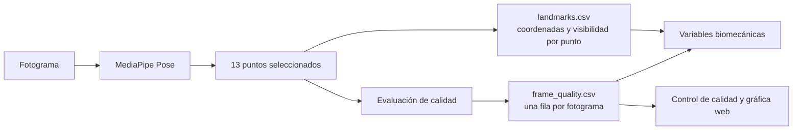
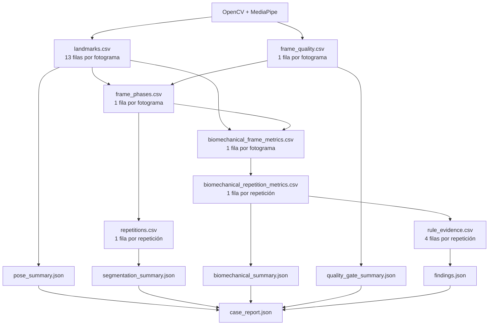

# Análisis trazable del caso `dev_valgo_izq_002`

## 1. Propósito

Este documento explica cómo el sistema transforma un video frontal de sentadilla bilateral en resultados interpretables. El recorrido se concentra en las fases 2, 3, 4 y 5 de `plan_desarrollo_tecnico_sentadilla.md`:

1. extracción y control de puntos anatómicos clave;
2. segmentación temporal de las repeticiones;
3. cálculo de variables biomecánicas observables;
4. aplicación de reglas y umbrales interpretables.

El objetivo no es presentar el sistema como una caja negra, sino mostrar la cadena de evidencia completa:

```text
video -> fotogramas -> puntos 2D -> calidad -> fases -> fórmulas
      -> variables por repetición -> reglas -> compensaciones observables
```

El archivo analizado es:

`data/sentadilla_bilateral/raw/dev_valgo_izq_002.mp4`

La denominación del archivo representa el patrón intentado durante la grabación. No se utiliza como entrada del algoritmo ni garantiza que el sistema deba encontrar dicho patrón.

## 2. Resumen del caso

| Elemento | Resultado |
|---|---:|
| Resolución | 478 x 850 px |
| Duración | 27.54 s |
| Frecuencia | 24.04 fotogramas/s |
| Fotogramas | 662 |
| Puntos anatómicos seleccionados | 13 por fotograma |
| Filas de `landmarks.csv` | 8 606 |
| Fotogramas con pose | 662, 100 % |
| Fotogramas válidos | 662, 100 % |
| Promedio de puntos detectados | 13 de 13 |
| Visibilidad crítica mínima observada | 0.9217 |
| Repeticiones detectadas | 3 |
| Repeticiones aptas | 1, 2 y 3 |
| Conjunto de reglas | `0.2.0-provisional` |
| Decisiones finales | 12: cuatro por repetición |

El caso es útil porque no presenta solamente el patrón intentado de valgo izquierdo. La tercera repetición también supera los umbrales provisionales de inclinación del tronco y desplazamiento de pelvis, por lo que demuestra el comportamiento multietiqueta del sistema.

### Evidencias visuales del caso

- [Video overlay con pose y calidad](/D:/sistema-biomecanico/data/sentadilla_bilateral/outputs/dev_valgo_izq_002/overlay.mp4)
- [Gráfica de calidad de pose](/D:/sistema-biomecanico/data/sentadilla_bilateral/outputs/dev_valgo_izq_002/pose_quality.png)
- [Gráfica de segmentación temporal](/D:/sistema-biomecanico/data/sentadilla_bilateral/outputs/dev_valgo_izq_002/segmentation.png)
- [Gráfica de variables biomecánicas](/D:/sistema-biomecanico/data/sentadilla_bilateral/outputs/dev_valgo_izq_002/biomechanical_metrics.png)
- [Máxima profundidad de la repetición 1](/D:/sistema-biomecanico/data/sentadilla_bilateral/outputs/dev_valgo_izq_002/rep_01_maxima_profundidad.png)
- [Máxima profundidad de la repetición 2](/D:/sistema-biomecanico/data/sentadilla_bilateral/outputs/dev_valgo_izq_002/rep_02_maxima_profundidad.png)
- [Máxima profundidad de la repetición 3](/D:/sistema-biomecanico/data/sentadilla_bilateral/outputs/dev_valgo_izq_002/rep_03_maxima_profundidad.png)

## 3. Flujo general


---

## 4. Fase 2: extracción de pose 2D

### 4.1. Lectura del video

OpenCV abre el archivo y decodifica secuencialmente cada fotograma. Para este caso se procesaron los 662 fotogramas declarados por el video.

Antes de enviar la imagen a MediaPipe:

1. OpenCV entrega el fotograma en formato BGR.
2. El sistema lo convierte a RGB.
3. MediaPipe Pose procesa la imagen en modo de video.
4. Se conservan las coordenadas estimadas y su visibilidad.

La configuración actual utiliza:

- `static_image_mode=False`;
- `model_complexity=1`;
- suavizado temporal de puntos activado;
- confianza mínima de detección de 0.50;
- confianza mínima de seguimiento de 0.50.

### 4.2. De 33 puntos a 13 puntos relevantes

MediaPipe Pose estima 33 puntos corporales. El sistema no necesita todos para la sentadilla frontal, por lo que selecciona:

| Punto | Índice MediaPipe | Uso principal |
|---|---:|---|
| Nariz | 0 | Referencia complementaria y anonimización |
| Hombros | 11, 12 | Eje superior y centro del tronco |
| Caderas | 23, 24 | Centro de pelvis y segmentación |
| Rodillas | 25, 26 | Alineación frontal |
| Tobillos | 27, 28 | Centro de apoyo y eje de pierna |
| Talones | 29, 30 | Referencia distal del pie |
| Puntas de los pies | 31, 32 | Referencia distal alternativa |

`landmarks.csv` contiene una fila por punto y fotograma:

```text
frame_index,timestamp_seconds,landmark,x,y,z,visibility,presence
```

En este caso:

```text
662 fotogramas x 13 puntos = 8 606 filas
```

### 4.3. Significado de las coordenadas

- `x`: posición horizontal normalizada. `0` es el borde izquierdo y `1` el derecho.
- `y`: posición vertical normalizada. `0` es la parte superior y `1` la inferior.
- `z`: estimación relativa de profundidad de MediaPipe. No se utiliza en las fórmulas 2D de esta tesis.
- `visibility`: estimación del modelo sobre la visibilidad del punto.
- `presence`: campo conservado por el contrato, pero no utilizado actualmente para decidir la calidad.

Una coordenada normalizada permite trabajar independientemente de que el video mida 478, 720 o 1080 píxeles de ancho. Para dibujar el punto en la imagen se realiza:

```text
x_px = x_normalizado x ancho_video
y_px = y_normalizado x alto_video
```

### 4.4. ¿Cuándo se considera válido un fotograma?

El umbral operativo de visibilidad es `0.50`.

Un fotograma es válido cuando:

- ambos hombros, caderas, rodillas y tobillos alcanzan visibilidad de al menos 0.50;
- existe al menos una referencia distal utilizable por cada lado: talón o punta del pie;
- MediaPipe devuelve la estructura completa de pose.

El campo `detected_keypoints` cuenta cuántos de los 13 puntos seleccionados superan 0.50. No cuenta los 33 puntos completos de MediaPipe.

### 4.5. Resultado de calidad del caso

| Indicador | Resultado | Criterio |
|---|---:|---:|
| Fotogramas procesados | 100 % | ≥ 99 % |
| Fotogramas válidos | 100 % | ≥ 90 % |
| Calidad global recomendada | 100 % | ≥ 95 % |
| Puntos detectados | 13 de 13 en todos los fotogramas | Umbral individual 0.50 |
| Visibilidad crítica mínima | 0.9217 | ≥ 0.50 |

En los fotogramas de máxima profundidad:

| Repetición | Fotograma | Tiempo | Visibilidad crítica mínima |
|---|---:|---:|---:|
| 1 | 199 | 8.279 s | 0.9676 |
| 2 | 388 | 16.141 s | 0.9271 |
| 3 | 592 | 24.628 s | 0.9244 |

El overlay utiliza:

- esqueleto verde: fotograma válido;
- esqueleto naranja: fotograma que requiere revisión;
- panel con fotograma, estado, puntos detectados y visibilidad mínima;
- pixelado facial para preservar anonimato.

### 4.6. ¿Cómo se demuestra que los puntos fueron detectados correctamente?

La respuesta rigurosa es que la visibilidad de MediaPipe no demuestra por sí sola exactitud anatómica. Indica que el modelo considera el punto visible y estable, pero no es una medida de error contra una coordenada real.

La tesis dispone de cuatro niveles de corroboración:

1. **Disponibilidad:** el modelo produjo los puntos requeridos.
2. **Calidad automática:** visibilidad, continuidad y reglas de validez.
3. **Auditoría visual:** el overlay permite verificar que los puntos siguen hombros, caderas, rodillas y tobillos.
4. **Validación funcional:** la clasificación final se compara con evaluación experta.

Si se quisiera demostrar precisión geométrica de los puntos, se necesitaría un conjunto adicional de fotogramas anotados manualmente o un sistema de referencia y calcular error de posición. Ese experimento no forma parte actualmente del alcance principal, que evalúa la detección final de compensaciones.

### 4.7. Archivos de esta fase

| Archivo | Origen | Función |
|---|---|---|
| `landmarks.csv` | MediaPipe por cada fotograma | Coordenadas fuente |
| `frame_quality.csv` | Reglas de visibilidad | Calidad por fotograma |
| `pose_summary.json` | Agregación de los CSV | Resumen para API e interfaz |
| `overlay.mp4` | OpenCV + puntos MediaPipe | Auditoría técnica visual |
| `review.mp4` | Video anonimizado sin resultados | Revisión experta sin sesgo |
| `pose_quality.png` | Serie de calidad | Evidencia gráfica |

---

## 5. Fase 3: segmentación temporal

### 5.1. Señal utilizada

La sentadilla se segmenta mediante la coordenada vertical del punto medio de ambas caderas:

```text
hip_midpoint_y = (y_cadera_izquierda + y_cadera_derecha) / 2
```

En coordenadas de imagen, `y` aumenta hacia abajo. Por ello, cuando la persona desciende, `hip_midpoint_y` aumenta. La máxima profundidad aparece como un máximo local de la señal.

### 5.2. Limpieza de la señal

El sistema:

1. interpola pérdidas aisladas;
2. completa extremos si fuera necesario;
3. aplica una mediana móvil;
4. aplica un promedio móvil.

La ventana es aproximadamente:

```text
24.04 fotogramas/s x 0.20 s ≈ 5 fotogramas
```

Esta combinación reduce pequeñas vibraciones de los landmarks sin eliminar el ciclo principal de la sentadilla.

### 5.3. Detección de máximos de profundidad

Los máximos candidatos deben cumplir una prominencia mínima:

```text
prominencia_mínima = max(0.03, rango_señal x 0.18)
```

Además:

- se revisa una ventana de aproximadamente 3 segundos;
- dos máximos deben estar separados al menos 2 segundos;
- una repetición no puede extenderse más de 10 segundos;
- si el rango vertical global es menor de 0.04, no se reconoce una sentadilla suficiente.

### 5.4. Inicio y final de cada repetición

Para cada máxima profundidad se buscan los valles de reposo anteriores y posteriores. El inicio y el final se fijan cuando la señal cruza aproximadamente el 15 % de la amplitud entre reposo y profundidad:

```text
nivel_inicio = valle_inicial + 0.15 x (pico - valle_inicial)
nivel_final  = valle_final   + 0.15 x (pico - valle_final)
```

Las fases quedan etiquetadas como:

- `reposo`;
- `descenso`;
- `maxima_profundidad`;
- `ascenso`;
- `cierre`.

### 5.5. Resultado temporal

| Repetición | Inicio | Máxima profundidad | Final | Descenso | Ascenso | Total |
|---|---:|---:|---:|---:|---:|---:|
| 1 | 1.165 s | 8.279 s | 9.277 s | 7.114 s | 0.998 s | 8.112 s |
| 2 | 11.274 s | 16.141 s | 17.098 s | 4.867 s | 0.957 s | 5.824 s |
| 3 | 19.719 s | 24.628 s | 25.834 s | 4.909 s | 1.206 s | 6.115 s |

La primera repetición tiene un descenso considerablemente más largo. Esto no invalida automáticamente la detección, pero es una característica que debe poder verificarse visualmente en la curva y el video.

### 5.6. Puerta de calidad posterior

La segmentación se cruza con `frame_quality.csv`.

Para este caso:

- se detectaron tres repeticiones, cuando el mínimo actual es una;
- cada repetición posee 100 % de fotogramas válidos;
- los tres fotogramas de máxima profundidad son válidos;
- las repeticiones 1, 2 y 3 son aptas.

Una repetición inválida puede excluirse sin descartar necesariamente las demás. Las variables y reglas solo se aplican a las repeticiones elegibles.

### 5.7. Archivos de esta fase

| Archivo | Granularidad | Función |
|---|---|---|
| `frame_phases.csv` | Una fila por fotograma | Señal, fase y repetición |
| `repetitions.csv` | Una fila por repetición | Inicio, profundidad, final y duración |
| `segmentation_summary.json` | Resumen del caso | Contrato para API |
| `segmentation.png` | Gráfica | Corroboración visual |
| `rep_XX_inicio_descenso.png` | Evento | Evidencia visual |
| `rep_XX_maxima_profundidad.png` | Evento | Fotograma usado en reglas |
| `rep_XX_final_ascenso.png` | Evento | Evidencia del cierre |

---

## 6. Fase 4: variables biomecánicas observables

### 6.1. Separación entre medición y clasificación

Esta fase calcula números. Todavía no decide si existe una compensación.

La entrada es:

- coordenadas de `landmarks.csv`;
- fase y repetición de `frame_phases.csv`;
- validez por fotograma.

La salida principal es:

- una serie temporal por fotograma;
- un resumen por repetición en máxima profundidad.

### 6.2. Convenciones

- La captura es anterior dentro del plano frontal.
- `x` aumenta hacia la derecha de la imagen.
- La derecha de la imagen corresponde al lado anatómico izquierdo.
- Tronco y pelvis positivos indican dirección anatómica izquierda.
- Tronco y pelvis negativos indican dirección anatómica derecha.
- Rodilla positiva indica desviación medial.
- Rodilla negativa indica desviación lateral.
- Las distancias se expresan respecto al ancho inicial de hombros.

### 6.3. Referencia de escala

El sistema calcula el ancho de hombros en los fotogramas válidos de reposo y utiliza su mediana:

```text
W0 = mediana(|x_hombro_izquierdo - x_hombro_derecho|)
```

Para este caso:

```text
W0 = 0.258264 del ancho de la imagen
   ≈ 123.45 píxeles en un video de 478 px
```

Esta normalización evita que una distancia horizontal dependa directamente de la resolución, del tamaño aparente de la persona o de su distancia a la cámara.

### 6.4. Inclinación lateral del tronco

Se calculan los puntos medios de hombros `S` y pelvis `P`:

```text
S = (hombro_izquierdo + hombro_derecho) / 2
P = (cadera_izquierda + cadera_derecha) / 2
```

La inclinación respecto de la vertical es:

```text
theta_tronco = atan2(Sx - Px, Py - Sy)
```

Se expresa en grados porque describe la orientación de un eje corporal. El ángulo ya es independiente de la escala de la imagen.

### 6.5. Desplazamiento lateral de pelvis

Se calcula el centro de ambos tobillos `A`:

```text
A = (tobillo_izquierdo + tobillo_derecho) / 2
offset_pelvis = Px - Ax
```

El sistema resta el offset mediano del reposo:

```text
desplazamiento_pelvis =
    100 x (offset_pelvis - offset_inicial) / W0
```

Para este caso:

```text
offset_inicial = 0.006611
```

El resultado se expresa como porcentaje del ancho inicial de hombros porque es una distancia, no un ángulo.

### 6.6. Alineación cadera-rodilla-tobillo

El valgo requiere dos cálculos, uno por rodilla.

Para cada lado se construye primero una línea de referencia entre cadera `H` y tobillo `A`. A la altura vertical de la rodilla real `K`, se calcula dónde debería cruzar esa línea:

```text
t = (Ky - Hy) / (Ay - Hy)
Kx_esperado = Hx + t x (Ax - Hx)
```

Después se compara la rodilla real con la esperada:

```text
rodilla_izquierda =
    -100 x (Kx_real - Kx_esperado) / W0

rodilla_derecha =
     100 x (Kx_real - Kx_esperado) / W0
```

El cambio de signo hace que un valor positivo signifique medialización en ambos lados anatómicos.

Consecuencia:

- valor positivo: desplazamiento medial;
- valor negativo: desplazamiento lateral;
- el valor negativo no debe transformarse en valgo usando valor absoluto.

### 6.7. Diferencia bilateral

```text
diferencia_bilateral =
    |rodilla_izquierda - rodilla_derecha|
```

La diferencia puede ser alta porque una rodilla se medializa y la otra se lateraliza. No significa que ambas tengan valgo.

### 6.8. Resultados en máxima profundidad

| Rep. | Tronco | Pelvis | Rodilla izquierda | Rodilla derecha | Diferencia bilateral |
|---:|---:|---:|---:|---:|---:|
| 1 | -1.010° | 5.566 % | 21.370 % | -39.160 % | 60.530 % |
| 2 | 3.445° | 1.814 % | 13.252 % | -37.100 % | 50.352 % |
| 3 | 12.376° | 9.546 % | 27.285 % | -37.385 % | 64.671 % |

Esta tabla responde una duda importante: el valgo no debería representarse en la interfaz mediante un solo valor. La salida resumida debe mostrar:

- valor izquierdo;
- valor derecho;
- lado que activa la regla;
- valor combinado utilizado por la decisión.

### 6.9. Ejemplo completo: repetición 3

#### Tronco

```text
Sx - Px = 0.565206 - 0.540189 = 0.025016
Py - Sy = 0.741292 - 0.627286 = 0.114007

theta = atan2(0.025016, 0.114007)
theta = 12.376°
```

El signo positivo indica inclinación anatómica izquierda.

#### Pelvis

```text
offset_actual = Px - Ax
offset_actual = 0.540189 - 0.508923
offset_actual = 0.031266

desplazamiento =
    100 x (0.031266 - 0.006611) / 0.258264
desplazamiento = 9.546 %
```

El signo positivo indica desplazamiento anatómico izquierdo.

#### Rodilla izquierda

```text
Kx_real = 0.544360
Kx_esperado = 0.614828

desviación_izquierda =
    -100 x (0.544360 - 0.614828) / 0.258264
desviación_izquierda = 27.285 %
```

La desviación es medial y positiva.

#### Rodilla derecha

```text
Kx_real = 0.343448
Kx_esperado = 0.440001

desviación_derecha =
    100 x (0.343448 - 0.440001) / 0.258264
desviación_derecha = -37.385 %
```

El valor es lateral y no activa valgo derecho.

#### Diferencia bilateral

```text
|27.285 - (-37.385)| = 64.671 %
```

### 6.10. ¿Por qué hay grados y porcentajes?

| Variable | Unidad | Razón |
|---|---|---|
| Inclinación del tronco | Grados | Mide orientación respecto de la vertical |
| Desplazamiento de pelvis | % del ancho de hombros | Mide distancia horizontal |
| Desviación de cada rodilla | % del ancho de hombros | Mide distancia entre posición real y línea esperada |
| Diferencia bilateral | % del ancho de hombros | Compara dos distancias normalizadas |

No debe mostrarse un porcentaje como si fuera probabilidad o confianza. Es una distancia normalizada.

### 6.11. Archivos de esta fase

| Archivo | Contenido |
|---|---|
| `biomechanical_frame_metrics.csv` | 662 filas, una por fotograma |
| `biomechanical_repetition_metrics.csv` | Tres filas, una por repetición |
| `biomechanical_summary.json` | Referencia de escala, convenciones y resumen |
| `biomechanical_metrics.png` | Series temporales de las variables |

---

## 7. Fase 5: reglas biomecánicas interpretables

### 7.1. Regla general de tres bandas

Cada variable se clasifica mediante dos límites:

```text
valor <= límite de ausencia       -> ausente
valor >= límite de presencia      -> presente
valor entre ambos límites         -> no concluyente
```

El estado intermedio evita forzar una clasificación cuando el valor está cerca del umbral.

### 7.2. Umbrales provisionales

| Patrón | Variable | Ausente | No concluyente | Presente |
|---|---|---:|---:|---:|
| Inclinación del tronco | Magnitud del ángulo | ≤ 8° | > 8° y < 12° | ≥ 12° |
| Desplazamiento de pelvis | Magnitud normalizada | ≤ 5 % | > 5 % y < 8 % | ≥ 8 % |
| Valgo visible por lado | Desviación medial positiva | ≤ 2 % | > 2 % y < 5 % | ≥ 5 % |
| Asimetría bilateral | Diferencia absoluta | ≤ 8 % | > 8 % y < 12 % | ≥ 12 % |

Estos valores son umbrales de ingeniería provisionales. No son puntos de corte clínicos.

### 7.3. Evaluación independiente

Las reglas se aplican:

- por repetición;
- por patrón;
- sin consenso entre repeticiones;
- sin utilizar el nombre del archivo;
- sin utilizar todavía la evaluación experta;
- permitiendo más de un patrón presente en una misma repetición.

### 7.4. Resultado del caso

| Rep. | Tronco | Pelvis | Valgo | Asimetría |
|---:|---|---|---|---|
| 1 | Ausente, -1.010° | No concluyente, 5.566 % | Presente izquierda, 21.370 % | Presente, 60.530 %, predominio izquierdo |
| 2 | Ausente, 3.445° | Ausente, 1.814 % | Presente izquierda, 13.252 % | Presente, 50.352 %, predominio izquierdo |
| 3 | Presente izquierda, 12.376° | Presente izquierda, 9.546 % | Presente izquierda, 27.285 % | Presente, 64.671 %, predominio izquierdo |

La repetición 3 demuestra una salida multietiqueta: cuatro reglas independientes resultan positivas.

### 7.5. Cómo se decide el valgo

El motor conserva ambos lados:

```text
izquierda = 27.285 % -> presente
derecha   = -37.385 % -> ausente
resultado = valgo visible izquierdo
```

El valor resumido de la decisión es el mayor valor medial positivo disponible. Para explicar el resultado, la interfaz no debe ocultar el valor del lado contrario.

### 7.6. Archivos de esta fase

| Archivo | Función |
|---|---|
| `config/squat/ruleset_v0_1_provisional.json` | Umbrales y versión `0.2.0-provisional` |
| `rule_evidence.csv` | Una fila por repetición y patrón |
| `findings.json` | Decisiones estructuradas |
| `case_report.json` | Contrato agregado consumido por la API y la web |

El nombre físico del archivo de configuración conserva `v0_1`, pero su contenido actual declara la versión lógica `0.2.0-provisional`. Conviene renombrarlo en una migración posterior para evitar confusión, sin cambiar silenciosamente la versión de reglas.

---

## 8. Origen y relación de CSV y JSON

### 8.1. Diferencia entre `landmarks.csv` y `frame_quality.csv`

Los dos archivos se generan simultáneamente a partir del mismo resultado de
MediaPipe Pose para cada fotograma, pero representan niveles diferentes de
información.

`landmarks.csv` constituye la evidencia anatómica primaria. Contiene una fila
por punto anatómico y fotograma, con las coordenadas normalizadas `x`, `y`, `z`,
la visibilidad y la presencia estimada. En este proyecto se conservan 13 puntos:
nariz, hombros, caderas, rodillas, tobillos, talones y puntas de los pies. Este
archivo permite reconstruir la geometría, calcular variables biomecánicas y
dibujar los overlays. Si MediaPipe no devuelve una pose para un fotograma, no se
generan las 13 filas correspondientes.

`frame_quality.csv` es una evaluación derivada de una fila por fotograma. No se
calcula posteriormente leyendo `landmarks.csv`; ambos se escriben dentro del
mismo ciclo de procesamiento a partir del objeto de evaluación en memoria. Sus
campos principales son:

| Campo | Significado |
|---|---|
| `pose_detected` | MediaPipe devolvió una pose con los puntos requeridos |
| `detected_keypoints` | Cantidad de los 13 puntos cuya visibilidad alcanza el umbral configurado |
| `minimum_critical_visibility` | Menor visibilidad entre hombros, caderas, rodillas y tobillos |
| `valid_for_analysis` | El fotograma cumple la disponibilidad estructural requerida |
| `invalid_reason` | Punto crítico o referencia distal que impidió considerar válido el fotograma |

El conteo se obtiene mediante:

```text
detected_keypoints(f) =
    suma[visibilidad del punto k en el fotograma f >= 0.50]
```

La visibilidad crítica se obtiene mediante:

```text
minimum_critical_visibility(f) =
    mínimo(visibilidad de hombros, caderas, rodillas y tobillos)
```

Para que un fotograma sea válido se requiere que los ocho puntos críticos
superen el umbral y que cada pie conserve al menos una referencia distal
utilizable: talón o punta del pie. La nariz no interviene en esta regla. Por
ello, un fotograma puede ser válido con menos de 13 puntos detectados si la
ausencia corresponde a una referencia redundante del pie.

En el fotograma 0 de `dev_valgo_izq_002`, los 13 puntos superan el umbral y
`minimum_critical_visibility` es `0.99717963`, correspondiente al tobillo
derecho, que es el punto crítico con menor visibilidad. El talón izquierdo tiene
un valor inferior, pero no forma parte del mínimo crítico porque se evalúa como
referencia distal.

La expresión “punto detectado” debe interpretarse como punto disponible según
la confianza de MediaPipe, no como prueba de exactitud anatómica absoluta. La
validez frente a posiciones reales requeriría comparación con un sistema de
referencia externo.

### 8.2. Uso en la interfaz

La gráfica **Disponibilidad de pose por fotograma** utiliza
`frame_quality.csv`, concretamente `detected_keypoints`,
`minimum_critical_visibility` y `valid_for_analysis`. Esta elección evita
reagrupar las numerosas filas de `landmarks.csv` cada vez que se abre el caso y
mantiene en una sola fuente la regla de aceptación aplicada durante el
procesamiento.

La relación funcional es:



En síntesis, `landmarks.csv` responde qué punto fue estimado, dónde se ubicó y
con qué visibilidad; `frame_quality.csv` responde si el conjunto disponible en
ese fotograma fue suficiente para participar en el análisis.



Los CSV son evidencia granular y reproducible. Los JSON son resúmenes estructurados para API, interfaz y exportación. El `case_report.json` funciona como índice agregado del análisis.

## 9. Qué demuestra y qué no demuestra este caso

### Demuestra

- extracción estable de pose 2D;
- cobertura de los 13 puntos seleccionados;
- detección de tres repeticiones;
- cálculo reproducible de variables por repetición;
- valgo evaluado por lado;
- clasificación multietiqueta;
- trazabilidad desde coordenadas hasta umbrales.

### No demuestra

- diagnóstico clínico;
- causa anatómica de la compensación;
- rotación interna o externa tridimensional;
- exactitud absoluta de MediaPipe contra un sistema de captura de movimiento;
- validez definitiva de los umbrales;
- desempeño final frente a expertos.

## 10. Conclusión del análisis

El principal valor demostrativo del sistema no es únicamente indicar “valgo izquierdo”. El aporte es poder mostrar:

1. dónde ubicó los puntos anatómicos;
2. si el fotograma fue técnicamente utilizable;
3. cómo separó cada repetición;
4. qué líneas y referencias geométricas construyó;
5. qué valor obtuvo en cada lado;
6. qué umbral aplicó;
7. por qué emitió presente, ausente o no concluyente.

Esta cadena es la base para una interfaz explicativa dirigida al asesor y al jurado.
