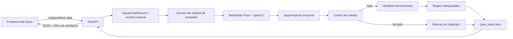

# Arquitectura de API previa a la interfaz de sentadilla bilateral

## 1. Propósito

Este documento define el límite técnico entre el motor local de análisis y la futura interfaz web. El objetivo es que el frontend no tenga que conocer cómo se relacionan los CSV, JSON, videos, imágenes y gráficas generados por el pipeline.

La capa implementada permite:

1. registrar un caso mediante los campos del Instrumento 1;
2. recibir y conservar el video local;
3. ejecutar el pipeline completo;
4. devolver un reporte agregado;
5. recuperar posteriormente el reporte sin recalcularlo;
6. acceder a los artefactos mediante rutas controladas.

## 2. Arquitectura implementada



La API no vuelve a implementar las fórmulas. Delega el procesamiento en `src/squat/` y se limita a validar la entrada, persistir el archivo, ejecutar el servicio y entregar el contrato resultante.

## 3. Contrato de entrada

### 3.1. `case_record.json`

Este archivo representa la información del Instrumento 1 y separa:

- el registro técnico generado automáticamente;
- la revisión manual del protocolo;
- la decisión de aceptación, rechazo o revisión pendiente.

Los campos manuales incluyen fecha y fuente del registro, dispositivo, iluminación, fondo, visibilidad corporal, oclusiones, observabilidad de la sentadilla, superficie, apoyo de los talones, disponibilidad de puntos anatómicos clave y responsable de la revisión.

El sistema no infiere automáticamente las condiciones de apoyo plantar. La API únicamente conserva la información suministrada por el investigador.

## 4. Contrato de salida

### 4.1. `case_report.json`

Este archivo funciona como índice de los resultados requeridos por el Instrumento 2. Incluye:

- estado general del caso;
- resumen de pose;
- promedio de puntos anatómicos clave detectados por fotograma;
- repeticiones y eventos temporales;
- control de calidad;
- variables biomecánicas por repetición;
- decisiones de las reglas interpretables;
- hallazgos presentes y resultados no concluyentes;
- manifiesto de artefactos;
- versiones del pipeline y de las reglas;
- nota sobre el carácter provisional de los umbrales.

Los nombres de archivos del reporte son relativos. La API no expone rutas absolutas de Windows ni obliga al frontend a acceder directamente al sistema de archivos.

### 4.2. Estados posibles

| Estado | Significado para la interfaz |
|---|---|
| `registro_pendiente` | Falta revisar el protocolo; no se procesa la pose |
| `registro_rechazado` | El caso incumple el protocolo y conserva el motivo |
| `analisis_parcial` | Solo existen algunas etapas del pipeline |
| `no_apto_para_analisis` | El control técnico impide calcular hallazgos |
| `analisis_completo` | Se generaron calidad, métricas y hallazgos |

## 5. Evidencia visual por repetición

Cada repetición genera:

- `rep_XX_inicio_descenso.png`;
- `rep_XX_maxima_profundidad.png`;
- `rep_XX_final_ascenso.png`.

Las capturas proceden de `overlay.mp4`, que ya contiene anonimización facial y puntos superpuestos. No se extraen del video original.

Cada captura conserva el número de repetición, tipo de evento, fotograma, tiempo y nombre relativo del archivo.

## 6. Endpoints disponibles

### 6.1. Crear y analizar un caso

`POST /api/v1/squat/cases`

Formato: `multipart/form-data`.

| Campo | Tipo | Uso |
|---|---|---|
| `video` | Archivo | Video frontal de la sentadilla |
| `case_id` | Texto | Identificador único |
| `participant_code` | Texto opcional | Código seudonimizado |
| `profile` | Texto | Caso controlado, negativo o no etiquetado |
| `protocol_review_status` | Texto | Aceptado, pendiente o rechazado |
| `exclusion_reason` | Texto opcional | Obligatorio cuando se rechaza |
| `intended_findings_json` | JSON serializado | Etiquetas intentadas, solo para desarrollo |
| `manual_review_json` | JSON serializado | Campos manuales del Instrumento 1 |

Respuesta: `case_report.json` validado mediante Pydantic.

La carga se escribe por bloques y se consolida mediante un archivo temporal. Esto evita mantener el video completo en memoria y reduce el riesgo de dejar un archivo incompleto.

### 6.2. Consultar un reporte existente

`GET /api/v1/squat/cases/{case_id}`

Devuelve el reporte almacenado sin repetir MediaPipe ni los cálculos.

### 6.3. Consultar el registro metodológico

`GET /api/v1/squat/cases/{case_id}/record`

Devuelve el contrato tipado del Instrumento 1. Se mantiene separado de los artefactos compartibles porque puede contener información manual del caso.

### 6.4. Consultar un artefacto

`GET /api/v1/squat/cases/{case_id}/assets/{filename}`

Ejemplos:

- `/api/v1/squat/cases/caso_001/assets/overlay.mp4`;
- `/api/v1/squat/cases/caso_001/assets/rep_01_maxima_profundidad.png`;
- `/api/v1/squat/cases/caso_001/assets/biomechanical_metrics.png`.

La validación impide solicitar rutas externas a la carpeta del caso y limita las descargas a los archivos declarados en el manifiesto de `case_report.json`. El registro metodológico no se sirve como artefacto público.

## 7. Comandos reproducibles

Exportar esquemas:

```powershell
D:\anaconda4\envs\analisis-bio\python.exe scripts\run_squat_analysis.py export-schemas
```

Ejecutar el análisis completo:

```powershell
D:\anaconda4\envs\analisis-bio\python.exe scripts\run_squat_analysis.py analyze `
  --case-id caso_001 `
  --video data\sentadilla_bilateral\raw\caso_001.mp4
```

Construir contratos para un caso procesado:

```powershell
D:\anaconda4\envs\analisis-bio\python.exe scripts\run_squat_analysis.py assemble-existing `
  --case-id caso_001 `
  --case-output-dir data\sentadilla_bilateral\outputs\caso_001 `
  --protocol-review-status aceptado
```

## 8. Primera interfaz web recomendada

La primera versión debe ser una aplicación web local para el investigador, no una aplicación clínica.

### Pantalla 1. Registro

- identificador y datos manuales del Instrumento 1;
- carga del video;
- decisión de protocolo;
- acción para iniciar el análisis.

### Pantalla 2. Procesamiento

- indicador de operación en curso;
- explicación de las etapas;
- advertencia de que el proceso puede tardar decenas de segundos.

### Pantalla 3. Resultado

- estado técnico;
- tarjetas para los cuatro patrones;
- overlay y línea temporal;
- galería de eventos;
- métricas por repetición;
- explicación de reglas;
- descargas técnicas.

### Pantalla 4. Vista técnica

- Instrumento 2;
- control de calidad;
- gráficas, CSV y JSON;
- versiones del pipeline y las reglas.

## 9. Procesamiento síncrono

El endpoint actual mantiene la conexión hasta terminar el análisis. Es suficiente para una demostración local.

Si las pruebas muestran tiempos excesivos o concurrencia, el siguiente diseño será:

1. `POST` devuelve `202 Accepted`;
2. un proceso de fondo ejecuta el pipeline;
3. el frontend consulta el estado;
4. el reporte se recupera al terminar.

No conviene introducir una cola de trabajos antes de demostrar que se necesita.

## 10. Delimitaciones

- La API no emite diagnósticos clínicos.
- Las etiquetas intentadas no intervienen en las reglas.
- Los umbrales siguen siendo provisionales.
- El Instrumento 3 permanece separado.
- El almacenamiento actual es local.
- La autenticación y la base de datos se incorporarán solo si el uso lo exige.

## 11. Decisiones para la interfaz web

Las decisiones posteriores a esta arquitectura se documentan en `plan_frontend_web_sentadilla.md`:

1. Next.js vivirá inicialmente en `apps/web/` dentro del repositorio actual.
2. FastAPI continuará como única capa de dominio y análisis.
3. Supabase local proporcionará persistencia, autenticación y almacenamiento privado.
4. La primera integración reutilizará el procesamiento síncrono; antes del uso multiusuario se añadirá estado persistente y ejecución de fondo local sin incorporar una cola distribuida.
5. La interfaz incluirá el flujo del investigador y, después de estabilizarlo, el flujo ciego del Instrumento 3 para expertos.
6. Las exportaciones metodológicas se generarán en el backend.
