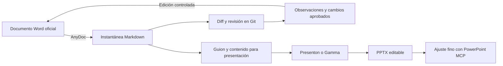

# Estrategia de presentaciones y trazabilidad documental

## Decisión recomendada

Se utilizarán herramientas distintas para responsabilidades distintas:

1. **AnyDoc** convertirá documentos institucionales a Markdown para revisar contenido y diferencias mediante Git.
2. **La aplicación web** conservará las demostraciones interactivas calculadas con los datos reales de cada caso: señal original y suavizada, prominencia, recuperación, coordenadas, W0, variables y reglas.
3. **Canva o Figma Slides** se utilizarán para componer la presentación visual a partir del guion versionado. Ambas cuentas se encuentran autenticadas; Canva permite reutilizar diseños existentes y Figma aporta diagramas y una edición estructurada.
4. **HyperFrames** generará únicamente clips breves y controlados para explicar fenómenos temporales que no dependen de un caso específico, como ruido, pérdida de coordenadas, doble pico y recuperación insuficiente.
5. **Draw.io** se utilizará para arquitectura y flujos técnicos exportables. El servidor local quedó registrado, pero el host actual lo reporta como no compatible. Esto no obliga a dibujar manualmente: se generará una fuente Mermaid versionada y un archivo `.drawio` editable mediante XML de mxGraph; diagrams.net podrá abrirlo directamente.
6. **PowerPoint o Google Slides** quedarán como salida editable y como etapa de revisión final, no como fuente única del contenido.
7. **Gamma y Presenton** permanecerán como alternativas de exploración, no como dependencias del flujo principal.

Esta separación evita pedirle a una sola herramienta que resuelva contenido académico, diseño visual, edición fina e interactividad.

## Evaluación de recursos

| Recurso | Utilidad principal | Ventaja para la tesis | Limitación | Decisión |
|---|---|---|---|---|
| [AnyDoc](https://github.com/firecrawl/anydoc) | Convertir DOCX, PPTX, XLSX y PDF de texto a Markdown | Produce una representación semántica versionable y funciona localmente | No conserva la maquetación exacta de Word ni extrae OCR de documentos escaneados | Adoptar para instantáneas y revisión |
| [pdf-inspector](https://github.com/firecrawl/pdf-inspector) | Inspeccionar, clasificar y extraer texto de PDF | Ayuda a distinguir PDF textual de PDF escaneado | No es necesario para convertir el DOCX; AnyDoc ya lo utiliza internamente para PDF | Usar solo para PDFs problemáticos |
| [Presenton](https://github.com/presenton/presenton) | Generar, editar y exportar presentaciones mediante interfaz, API o MCP | Admite plantillas reutilizables, archivos de entrada, despliegue local y salida editable en PPTX | Requiere configurar Docker y un proveedor de modelo para obtener resultados de calidad | Alternativa si Canva o Figma no ofrecen control suficiente |
| [Gamma API](https://developers.gamma.app/) | Generar presentaciones rápidamente desde texto | Buena composición visual inicial y baja fricción | Menor control determinista sobre la composición y dependencia de servicio externo | Usar para explorar alternativas visuales |
| [PowerPoint MCP](https://github.com/ykuwai/ppt-mcp) | Controlar PowerPoint en tiempo real mediante COM | Permite corregir tipografía, formas, tablas, gráficos, animaciones y exportación sin regenerar todo el archivo | Requiere Windows y Microsoft PowerPoint; no sustituye la dirección visual inicial | Segunda pasada de ajuste fino |
| [Slidev](https://github.com/slidevjs/slidev) | Crear presentaciones técnicas desde Markdown | Soporta LaTeX, Mermaid, animaciones, grabación y componentes interactivos | Su exportación a PPTX no siempre conserva toda la interactividad o apariencia web | Alternativa para una exposición técnica reproducible |
| [Marp CLI](https://github.com/marp-team/marp-cli) | Convertir Markdown a HTML, PDF o PPTX | Flujo simple, reproducible y fácil de versionar | Menor libertad visual que Presenton, PowerPoint o Slidev | Útil para borradores sobrios |
| [Canva](https://www.canva.com/) | Componer una presentación editable y reutilizar diseños existentes | Cuenta autenticada, buena edición visual y exportación a PPTX/PDF | La composición final no es determinista ni adecuada como fuente de verdad textual | Adoptar para la primera versión visual |
| [Figma Slides](https://www.figma.com/slides/) | Diseñar diapositivas y diagramas con componentes reutilizables | Cuenta autenticada y buena integración entre presentación, arquitectura y figuras | La cuenta disponible tiene plan Starter y asiento View; algunas operaciones pueden depender de permisos del archivo | Adoptar como alternativa de composición y diagramación |
| [HyperFrames](https://github.com/heygen-com/hyperframes) | Generar animaciones explicativas mediante código | Instalado localmente; permite representar ruido, prominencia, recuperación e interpolación con control temporal | No debe sustituir la evidencia del caso ni convertir cada diapositiva en video | Adoptar para dos o tres clips breves |
| [Draw.io](https://github.com/jgraph/drawio-mcp) | Crear arquitecturas y flujos editables con iconos técnicos | Formato `.drawio`, exportación y biblioteca amplia de formas | El MCP stdio figura como no compatible en el host actual | Adoptar mediante generación programática de `.drawio`; usar el MCP solo cuando el host lo admita |

## Flujo documental adoptado

El `.docx` institucional continuará siendo el documento oficial de entrega. El Markdown generado será una **instantánea semántica para revisión**, no una copia visual ni un reemplazo automático.



No se recomienda una sincronización bidireccional automática entre Word y Markdown. El Word contiene índices, saltos de sección, tablas complejas, formato institucional y otros elementos que Markdown no representa con fidelidad completa.

## Uso reproducible de AnyDoc

La skill `convert-documents-to-markdown` de AnyDoc quedó instalada para Codex. La plantilla principal puede sincronizarse con:

```powershell
powershell -ExecutionPolicy Bypass -File scripts\sync_thesis_docx_to_markdown.ps1
```

También puede convertirse otro archivo indicando rutas explícitas:

```powershell
powershell -ExecutionPolicy Bypass -File scripts\sync_thesis_docx_to_markdown.ps1 `
  -InputPath "docs/archivos-tesis/Proyecto-tesis-final-sin-carga.docx" `
  -OutputPath "docs/markdown-snapshots/Proyecto-tesis-final-sin-carga.md"
```

El script:

- conserva intacto el archivo de entrada;
- escribe UTF-8;
- rechaza una salida vacía o con señales frecuentes de codificación dañada;
- informa cantidad de caracteres, encabezados, filas de tabla y hashes SHA-256;
- reemplaza la instantánea anterior solo si la conversión termina correctamente.

## Resultado de la prueba inicial

La conversión de `Plantilla_proyecto_de_tesis_completada.docx` generó una instantánea con aproximadamente 106 000 caracteres, 34 encabezados y 165 filas de tabla. No se detectaron caracteres de reemplazo ni secuencias de texto corrupto. Se conservaron el contenido, los vínculos del índice, las referencias y la estructura tabular principal.

Las imágenes incrustadas se representan principalmente mediante su texto alternativo; por ello, la inspección visual final deberá seguir realizándose sobre el Word o el PDF renderizado.

## Estrategia para rehacer la presentación

La siguiente versión no debe generarse como una colección de diapositivas independientes. Debe construirse como una narración visual sincronizada con la aplicación web:

1. **Problema:** observar una compensación no explica cómo el sistema llegó a clasificarla.
2. **Entrada:** video frontal y detección de puntos anatómicos clave.
3. **Señal:** punto medio de caderas y sistema de coordenadas de imagen.
4. **Limpieza:** señal original, interpolación de huecos y suavizado.
5. **Segmentación:** prominencia, recuperación biomecánica y fases de la repetición.
6. **Geometría:** ancho inicial de hombros, referencias anatómicas y fotograma de máxima profundidad.
7. **Variables:** fórmulas desarrolladas con valores reales del caso.
8. **Reglas:** umbrales provisionales, clasificación independiente por patrón y trazabilidad.
9. **Demostración:** transición a la aplicación web para explorar video, curvas y resultados sincronizados.
10. **Validación:** comparación con expertos, F1-score y concordancia.

La presentación debe contener conceptos y decisiones; la web debe contener exploración y evidencia. Los videos explicativos deben reservarse para fenómenos temporales difíciles de representar en una sola imagen, como el efecto de la limpieza, la prominencia y la fusión de picos por recuperación insuficiente.

## Próximo incremento recomendado

1. Mantener Mermaid como fuente textual versionada y generar `.drawio` como artefacto editable; no depender del MCP local para comenzar.
2. Preparar en Markdown el guion definitivo por diapositiva, incluyendo mensaje, evidencia, transición a la web y notas del expositor.
3. Crear dos recursos reutilizables en formato Mermaid y `.drawio`: arquitectura general y flujo de las fases 2 a 5. Figma podrá emplearse para el acabado visual dentro de la presentación.
4. Generar en Canva una primera versión visual y, en paralelo, validar si Figma Slides permite una edición más precisa con el plan actual.
5. Producir con HyperFrames solo dos clips: limpieza/prominencia/recuperación y geometría de alineación cadera-rodilla-tobillo.
6. Integrar capturas o enlaces de la web para la demostración con datos reales; los videos controlados deberán presentarse como explicación conceptual, no como resultado experimental.
7. Exportar a PPTX, realizar la pasada final y comprobar que el guion Markdown y las notas del expositor coincidan con la versión entregable.

## Resultado del incremento de presentación técnica

La estrategia se materializó inicialmente en una presentación editable de 16 diapositivas. La versión 3 amplía el recorrido a 18 diapositivas para explicar también la producción de artefactos, la diferencia entre interpolación temporal y espacial y el ejemplo numérico de la ventana móvil. El contenido sigue una secuencia única desde la captura del video hasta la validación frente a expertos, y diferencia explícitamente tres responsabilidades: la presentación explica las decisiones, la aplicación web conserva la evidencia interactiva y los artefactos descargables permiten auditar el procesamiento.

Los entregables sincronizados son:

- `presentacion_proceso_interno_sentadilla_v3.pptx`: presentación editable con notas del expositor;
- `presentacion_proceso_interno_sentadilla_v3.pdf`: versión estable para revisión y envío;
- `guion_presentacion_proceso_interno_sentadilla.md`: fuente textual de la narrativa, fórmulas, transiciones y demostraciones;
- `trazabilidad_presentacion_proceso_interno_sentadilla.md`: registro de versiones y correspondencia de cambios;
- `diagramas/presentacion/fases_2_5_sentadilla.mmd`: fuente Mermaid versionada del flujo técnico;
- `diagramas/presentacion/fases_2_5_sentadilla.drawio`: diagrama editable en diagrams.net;
- `assets/presentacion_sentadilla/hyperframes_segmentacion/segmentacion_prominencia_recuperacion.mp4`: clip explicativo de limpieza, prominencia y validación de recuperación;
- `assets/presentacion_sentadilla/hyperframes_senal_caderas/senal_caderas_animada.mp4`: señal real animada del centro de caderas;
- `assets/presentacion_sentadilla/hyperframes_geometria_variables/construccion_geometrica_variables.mp4`: construcción secuencial de `W0` y las variables;
- `assets/presentacion_sentadilla/web_resumen_caso.png` y `web_trazabilidad_caso.png`: evidencias actuales de la aplicación web.

La animación controlada no se presenta como resultado experimental. Su función es explicar fenómenos temporales difíciles de comunicar en una imagen estática. Los valores experimentales, las curvas completas, las coordenadas, los umbrales y los archivos técnicos continúan mostrándose en la aplicación web y en los resultados descargables del caso.

La revisión final comprobó la apertura de las 18 diapositivas en PowerPoint, la exportación completa a PDF, la generación de la instantánea semántica de AnyDoc y el cumplimiento de las validaciones de HyperFrames sin errores de ejecución, composición ni contraste. Para conservar compatibilidad del archivo PPTX, los clips se vinculan desde sus portadas en lugar de incrustarse dentro del paquete de PowerPoint.
