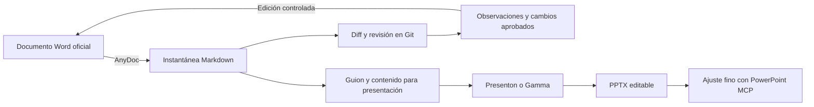

# Estrategia de presentaciones y trazabilidad documental

## Decisión recomendada

Se utilizarán herramientas distintas para responsabilidades distintas:

1. **AnyDoc** convertirá documentos institucionales a Markdown para revisar contenido y diferencias mediante Git.
2. **Presenton** será la primera opción para generar una nueva presentación visual y editable a partir del guion y de una plantilla gráfica propia.
3. **PowerPoint MCP** servirá para realizar ajustes precisos sobre el archivo `.pptx` abierto en Microsoft PowerPoint.
4. **La aplicación web** conservará las demostraciones interactivas, sincronizadas con el video y los datos del caso.
5. **Gamma** podrá emplearse para explorar rápidamente una dirección visual, pero no será la fuente principal del contenido ni del control de versiones.

Esta separación evita pedirle a una sola herramienta que resuelva contenido académico, diseño visual, edición fina e interactividad.

## Evaluación de recursos

| Recurso | Utilidad principal | Ventaja para la tesis | Limitación | Decisión |
|---|---|---|---|---|
| [AnyDoc](https://github.com/firecrawl/anydoc) | Convertir DOCX, PPTX, XLSX y PDF de texto a Markdown | Produce una representación semántica versionable y funciona localmente | No conserva la maquetación exacta de Word ni extrae OCR de documentos escaneados | Adoptar para instantáneas y revisión |
| [pdf-inspector](https://github.com/firecrawl/pdf-inspector) | Inspeccionar, clasificar y extraer texto de PDF | Ayuda a distinguir PDF textual de PDF escaneado | No es necesario para convertir el DOCX; AnyDoc ya lo utiliza internamente para PDF | Usar solo para PDFs problemáticos |
| [Presenton](https://github.com/presenton/presenton) | Generar, editar y exportar presentaciones mediante interfaz, API o MCP | Admite plantillas reutilizables, archivos de entrada, despliegue local y salida editable en PPTX | Requiere configurar Docker y un proveedor de modelo para obtener resultados de calidad | Primera opción para rehacer la presentación |
| [Gamma API](https://developers.gamma.app/) | Generar presentaciones rápidamente desde texto | Buena composición visual inicial y baja fricción | Menor control determinista sobre la composición y dependencia de servicio externo | Usar para explorar alternativas visuales |
| [PowerPoint MCP](https://github.com/ykuwai/ppt-mcp) | Controlar PowerPoint en tiempo real mediante COM | Permite corregir tipografía, formas, tablas, gráficos, animaciones y exportación sin regenerar todo el archivo | Requiere Windows y Microsoft PowerPoint; no sustituye la dirección visual inicial | Segunda pasada de ajuste fino |
| [Slidev](https://github.com/slidevjs/slidev) | Crear presentaciones técnicas desde Markdown | Soporta LaTeX, Mermaid, animaciones, grabación y componentes interactivos | Su exportación a PPTX no siempre conserva toda la interactividad o apariencia web | Alternativa para una exposición técnica reproducible |
| [Marp CLI](https://github.com/marp-team/marp-cli) | Convertir Markdown a HTML, PDF o PPTX | Flujo simple, reproducible y fácil de versionar | Menor libertad visual que Presenton, PowerPoint o Slidev | Útil para borradores sobrios |

## Flujo documental adoptado

El `.docx` institucional continuará siendo el documento oficial de entrega. El Markdown generado será una **instantánea semántica para revisión**, no una copia visual ni un reemplazo automático.



No se recomienda una sincronización bidireccional automática entre Word y Markdown. El Word contiene índices, saltos de sección, tablas complejas, formato institucional y otros elementos que Markdown no representa con fidelidad completa.

## Uso reproducible de AnyDoc

La skill `convert-documents-to-markdown` de AnyDoc quedó instalada para Codex. La plantilla principal puede sincronizarse con:

```powershell
powershell -ExecutionPolicy Bypass -File scripts\sync_thesis_docx_to_markdown.ps1
```

También puede convertirse otro archivo indicando rutas explícitas:

```powershell
powershell -ExecutionPolicy Bypass -File scripts\sync_thesis_docx_to_markdown.ps1 `
  -InputPath "docs/archivos-tesis/Proyecto-tesis-final-sin-carga.docx" `
  -OutputPath "docs/markdown-snapshots/Proyecto-tesis-final-sin-carga.md"
```

El script:

- conserva intacto el archivo de entrada;
- escribe UTF-8;
- rechaza una salida vacía o con señales frecuentes de codificación dañada;
- informa cantidad de caracteres, encabezados, filas de tabla y hashes SHA-256;
- reemplaza la instantánea anterior solo si la conversión termina correctamente.

## Resultado de la prueba inicial

La conversión de `Plantilla_proyecto_de_tesis_completada.docx` generó una instantánea con aproximadamente 106 000 caracteres, 34 encabezados y 165 filas de tabla. No se detectaron caracteres de reemplazo ni secuencias de texto corrupto. Se conservaron el contenido, los vínculos del índice, las referencias y la estructura tabular principal.

Las imágenes incrustadas se representan principalmente mediante su texto alternativo; por ello, la inspección visual final deberá seguir realizándose sobre el Word o el PDF renderizado.

## Estrategia para rehacer la presentación

La siguiente versión no debe generarse como una colección de diapositivas independientes. Debe construirse como una narración visual sincronizada con la aplicación web:

1. **Problema:** observar una compensación no explica cómo el sistema llegó a clasificarla.
2. **Entrada:** video frontal y detección de puntos anatómicos clave.
3. **Señal:** punto medio de caderas y sistema de coordenadas de imagen.
4. **Limpieza:** señal original, interpolación de huecos y suavizado.
5. **Segmentación:** prominencia, recuperación biomecánica y fases de la repetición.
6. **Geometría:** ancho inicial de hombros, referencias anatómicas y fotograma de máxima profundidad.
7. **Variables:** fórmulas desarrolladas con valores reales del caso.
8. **Reglas:** umbrales provisionales, clasificación independiente por patrón y trazabilidad.
9. **Demostración:** transición a la aplicación web para explorar video, curvas y resultados sincronizados.
10. **Validación:** comparación con expertos, F1-score y concordancia.

La presentación debe contener conceptos y decisiones; la web debe contener exploración y evidencia. Los videos explicativos deben reservarse para fenómenos temporales difíciles de representar en una sola imagen, como el efecto de la limpieza, la prominencia y la fusión de picos por recuperación insuficiente.

## Próximo incremento recomendado

1. Instalar Presenton localmente con Docker.
2. Crear una plantilla visual propia a partir de la identidad actual de la aplicación web.
3. Importar el guion Markdown y generar dos variantes de composición.
4. Seleccionar una variante y corregirla con PowerPoint MCP.
5. Incorporar únicamente dos o tres clips breves: limpieza de señal, prominencia y cálculo geométrico en máxima profundidad.
