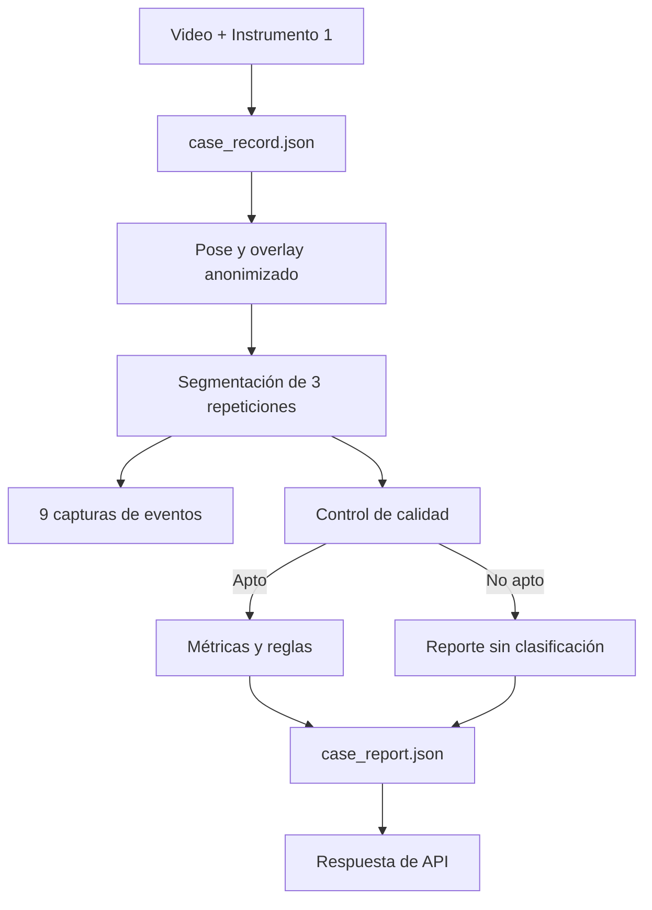

# Evidencia de contratos, capturas y API previa a la interfaz

## 1. Incremento implementado

Este incremento completa las prioridades previas a la interfaz:

1. esquemas de `case_record.json` y `case_report.json`;
2. generación de ambos contratos desde el pipeline;
3. capturas de inicio, máxima profundidad y final por repetición.

También incorpora la API mínima para que el frontend no dependa de rutas locales.

## 2. Componentes verificables

| Componente | Evidencia |
|---|---|
| Contratos Pydantic | `src/squat/contracts.py` |
| Esquemas JSON | `config/squat/schemas/` |
| Capturas anonimizadas | `src/squat/evidence.py` |
| Orquestación completa | `src/squat/service.py` |
| Comandos reproducibles | `scripts/run_squat_analysis.py` |
| Endpoints | `api/routes/squat.py` |
| Pruebas | `tests/squat/test_contracts.py`, `tests/squat/test_evidence.py`, `tests/test_squat_api.py` |

## 3. Flujo demostrado

## 4. Validación con video piloto

Se ejecutó el pipeline completo sobre:

`data/sentadilla_bilateral/raw/dev_valgo_izq_002.mp4`

Resultados:

- 662 fotogramas procesados;
- 100 % de fotogramas válidos;
- promedio de 13 puntos detectados por fotograma;
- tres repeticiones;
- nueve capturas anonimizadas;
- estado `analisis_completo`;
- valgo dinámico visible izquierdo presente;
- asimetría bilateral observable presente;
- desplazamiento lateral de pelvis no concluyente.

| Repetición | Inicio | Máxima profundidad | Final |
|---|---:|---:|---:|
| 1 | Fotograma 28 | Fotograma 199 | Fotograma 223 |
| 2 | Fotograma 271 | Fotograma 388 | Fotograma 411 |
| 3 | Fotograma 474 | Fotograma 592 | Fotograma 621 |

La inspección visual confirmó que las imágenes proceden del overlay y mantienen el pixelado facial.

## 5. Relación con los objetivos

Este incremento fortalece principalmente la demostración de la implementación del prototipo:

- reúne las salidas en un reporte único;
- conserva trazabilidad entre entrada, calidad, variables, reglas y resultado;
- permite demostrar el funcionamiento sin mostrar código;
- ofrece imágenes comparables de eventos biomecánicos;
- hace consumible el prototipo mediante HTTP.

También conserva evidencia de pose, segmentación, variables y criterios interpretables.

## 6. Manejo de fallos

- Un registro pendiente o rechazado no inicia la pose.
- Un video que no supera calidad no genera hallazgos.
- Un archivo que no es video es rechazado.
- Un identificador repetido produce conflicto.
- Las rutas absolutas se eliminan del reporte.
- Los archivos se sirven solo desde la carpeta del caso.

## 7. Verificación automatizada

La suite dirigida de sentadilla y API completó 76 pruebas correctamente. La suite completa del repositorio registró 235 pruebas correctas y dos fallas ajenas a este incremento:

- conexión no disponible a Supabase en una prueba del catálogo de chat;
- bloqueo concurrente del almacenamiento local Qdrant en una prueba de indexación.

La ejecución real del video piloto complementó las pruebas unitarias con una validación de integración del pipeline completo.

## 8. Estado

Las prioridades previas a la interfaz están implementadas. El siguiente incremento debe diseñar la experiencia web apoyándose en contratos y endpoints estables, sin acceder directamente a los CSV ni duplicar reglas en JavaScript.
