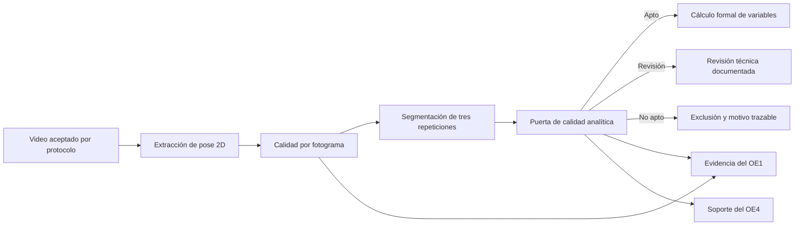

# Evidencia transversal: control de calidad analítica

## Función dentro de los objetivos

El control de calidad no constituye un objetivo específico independiente. Se relaciona principalmente con:

- **Objetivo Específico 1:** verifica que los puntos anatómicos clave necesarios estén disponibles durante el video y en los fotogramas críticos;
- **Objetivo Específico 4:** evita que el prototipo continúe el flujo formal con entradas que no pueden producir resultados biomecánicos completos.

La puerta se ejecuta después de la extracción de pose y la segmentación, y antes del cálculo formal de variables.

## Diferencia entre dos controles

1. **Aceptación del protocolo de captura:** revisión inicial de vista, iluminación, fondo, encuadre, oclusiones y ejecución. Se registra mediante el Instrumento 1.
2. **Calidad analítica automática:** revisión posterior de la disponibilidad real de puntos anatómicos clave y fases detectadas. Se genera desde las salidas del software.

Un video puede superar la revisión visual inicial y aun así presentar pérdidas temporales que obliguen a excluirlo del análisis.

## Flujo



## Política técnica inicial

La política implementada es configurable y está separada de los futuros umbrales biomecánicos:

| Criterio | Exclusión | Advertencia |
|---|---:|---:|
| Fotogramas procesados correctamente | Menos de 99 % | No aplica |
| Fotogramas válidos del video | Menos de 90 % | Entre 90 % y menos de 95 % |
| Repeticiones completas | Distinto de 3 | No aplica |
| Fotogramas válidos por repetición | Menos de 80 % | Entre 80 % y menos de 90 % |
| Máxima profundidad | Fotograma crítico no válido | No aplica |

Los porcentajes son valores operativos iniciales para desarrollo y deberán confirmarse metodológicamente antes de congelar el protocolo final. La exigencia de tres repeticiones y de máxima profundidad válida deriva directamente del protocolo de captura y de la necesidad de calcular variables en la fase crítica.

## Estados

- `apto_para_analisis`: cumple criterios de exclusión y recomendaciones.
- `revision_requerida`: no presenta una falla excluyente, pero incumple una recomendación.
- `no_apto_para_analisis`: falla al menos un criterio crítico y no debe incorporarse al análisis formal.

El comando devuelve código de salida `2` cuando el video no es apto, lo que permite detener automáticamente un pipeline.

## Resultados actuales

| Caso | Estado | Motivo principal |
|---|---|---|
| `squat-normal-1` | Apto para análisis | Cumple todos los criterios |
| `squat-normal-2` | Apto para análisis | Cumple todos los criterios |
| `squat-controlado-1` | Apto para análisis | Cumple todos los criterios |
| `squat-controlado-2` | No apto para análisis formal | Repetición 3 con 78.30 % de fotogramas válidos y máxima profundidad no válida |

Esta decisión no clasifica compensaciones. Solo determina si la evidencia visual permite calcularlas de forma completa.

## Ejecución

```powershell
D:\anaconda4\envs\analisis-bio\python.exe scripts\run_squat_analysis.py quality-check `
  --case-id caso_001 `
  --pose-summary-json data\sentadilla_bilateral\outputs\caso_001\pose_summary.json `
  --segmentation-summary-json data\sentadilla_bilateral\outputs\caso_001\segmentation_summary.json `
  --frame-quality-csv data\sentadilla_bilateral\outputs\caso_001\frame_quality.csv
```

La salida queda almacenada en `quality_gate_summary.json`, con cada verificación, valor observado, requisito, advertencias y motivos de exclusión.
