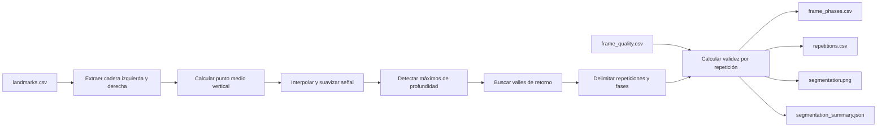

# Evidencia técnica de la Fase 3: segmentación temporal

## Propósito

Esta evidencia demuestra que el sistema puede dividir una grabación frontal de sentadilla bilateral en repeticiones y fases temporales antes de calcular variables biomecánicas. La segmentación no clasifica compensaciones ni establece diagnósticos.

## Señal utilizada

La señal base es la coordenada vertical normalizada del punto medio entre ambas caderas. En coordenadas de imagen, un valor mayor representa un desplazamiento hacia abajo. Después de interpolar valores aislados y suavizar la serie, los máximos locales prominentes representan la mayor profundidad de cada repetición.

Los valles anteriores y posteriores se utilizan para delimitar:

- inicio del descenso;
- máxima profundidad;
- ascenso;
- cierre y retorno al reposo.

## Flujo implementado



## Resultados sobre los videos iniciales

| Caso | Repeticiones detectadas | Fotogramas de máxima profundidad | Validez por repetición |
|---|---:|---|---|
| `squat-normal-1` | 3 | 256, 527, 726 | 100 %, 100 %, 100 % |
| `squat-normal-2` | 3 | 201, 460, 675 | 100 %, 100 %, 100 % |
| `squat-controlado-1` | 3 | 280, 602, 900 | 100 %, 100 %, 100 % |
| `squat-controlado-2` | 3 | 242, 544, 781 | 100 %, 100 %, 78.30 % |

La menor validez de la tercera repetición de `squat-controlado-2` no significa que la repetición no exista. Indica que una parte del intervalo requiere revisión por pérdida temporal de referencias del tobillo y pie izquierdos.

## Artefactos verificables

Por cada caso, el comando `segment` genera:

- `frame_phases.csv`: señal original, señal suavizada, fase y repetición por fotograma;
- `repetitions.csv`: inicio, máxima profundidad, fin y duración de cada repetición;
- `segmentation.png`: evidencia visual de la señal y sus ciclos;
- `segmentation_summary.json`: resumen estructurado y versionado.

Ejemplo reproducible:

```powershell
D:\anaconda4\envs\analisis-bio\python.exe scripts\run_squat_analysis.py segment `
  --case-id squat-normal-1 `
  --landmarks-csv data\sentadilla_bilateral\outputs\squat-normal-1\landmarks.csv `
  --frame-quality-csv data\sentadilla_bilateral\outputs\squat-normal-1\frame_quality.csv
```

## Alcance y siguiente validación

Los cuatro videos permiten validar la implementación inicial y la coherencia visual de tres ciclos por caso. Todavía se requerirán videos adicionales con velocidades, pausas, profundidades y calidades de captura diferentes para estimar la robustez del algoritmo y ajustar sus parámetros sin sobreajustarlos a esta muestra de desarrollo.
