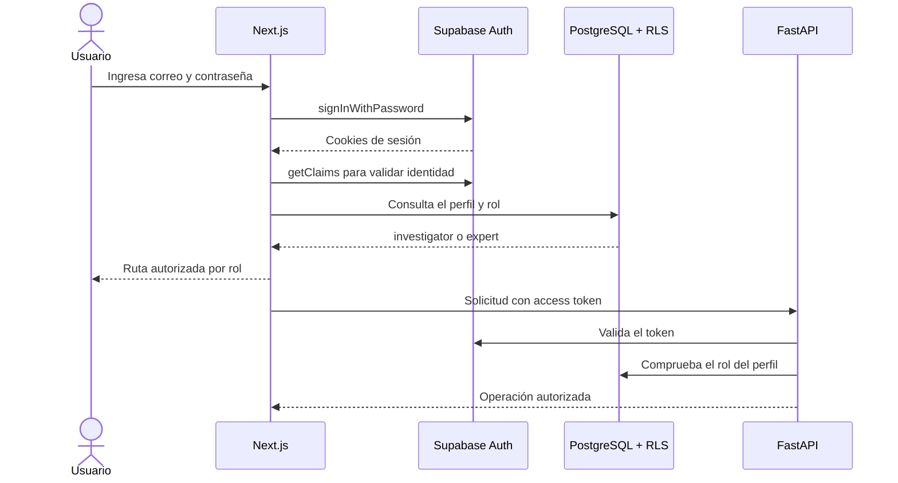

# Evidencia de la fase F1: autenticación y persistencia

## 1. Propósito

La fase F1 establece la frontera de seguridad y el modelo persistente de la aplicación web para el análisis de sentadilla bilateral. Esta fase no modifica los cálculos biomecánicos ni los umbrales del sistema. Su objetivo es asegurar que cada operación posterior tenga un usuario, un rol, un caso y una traza persistente.

## 2. Componentes implementados

| Componente | Implementación | Utilidad |
|---|---|---|
| Sesión web | Supabase Auth con correo y contraseña | Identifica al investigador y a los evaluadores |
| Autenticación SSR | `@supabase/ssr`, cookies y `proxy.ts` | Conserva y renueva la sesión en Next.js |
| Autorización por rol | `investigator` y `expert` | Separa el registro de casos de la evaluación experta |
| Protección de FastAPI | Validación remota del token y consulta del perfil | Evita confiar únicamente en controles visuales del frontend |
| Persistencia | PostgreSQL de Supabase | Conserva casos, análisis, artefactos y evaluaciones |
| Seguridad de datos | Row Level Security | Restringe filas según el rol y la asignación |
| Archivos | Buckets privados | Evita publicar videos y resultados del estudio |

## 3. Arquitectura de autenticación



La página pública y la pantalla de acceso pueden prerenderizarse. Las rutas autenticadas se resuelven dinámicamente dentro de límites `Suspense`. No se aplica `use cache` a sesiones, perfiles, casos privados ni evaluaciones.

## 4. Modelo persistente

| Tabla | Responsabilidad |
|---|---|
| `profiles` | Rol del usuario dentro del estudio |
| `squat_cases` | Identificación, estado e Instrumento 1 |
| `squat_analysis_runs` | Ejecución, versiones, reporte y errores |
| `squat_artifacts` | Rutas privadas de overlays, capturas, tablas y gráficos |
| `squat_expert_assignments` | Casos asignados a cada evaluador |
| `squat_expert_evaluations` | Borrador o envío del Instrumento 3 |
| `squat_expert_evaluation_items` | Clasificación independiente de cada patrón |

Los contratos completos pueden almacenarse en `jsonb`, mientras que los campos utilizados para filtrar, paginar, autorizar o controlar estados permanecen como columnas.

## 5. Reglas de acceso

- El investigador puede crear y administrar los casos del estudio.
- El evaluador solo puede consultar los casos que le fueron asignados.
- El evaluador no puede consultar ejecuciones, artefactos ni resultados computacionales.
- El evaluador puede editar su evaluación mientras se encuentre en borrador.
- Una evaluación enviada no puede volver a modificarse mediante las políticas normales.
- Los buckets `squat-inputs`, `squat-artifacts` y `squat-exports` son privados.
- FastAPI restringe los endpoints actuales de resultados al investigador.

La interfaz no constituye el único control. Las restricciones se aplican también en PostgreSQL y FastAPI.

## 6. Decisiones de Next.js

- Se utiliza App Router con Server Components por defecto.
- `cacheComponents` permanece habilitado.
- La autenticación se resuelve en el servidor mediante cookies.
- `getClaims()` protege las páginas; `getSession()` no se usa para tomar decisiones de autorización.
- Las rutas privadas producen Partial Prerendering: estructura estática y contenido de sesión transmitido dinámicamente.
- La paginación futura se representará mediante `searchParams` de la URL y consultas del servidor.

TanStack Query se reserva para el sondeo del estado de análisis en la fase de procesamiento. Zustand no se incorpora porque los datos persistentes pertenecen a Supabase y los formularios pueden mantener estado local sin un almacén global.

## 7. Configuración local

El frontend requiere un archivo `apps/web/.env.local` basado en `apps/web/.env.example`. Las cuentas deben crearse en Supabase Auth con los metadatos de usuario `display_name` y `squat_role`.

Roles previstos:

| Cuenta | Rol |
|---|---|
| Investigador | `investigator` |
| Evaluador 1 | `expert` |
| Evaluador 2 | `expert` |
| Evaluador 3 | `expert` |

La contraseña no debe incorporarse al repositorio. Si una cuenta ya existía antes de la migración, su columna `profiles.squat_role` debe actualizarse desde Supabase Studio.

Para activar la validación obligatoria en FastAPI:

```env
SQUAT_AUTH_REQUIRED=true
```

Mientras esta variable permanezca en `false`, FastAPI utiliza un investigador local únicamente para preservar la compatibilidad del pipeline y sus pruebas durante la transición.

## 8. Verificaciones

- ESLint del frontend.
- Pruebas unitarias de roles y rutas iniciales.
- Compilación de producción de Next.js con Cache Components.
- Pruebas de contratos y autorización de FastAPI.
- Migración preparada para una reconstrucción local de Supabase.

La validación de extremo a extremo con las cuatro cuentas requiere que el stack de Supabase local esté iniciado. Esa comprobación se incorporará al recorrido Playwright autenticado una vez creados los usuarios locales.

## 9. Relación con el proyecto

Esta fase permite demostrar que el prototipo no es únicamente una ejecución aislada de scripts. Cada video y resultado podrá asociarse a un caso persistente, conservar versiones, restringirse por rol y recuperarse posteriormente. Esta trazabilidad será necesaria para el cuarto objetivo específico y para la comparación ciega con evaluadores del objetivo de desempeño técnico.
