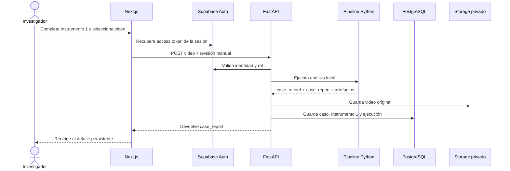

# Evidencia de la fase F2: registro, carga e historial

## 1. Propósito

La fase F2 conecta el Instrumento 1 con la aplicación web y convierte cada análisis en un caso recuperable. El frontend registra las condiciones observables, envía el video a FastAPI y consulta posteriormente el historial desde Supabase mediante paginación del servidor.

Esta fase no traslada cálculos biomecánicos al frontend. FastAPI sigue siendo la única capa que ejecuta el pipeline y construye los contratos `case_record.json` y `case_report.json`.

## 2. Flujo implementado



## 3. Componentes entregados

| Componente | Función |
|---|---|
| `/cases` | Historial SSR con filtros y paginación por URL |
| `/cases/new` | Registro del Instrumento 1 y carga accesible del video |
| `/cases/[caseId]` | Resumen inicial del reporte generado |
| `GET /api/v1/squat/cases` | Página estable de casos persistidos |
| `POST /api/v1/squat/cases` | Análisis y persistencia opcional del caso |
| `SupabaseSquatStore` | Escritura del video, caso y ejecución analítica |

## 4. Relación con los instrumentos

El formulario web registra los campos manuales del Instrumento 1:

- código del video y participante;
- fecha, fuente y dispositivo;
- iluminación y fondo;
- visibilidad corporal y oclusiones;
- observabilidad de la sentadilla;
- superficie;
- soporte externo bajo los talones;
- contacto aparente de los talones;
- conformidad de la condición de apoyo;
- observación del apoyo plantar.

Las opciones de selección utilizan los mismos códigos admitidos por `SquatManualProtocolReview`. El frontend no inventa categorías ni decide si el video es biomecánicamente apto.

El reporte devuelto inicia la representación del Instrumento 2 mediante:

- porcentaje de fotogramas válidos;
- repeticiones segmentadas;
- cantidad de patrones presentes;
- estado general del análisis;
- versión del pipeline.

La visualización completa de artefactos, reglas y gráficos corresponde a la fase F3.

## 5. Persistencia

Cuando `SQUAT_PERSISTENCE_REQUIRED=true`, FastAPI:

1. carga el video original en `squat-inputs/{case_id}/original.ext`;
2. inserta el caso y el Instrumento 1 en `squat_cases`;
3. inserta el reporte y las versiones en `squat_analysis_runs`;
4. expone el caso en el historial paginado.

Las escrituras se realizan desde FastAPI con la clave de servicio. El navegador nunca recibe esa clave. La autorización del usuario ocurre antes de la operación y los endpoints actuales de registro e historial están restringidos al investigador.

## 6. SSR, paginación y estado

El historial recibe `page` y `status` mediante `searchParams`. Next.js resuelve la consulta en un Server Component con `cache: "no-store"` porque contiene datos privados y variables. La URL conserva el estado del filtro y permite recargar o compartir una ruta interna sin Zustand.

TanStack Query continúa siendo innecesario mientras el endpoint de análisis sea síncrono. Se incorporará si la fase F3 transforma el procesamiento en una tarea de fondo que requiera sondeo periódico.

## 7. Prueba de integración real

Se procesó `dev_pelvis_der_002.mp4` mediante el endpoint autenticado con el identificador `f2_integracion_001`.

Resultados verificados:

| Verificación | Resultado |
|---|---|
| Respuesta HTTP | `200` |
| Caso persistido | `f2_integracion_001` |
| Participante | `P-F2-001` |
| Video privado | `squat-inputs/f2_integracion_001/original.mp4` |
| Ejecución persistida | Pipeline `0.1.0` |
| Historial paginado | Un registro recuperado |
| Estado obtenido | `excluded` |

El estado `excluded` se conservó porque el pipeline clasificó el video como no apto según sus controles actuales. La prueba no fuerza un resultado favorable: demuestra que la decisión real del motor se conserva desde el análisis hasta PostgreSQL y el historial.

## 8. Pruebas

- Pruebas API para recepción del video, contratos, artefactos, autorización e historial paginado.
- Build de Next.js con `/cases`, `/cases/new` y `/cases/[caseId]` como rutas parcialmente prerenderizadas.
- Playwright público y autenticado con sesión reutilizada mediante `storageState`.
- Prueba del formulario del Instrumento 1 sin ejecutar el pipeline pesado en cada corrida E2E.
- Integración manual real del pipeline, Storage, PostgreSQL y endpoint de historial.

## 9. Configuración del backend

Para usar la persistencia local:

```env
SUPABASE_URL=http://127.0.0.1:54321
SUPABASE_PUBLISHABLE_KEY=<publishable-key-local>
SUPABASE_SECRET_KEY=<secret-key-local>
SQUAT_AUTH_REQUIRED=true
SQUAT_PERSISTENCE_REQUIRED=true
```

Las claves se obtienen mediante `npx supabase status -o env` y no deben incorporarse al repositorio.

## 10. Relación con los objetivos

Esta fase aporta evidencia directa a la implementación del prototipo: demuestra que un registro metodológico puede convertirse en una ejecución reproducible, persistente y consultable. También mantiene trazabilidad entre entrada, Instrumento 1, reporte computacional y estado del caso, necesaria para las visualizaciones del Instrumento 2 y la comparación experta posterior.
