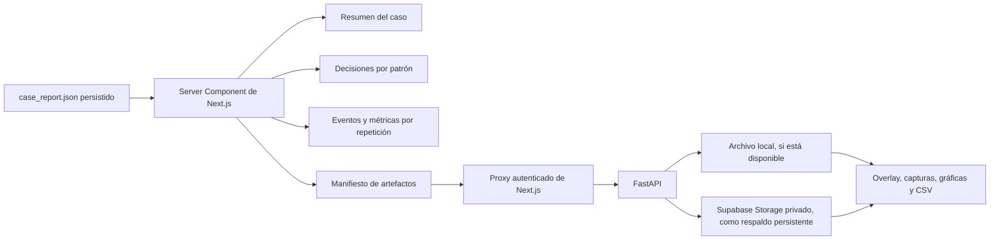

# Evidencia de implementación de la fase F3

## 1. Alcance implementado

La fase F3 convierte `case_report.json` y sus artefactos asociados en una vista
de resultados trazable para el investigador. El frontend no recalcula métricas
ni aplica umbrales. FastAPI continúa siendo la única fuente de verdad para la
estimación de pose, la segmentación, las variables biomecánicas y las
clasificaciones interpretables.

La ruta implementada es:

```text
/cases/{case_id}
```

La página presenta:

- estado técnico del caso;
- porcentaje de fotogramas válidos;
- promedio de puntos anatómicos clave detectados por fotograma;
- cantidad de repeticiones segmentadas;
- cantidad de patrones presentes;
- overlay anonimizado;
- saltos al inicio, máxima profundidad y final de cada repetición;
- clasificación independiente de los cuatro patrones;
- valores por repetición, umbrales y regla aplicada;
- capturas comparativas de máxima profundidad;
- gráficas de pose, segmentación y variables biomecánicas;
- controles de calidad;
- descargas técnicas relacionadas con el Instrumento 2.

## 2. Flujo implementado



## 3. Persistencia de artefactos

Al finalizar un análisis con persistencia habilitada, FastAPI guarda:

1. el video original en el bucket privado `squat-inputs`;
2. el registro del Instrumento 1 en `squat_cases.instrument_1`;
3. el reporte del Instrumento 2 en `squat_analysis_runs.report`;
4. cada archivo declarado en el manifiesto de `case_report.json` en
   `squat-artifacts`;
5. un registro por archivo en la tabla `squat_artifacts`.

No se cargan automáticamente archivos internos que no formen parte del
manifiesto. Esta restricción evita exponer resultados auxiliares no incluidos
en el contrato de la interfaz.

El endpoint de artefactos conserva una ruta local rápida. Si el directorio de
salida ya no existe, recupera el archivo desde Supabase Storage. Las solicitudes
parciales HTTP se reenvían para permitir reproducción y desplazamiento temporal
en el overlay.

## 4. Acceso desde el navegador

Un elemento `<video>` no puede adjuntar por sí solo el token Bearer utilizado
por FastAPI. Por ello se añadió un Route Handler autenticado:

```text
/api/squat/cases/{case_id}/assets/{filename}
```

El Route Handler:

- obtiene la sesión SSR de Supabase;
- reenvía el token a FastAPI;
- propaga encabezados de rango y tipo de contenido;
- no almacena el resultado en caché compartida;
- mantiene privados el overlay, las imágenes y los archivos técnicos.

## 5. Relación con el Instrumento 2

| Bloque de la interfaz | Información metodológica representada |
|---|---|
| Resumen técnico | Fotogramas procesados, fotogramas válidos, puntos clave promedio y repeticiones |
| Resultado por patrón | Salida interpretativa del sistema |
| Evidencia por repetición | Variable calculada, estado por repetición y valor agregado |
| Umbrales | Límites de ausencia y presencia del conjunto provisional de reglas |
| Capturas | Evidencia visual de máxima profundidad |
| Gráficas | Calidad de pose, segmentación temporal y evolución de variables |
| Control técnico | Criterios de aceptación, valor observado y requisito |
| Descargas | CSV de segmentación, calidad, métricas, reglas y puntos anatómicos |

La pantalla es una representación del Instrumento 2, no un instrumento nuevo.
Los archivos descargables permiten auditar o reconstruir los valores mostrados.

## 6. Relación con los objetivos específicos

| Evidencia visual | Objetivo respaldado |
|---|---|
| Overlay, calidad de pose y promedio de puntos clave | Identificar los puntos anatómicos clave y aplicar estimación de pose 2D |
| Eventos y gráfica de segmentación | Delimitar fases comparables del movimiento |
| Métricas y capturas por repetición | Calcular variables biomecánicas observables |
| Tarjetas de decisión, valores y umbrales | Aplicar criterios biomecánicos interpretables |
| Integración completa por caso | Implementar el prototipo funcional |

La interfaz no evalúa todavía el desempeño técnico frente a expertos. Ese
objetivo corresponde a las fases de evaluación ciega, consolidación y
comparación.

## 7. Decisiones de alcance

No se añadió Recharts ni otra librería de gráficas. El backend ya genera
gráficas reproducibles con Matplotlib, y las comparaciones breves por repetición
se representan con CSS. Una librería interactiva solo será necesaria si se
implementa posteriormente un cursor temporal sincronizado fotograma a
fotograma.

Tampoco se añadió TanStack Query en esta fase. El procesamiento actual es
síncrono y el formulario ya representa el estado de espera. Se incorporará
sondeo o ejecución en segundo plano únicamente si las mediciones con videos
reales muestran que la duración o la recuperación ante interrupciones lo
requieren.

## 8. Validación ejecutada

La integración real utilizó el caso `f3_integracion_001`.

Resultados:

- estado del caso en Supabase: `completed`;
- estado de la ejecución: `completed`;
- artefactos registrados en base de datos: 20;
- archivos almacenados en el bucket privado: 20;
- overlay persistido: sí;
- recuperación del overlay sin directorio local: HTTP 206;
- bytes recuperados en la prueba de rango: 1024.

Verificaciones automatizadas:

- pruebas dirigidas de FastAPI y persistencia: 6 aprobadas;
- pruebas Vitest: 4 aprobadas;
- pruebas Playwright: 6 aprobadas;
- ESLint: aprobado;
- build de producción de Next.js: aprobado.

## 9. Resultado de la fase

La demostración permite iniciar sesión, registrar y procesar un video, volver a
encontrar el caso en el historial y explicar visualmente cómo la estimación de
pose, la segmentación, las variables y las reglas producen una o varias
compensaciones observables. La siguiente fase funcional corresponde a la
evaluación experta ciega.
