# Evidencia de la fase F4: evaluación experta ciega

## 1. Propósito

La fase F4 implementa la aplicación digital del Instrumento 3 para que los
evaluadores expertos clasifiquen de forma independiente cuatro patrones
observables de la sentadilla bilateral:

- inclinación lateral del tronco;
- desplazamiento lateral de pelvis;
- valgo dinámico visible;
- asimetría bilateral observable.

Esta fase no consolida todavía la referencia final ni calcula F1-score o
coeficiente Kappa. Esas operaciones corresponden a la fase F5, después de que
las evaluaciones hayan sido enviadas y bloqueadas.

## 2. Separación entre evidencia técnica y revisión experta

El procesamiento produce dos videos con la misma duración y secuencia:

| Artefacto | Usuario | Contenido | Finalidad |
|---|---|---|---|
| `overlay.mp4` | Investigador | Video anonimizado, landmarks y paneles del análisis | Explicar y auditar el funcionamiento computacional |
| `review.mp4` | Evaluador experto | Video anonimizado sin landmarks, umbrales ni resultados | Emitir un juicio observacional independiente |

El rostro se anonimiza antes de escribir ambos artefactos. Después se guarda el
fotograma limpio en `review.mp4` y se agregan las superposiciones únicamente a
la copia destinada al investigador.

## 3. Flujo implementado

```mermaid
flowchart LR
    A["Investigador selecciona un caso procesado"] --> B["Asigna dos o tres evaluadores"]
    B --> C["Experto inicia sesión"]
    C --> D["API valida rol y pertenencia de la asignación"]
    D --> E["Experto revisa review.mp4"]
    E --> F["Clasifica cuatro patrones independientes"]
    F --> G["Guarda borrador"]
    G --> H["Envía evaluación final"]
    H --> I["Evaluación bloqueada"]
    I --> J["Fase F5: consolidación y comparación"]
```

Un video puede recibir varias clasificaciones positivas porque los cuatro
patrones son independientes. La presencia de valgo, por ejemplo, no impide
registrar simultáneamente desplazamiento de pelvis o asimetría bilateral.

## 4. Controles de acceso

La evaluación ciega no depende solo de ocultar componentes en el frontend.
FastAPI comprueba el rol y la asignación antes de devolver información.

| Operación | Investigador | Experto asignado |
|---|---:|---:|
| Listar evaluadores | Sí | No |
| Asignar un caso | Sí | No |
| Consultar reporte y artefactos técnicos | Sí | No |
| Consultar asignaciones propias | No aplica | Sí |
| Reproducir `review.mp4` del caso asignado | No aplica | Sí |
| Guardar su borrador | No | Sí |
| Modificar una evaluación enviada | No | No |

La respuesta de detalle para el experto no contiene el reporte, los hallazgos,
las métricas biomecánicas, los umbrales ni las rutas de los artefactos técnicos.

## 5. Correspondencia con el Instrumento 3

Por cada patrón se registran:

- clasificación: ausente, presente o no concluyente;
- lado observado cuando corresponde: izquierdo, derecho, bilateral o sin
  dirección definida;
- confianza del evaluador: baja, media o alta;
- observación opcional.

También se admite una observación general del caso. El borrador puede contener
patrones pendientes, pero el envío final exige clasificar los cuatro. Al
enviarse, la evaluación cambia a estado final y queda inmutable.

## 6. Evidencia de verificación

La integración local se comprobó con un caso real procesado y dos cuentas de
experto. Los resultados observados fueron:

| Verificación | Resultado |
|---|---|
| Asignación del caso | Correcta |
| Ausencia de resultados del sistema en la respuesta experta | Correcta |
| Entrega parcial del video de revisión | HTTP 206 |
| Guardado de borrador | HTTP 200 |
| Envío final con los cuatro patrones | HTTP 200 |
| Intento de edición posterior | HTTP 409 |
| Intento del experto de consultar el reporte técnico | HTTP 403 |

Además, una prueba Playwright recorrió el flujo visible de inicio de sesión,
revisión del caso, clasificación, guardado, envío y bloqueo. Las pruebas
unitarias y de API verifican la validación multietiqueta, la autorización y la
diferencia entre `overlay.mp4` y `review.mp4`.

## 7. Relación con los objetivos específicos

La fase aporta evidencia a la implementación del prototipo y prepara la
evaluación de su desempeño técnico. Permite recolectar de manera estructurada la
referencia observacional independiente que, en la fase F5, será comparada con
las clasificaciones del sistema mediante coincidencias, discrepancias,
F1-score y coeficiente Kappa.
