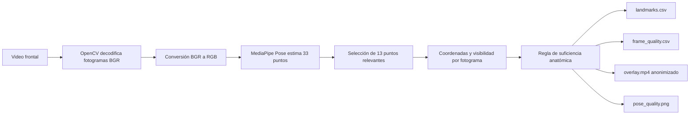
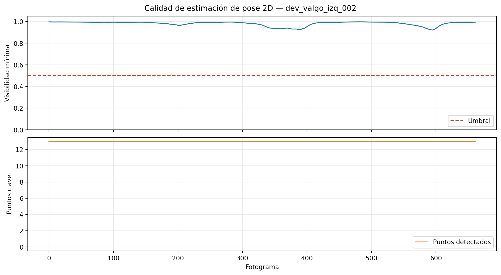

# Evidencia del Objetivo Específico 1: puntos anatómicos clave y pose 2D

## Objetivo vigente

**Identificar los puntos anatómicos clave del cuerpo (landmarks) en 2D relevantes para el análisis biomecánico observable de la sentadilla bilateral a partir de videos capturados con cámara convencional.**

## Qué debe demostrarse

El objetivo se considera técnicamente demostrado cuando el sistema puede decodificar el video, estimar la pose en cada fotograma, conservar los puntos relevantes con sus coordenadas y visibilidad, determinar si existe evidencia anatómica suficiente y producir una representación visual auditable. Esto no demuestra todavía segmentación, compensaciones ni desempeño frente a expertos.

## Flujo de evidencia



## Responsabilidad de cada componente

| Componente | Responsabilidad demostrable |
|---|---|
| OpenCV | Abre el archivo, consulta sus propiedades y decodifica secuencialmente los fotogramas. |
| Conversión de color | Transforma BGR, formato usado por OpenCV, a RGB, formato esperado por MediaPipe. |
| MediaPipe Pose | Estima coordenadas normalizadas `x`, `y`, `z`, visibilidad y presencia. |
| Lógica propia | Selecciona 13 referencias, aplica la regla de validez y crea resúmenes por fotograma. |
| OpenCV y FFmpeg | Dibujan y codifican los videos de revisión y overlay reproducibles en navegador. |
| Matplotlib | Genera la gráfica estática de calidad de pose 2D. |

## Puntos utilizados

Se conservan 13 puntos: nariz; hombros, caderas, rodillas, tobillos, talones y puntas de los pies de ambos lados. La nariz es una referencia complementaria y no decide por sí sola la validez.

Un fotograma es válido cuando se cumplen simultáneamente estas condiciones:

1. Los ocho puntos centrales, hombros, caderas, rodillas y tobillos bilaterales, tienen coordenadas finitas y visibilidad igual o superior a `0.50`.
2. Existe al menos una referencia distal utilizable por lado: talón o punta del pie.
3. MediaPipe devolvió una estructura de pose completa.

`minimum_critical_visibility` es el menor valor entre los ocho puntos centrales. No es un promedio. `detected_keypoints` sí cuenta cuántos de los 13 puntos son utilizables en el fotograma.

## Indicadores y fórmulas

```text
Fotogramas procesados correctamente (%) =
    100 × fotogramas decodificados / fotogramas declarados por el video

Fotogramas válidos (%) =
    100 × fotogramas con evidencia anatómica suficiente / fotogramas decodificados

Promedio de puntos detectados por fotograma =
    suma de puntos utilizables en todos los fotogramas / fotogramas decodificados
```

La primera fórmula verifica continuidad técnica de lectura. Las dos restantes describen la disponibilidad de la pose; no deben confundirse.

## Evidencia visual



La curva superior muestra la visibilidad crítica mínima frente al umbral `0.50`; la inferior muestra la cantidad de puntos utilizables, con máximo de 13. El artefacto dinámico equivalente es [overlay.mp4](../data/sentadilla_bilateral/outputs/dev_valgo_izq_002/overlay.mp4), que superpone el esqueleto, el estado del fotograma y el pixelado facial.

## Resultado verificable del caso demostrativo

| Indicador | Resultado `dev_valgo_izq_002` |
|---|---:|
| Fotogramas declarados | 662 |
| Fotogramas decodificados | 662 |
| Fotogramas con pose | 662 |
| Fotogramas válidos | 662 |
| Procesamiento correcto | 100.00 % |
| Validez global | 100.00 % |
| Promedio de puntos detectados | 13.00 de 13 |

## Artefactos auditables

| Artefacto | Evidencia aportada |
|---|---|
| `landmarks.csv` | Una fila por punto y fotograma con coordenadas y visibilidad. |
| `frame_quality.csv` | Resumen por fotograma: pose, validez, conteo y visibilidad crítica mínima. |
| `pose_summary.json` | Indicadores globales y rutas de artefactos. |
| `overlay.mp4` | Correspondencia visual entre persona, esqueleto y estado de calidad. |
| `pose_quality.png` | Evolución de visibilidad y disponibilidad a lo largo del video. |

## Criterio de cumplimiento y alcance

El OE1 cuenta con una implementación reproducible y evidencia visual, tabular y numérica. Su validación metodológica definitiva requiere aplicarlo a la muestra formal. Una pose válida significa que existen referencias suficientes para continuar; no garantiza por sí sola que la captura cumpla el protocolo completo ni que una repetición o variable sea analíticamente válida.
