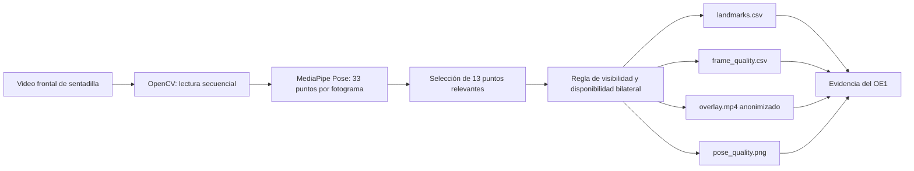

# Evidencia técnica del Objetivo Específico 1: estimación de pose 2D

## Objetivo relacionado

Identificar y extraer los puntos anatómicos clave del cuerpo en 2D relevantes para el análisis biomecánico observable de la sentadilla bilateral.

## Estado

El flujo base quedó implementado y probado con cuatro videos de desarrollo. Esta evidencia demuestra la capacidad técnica de detectar y exportar puntos anatómicos por fotograma; no clasifica todavía compensaciones ni sustituye la validación posterior con la muestra formal.

## Flujo implementado



## Puntos anatómicos exportados

- nariz como referencia complementaria;
- hombro izquierdo y derecho;
- cadera izquierda y derecha;
- rodilla izquierda y derecha;
- tobillo izquierdo y derecho;
- talón izquierdo y derecho;
- punta del pie izquierda y derecha.

## Regla inicial de fotograma válido

Un fotograma se considera válido cuando:

- hombros, caderas, rodillas y tobillos de ambos lados superan el umbral de visibilidad de 0.50;
- existe al menos una referencia distal utilizable por lado: talón o punta del pie;
- MediaPipe Pose produce una estructura completa de puntos.

Esta regla implementa la disponibilidad mínima definida para el Instrumento 1 y puede calibrarse posteriormente sin cambiar el contrato de salida.

## Resultados de los videos de desarrollo

| Caso | Fotogramas procesados | Pose detectada | Fotogramas válidos | Porcentaje válido | Observación |
|---|---:|---:|---:|---:|---|
| squat-normal-1 | 843 | 843 | 843 | 100.00 % | Pose estable durante toda la grabación |
| squat-normal-2 | 813 | 813 | 813 | 100.00 % | Pose estable durante toda la grabación |
| squat-controlado-1 | 996 | 996 | 996 | 100.00 % | Pose estable durante toda la grabación |
| squat-controlado-2 | 908 | 908 | 862 | 94.93 % | 46 fotogramas requieren revisión por pérdida de tobillo y referencia distal izquierdos |

## Artefactos verificables

Cada caso genera:

```text
data/sentadilla_bilateral/outputs/<case_id>/
  landmarks.csv
  frame_quality.csv
  overlay.mp4
  pose_quality.png
  pose_summary.json
```

El overlay incluye el esqueleto relevante, etiquetas de rodilla y tobillo, estado del fotograma, cantidad de puntos detectados, visibilidad mínima y pixelado facial. La gráfica permite ubicar temporalmente caídas de visibilidad y fotogramas que no cumplen la regla.

## Interpretación de los nombres de archivo

Los términos `normal` y `controlado` son etiquetas provisionales proporcionadas durante el desarrollo. No constituyen resultados del sistema ni referencia experta. La clasificación de compensaciones se realizará después de implementar segmentación temporal, variables biomecánicas y reglas interpretables, y se validará mediante el Instrumento 3.

## Estrategia de diagramación

Los diagramas se crearán incrementalmente cuando exista una implementación demostrable para cada objetivo específico. Mermaid será la fuente versionable durante el desarrollo. Al consolidar la tesis, los diagramas estables podrán migrarse a diagrams.net, Eraser o Excalidraw para su presentación final sin perder trazabilidad entre código, evidencia y objetivo.
