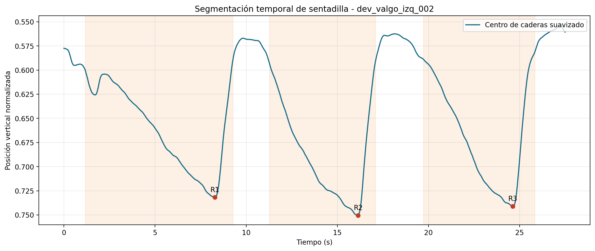

# Evidencia del Objetivo Específico 2: segmentación temporal de la sentadilla

## Objetivo vigente

**Establecer un procedimiento de segmentación temporal basado en la trayectoria vertical del punto medio de las caderas para delimitar repeticiones completas y localizar el fotograma de máxima profundidad de la sentadilla bilateral.**

## Qué debe demostrarse

El sistema debe transformar las coordenadas de ambas caderas en una señal temporal, reducir huecos breves y ruido, encontrar máximos de profundidad relevantes, evitar que una pausa inferior sea contada como otra sentadilla y etiquetar inicio, descenso, máxima profundidad, ascenso y cierre.

## Flujo de segmentación

```mermaid
flowchart LR
    A["Cadera izquierda y derecha por fotograma"] --> B["hip_midpoint_y"]
    B --> C["Interpolación de huecos breves"]
    C --> D["Mediana y promedio móvil centrados"]
    D --> E["Rango robusto P95 − P05"]
    E --> F["Máximos con prominencia suficiente"]
    F --> G["Separación temporal mínima"]
    G --> H["Validación de recuperación entre picos"]
    H --> I["Inicio · profundidad · cierre"]
    I --> J["frame_phases.csv y repetitions.csv"]
```



## Señal y limpieza

```text
hip_midpoint_y(f) = (y_cadera_izquierda(f) + y_cadera_derecha(f)) / 2
```

En coordenadas de imagen, `y` crece hacia abajo; por ello, un máximo de `hip_midpoint_y` representa una posición más profunda. La interpolación temporal cubre huecos breves únicamente para conservar continuidad de la señal. El fotograma continúa marcado como inválido en `frame_quality.csv`, de modo que la interpolación no fabrica evidencia biomecánica.

La ventana de suavizado es `max(3, round(fps × 0.20 s))`. Se aplica primero una mediana móvil centrada, que reduce estimaciones atípicas, y después un promedio móvil centrado, que atenúa pequeñas oscilaciones restantes.

## Prominencia y recuperación

```text
rango_robusto = P95(señal_suavizada) − P05(señal_suavizada)
prominencia_mínima = max(0.03, 0.18 × rango_robusto)

prominencia(p) = señal(p) − max(base_izquierda, base_derecha)
recuperación(p1,p2) = min(señal(p1), señal(p2)) − valle_entre_picos
```

- La prominencia verifica que un máximo sobresalga respecto de sus alrededores, no solo respecto del fotograma vecino.
- La ventana actual de búsqueda de bases es de hasta 10 segundos a cada lado del candidato.
- Los máximos separados por menos de 2 segundos compiten y se conserva el más profundo.
- Si dos máximos conservados no presentan una recuperación al menos igual a la prominencia mínima, pertenecen al mismo ciclo y se fusionan.

La última regla resolvió el caso límite en el que una pausa en profundidad produjo dos candidatos separados por `2.002 s`, pero con recuperación de solo `0.000204`, inferior a `0.03`. El sistema dejó de contarlos como dos repeticiones.

## Cómo se etiquetan las fases

Después de confirmar un máximo, el sistema busca a izquierda y derecha las posiciones más altas cercanas, representadas por los mínimos de la coordenada `y`. A partir de cada base construye un nivel equivalente al 15 % del recorrido hacia el pico:

```text
nivel_inicio = base_izquierda + 0.15 × (pico − base_izquierda)
nivel_cierre = base_derecha   + 0.15 × (pico − base_derecha)
```

El último cruce del nivel izquierdo marca el inicio; el primer cruce del nivel derecho marca el cierre. Los fotogramas entre inicio y pico se etiquetan como `descenso`, el pico como `maxima_profundidad`, los siguientes como `ascenso` y el cierre como `cierre`. Fuera de esos intervalos se conserva `reposo`.

La búsqueda de inicio y cierre se limita actualmente a 10 segundos alrededor del máximo. Esta decisión hace necesario el protocolo de ejecución continua: una pausa o fase que exceda ese intervalo puede impedir delimitar correctamente el ciclo y debe motivar revisión o nueva captura, no una conclusión biomecánica automática.

## Evidencia visual



Las regiones resaltadas corresponden a ciclos delimitados y los marcadores identifican el fotograma de máxima profundidad. La señal completa permite comprobar que el resultado no depende de una etiqueta escrita en el nombre del video.

## Resultado verificable del caso demostrativo

| Repetición | Inicio | Máxima profundidad | Cierre | Duración | Fotogramas válidos |
|---:|---:|---:|---:|---:|---:|
| 1 | 1.165 s | 8.279 s, F199 | 9.277 s | 8.112 s | 100 % |
| 2 | 11.274 s | 16.141 s, F388 | 17.098 s | 5.824 s | 100 % |
| 3 | 19.719 s | 24.628 s, F592 | 25.834 s | 6.115 s | 100 % |

## Puerta de calidad posterior

La detección temporal no basta para aceptar una ejecución. Cada repetición debe superar el porcentaje mínimo de fotogramas válidos y tener un fotograma de máxima profundidad válido. Si una repetición falla, se excluye esa ejecución sin ocultar las repeticiones válidas restantes. Si ninguna es elegible, el caso no continúa a variables ni comparación experta.

## Artefactos auditables

- `frame_phases.csv`: señal original, señal suavizada, fase y repetición por fotograma.
- `repetitions.csv`: inicio, máxima profundidad, cierre y duraciones.
- `segmentation_summary.json`: resumen estructurado de la etapa.
- `segmentation.png`: representación visual de la señal y los eventos.
- capturas `rep_XX_inicio_descenso.png`, `rep_XX_maxima_profundidad.png` y `rep_XX_final_ascenso.png`.

## Criterio de cumplimiento y alcance

El OE2 está implementado y cuenta con pruebas de casos normales y casos límite. Las ventanas, proporciones y umbrales son parámetros de ingeniería versionados; deben congelarse antes de la evaluación formal. El procedimiento localiza eventos observables bajo el protocolo, pero no determina por sí solo la calidad técnica de la sentadilla.
