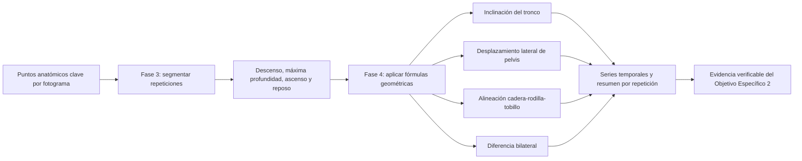

# Evidencia del Objetivo Específico 2: variables biomecánicas observables

## Objetivo demostrado

**Definir variables biomecánicas observables a partir de los puntos anatómicos clave estimados durante la sentadilla bilateral.**

La evidencia de este objetivo se compone de dos incrementos relacionados:

1. **Fase 3, segmentación temporal:** identifica repeticiones, fases y fotogramas de máxima profundidad.
2. **Fase 4, cálculo biomecánico:** transforma las coordenadas 2D de esos intervalos en variables geométricas trazables.

La Fase 3 es un prerrequisito técnico. La Fase 4 completa la evidencia principal mediante fórmulas, convenciones, series temporales, resúmenes por repetición y pruebas automatizadas.

## Flujo de trazabilidad



## Convenciones

- La captura corresponde a una vista anterior en el plano frontal.
- Las coordenadas `x` aumentan hacia la derecha de la imagen.
- En vista anterior, la derecha de la imagen corresponde al lado anatómico izquierdo.
- Un signo positivo de inclinación o desplazamiento representa dirección anatómica izquierda.
- La desviación de rodilla es positiva hacia medial y negativa hacia lateral.
- Las distancias se normalizan mediante el ancho de hombros observado durante el reposo inicial.
- Estas medidas son variables proxy 2D y no mediciones anatómicas tridimensionales.

## Fórmulas implementadas

### 1. Referencias centrales

Para hombros, pelvis y tobillos se utiliza el punto medio bilateral:

```text
S = (hombro_izquierdo + hombro_derecho) / 2
P = (cadera_izquierda + cadera_derecha) / 2
A = (tobillo_izquierdo + tobillo_derecho) / 2
```

El factor de normalización `W0` es la mediana del ancho de hombros en los fotogramas válidos del reposo inicial.

### 2. Inclinación lateral del tronco

```text
theta_tronco = atan2(Sx - Px, Py - Sy)
```

Se expresa en grados. Un valor positivo representa inclinación anatómica izquierda y un valor negativo, inclinación anatómica derecha.

### 3. Desplazamiento lateral de pelvis

```text
offset_pelvis = Px - Ax
desplazamiento_pelvis = 100 * (offset_pelvis - offset_inicial) / W0
```

La pelvis se evalúa respecto al centro de apoyo formado por ambos tobillos y se corrige con la posición inicial. El resultado es un porcentaje del ancho inicial de hombros.

### 4. Alineación cadera-rodilla-tobillo

Primero se calcula la posición esperada de la rodilla sobre la línea entre cadera y tobillo:

```text
t = (Ky - Hy) / (Ay - Hy)
Kx_esperado = Hx + t * (Ax - Hx)
```

Después se obtiene la desviación horizontal normalizada. El signo se adapta por lado para que el valor positivo siempre represente dirección medial:

```text
rodilla_izquierda = -100 * (Kx - Kx_esperado) / W0
rodilla_derecha   =  100 * (Kx - Kx_esperado) / W0
```

Esta variable describe alineación frontal observable. La clasificación como valgo dinámico visible requiere todavía una regla y un umbral, que corresponden a la Fase 5.

### 5. Diferencia bilateral

```text
diferencia_bilateral =
    abs(rodilla_izquierda - rodilla_derecha)
```

Se expresa como porcentaje del ancho inicial de hombros. Representa desigualdad entre ambos lados, pero todavía no determina por sí sola si existe una asimetría relevante.

## Resultados iniciales en máxima profundidad

Los siguientes intervalos corresponden a las tres repeticiones de cada video y no constituyen clasificaciones:

| Caso | Inclinación troncal en el pico | Desplazamiento pélvico en el pico | Diferencia bilateral en el pico |
|---|---|---|---|
| `squat-normal-1` | -2.70° a 2.05° | -7.80 % a -1.55 % | 2.18 % a 8.79 % |
| `squat-normal-2` | -7.28° a -3.72° | -1.66 % a -0.65 % | 0.22 % a 8.67 % |
| `squat-controlado-1` | 2.93° a 8.16° | -4.73 % a 2.58 % | 8.63 % a 21.66 % |
| `squat-controlado-2` | 1.74° a 7.48° | -5.67 % a -0.02 % | 18.11 % a 19.12 % |

La tercera repetición de `squat-controlado-2` no aporta medidas exactas en máxima profundidad porque ese fotograma fue marcado como no válido por pérdida de referencias distales izquierdas. El sistema conserva valores nulos en lugar de imputar una medición crítica.

## Artefactos generados

Por cada caso se exportan:

- `biomechanical_frame_metrics.csv`: variables por fotograma y fase;
- `biomechanical_repetition_metrics.csv`: valores de pico y extremos por repetición;
- `biomechanical_metrics.png`: gráfico temporal de las cuatro variables;
- `biomechanical_summary.json`: resumen versionado, convenciones y trazabilidad.

Ejemplo reproducible:

```powershell
D:\anaconda4\envs\analisis-bio\python.exe scripts\run_squat_analysis.py metrics `
  --case-id squat-normal-1 `
  --landmarks-csv data\sentadilla_bilateral\outputs\squat-normal-1\landmarks.csv `
  --frame-phases-csv data\sentadilla_bilateral\outputs\squat-normal-1\frame_phases.csv
```

## Separación entre medición e interpretación

La Fase 4 no utiliza etiquetas `normal`, `controlado`, `positivo` o `negativo` para calcular las variables. Tampoco aplica umbrales. Las reglas que traducirán estas medidas en inclinación lateral del tronco, desplazamiento lateral de pelvis, valgo dinámico visible o asimetría bilateral observable se implementarán y validarán en la Fase 5.

## Necesidad de videos adicionales

Los cuatro videos actuales son suficientes para verificar fórmulas, signos, exportaciones y casos de datos inválidos. Antes de fijar umbrales será necesario incorporar mayor diversidad de:

- participantes;
- amplitudes y direcciones de compensación;
- velocidades de ejecución;
- profundidad;
- calidad de captura;
- casos negativos y positivos controlados por cada patrón.
