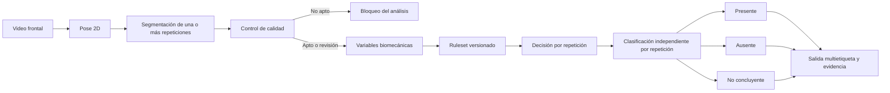

# Evidencia del Objetivo Específico 3: criterios biomecánicos interpretables

## 1. Objetivo demostrado

El tercer objetivo específico consiste en establecer criterios biomecánicos
interpretables para traducir las variables observables de la sentadilla
bilateral en compensaciones posturales y asimetrías cinemáticas.

La evidencia no se limita a una descripción conceptual. El prototipo ya
implementa un motor determinista que:

- consume exclusivamente métricas calculadas en la Fase 4;
- aplica reglas y umbrales almacenados fuera del código;
- evalúa cada repetición válida de forma independiente;
- conserva los estados `presente`, `ausente` y `no_concluyente`;
- permite múltiples hallazgos por video;
- registra el valor, la dirección, la banda de decisión y la justificación;
- bloquea casos rechazados por el control de calidad.

## 2. Artefactos técnicos

| Artefacto | Función |
|---|---|
| `config/squat/ruleset_v0_1_provisional.json` | Umbrales provisionales, unidades, versión y base de calibración |
| `src/squat/rules.py` | Aplicación determinista de las reglas |
| `src/squat/models.py` | Contratos tipados de reglas, decisiones y resultados |
| `scripts/run_squat_analysis.py classify` | Ejecución reproducible desde la terminal |
| `tests/squat/test_rules.py` | Pruebas de dirección, multietiqueta, incertidumbre y exclusión |
| `findings.json` | Resultado interpretable por video |
| `rule_evidence.csv` | Evidencia tabular de cada decisión |

## 3. Flujo de decisión

La etiqueta prevista durante la grabación no participa en este flujo. Solo se
utiliza después para revisar si el patrón intentado fue representado.

## 4. Conjunto de reglas provisional

Versión implementada: `0.1.0-provisional`.

| Hallazgo | Variable | Ausente | No concluyente | Presente |
|---|---|---:|---:|---:|
| Inclinación lateral del tronco | Magnitud del ángulo en máxima profundidad | ≤ 8° | > 8° y < 12° | ≥ 12° |
| Desplazamiento lateral de pelvis | Magnitud normalizada en máxima profundidad | ≤ 5 % | > 5 % y < 8 % | ≥ 8 % |
| Valgo dinámico visible por lado | Desviación medial positiva de rodilla | ≤ 2 % | > 2 % y < 5 % | ≥ 5 % |
| Asimetría bilateral observable | Diferencia absoluta entre ambas rodillas | ≤ 8 % | > 8 % y < 12 % | ≥ 12 % |

Los porcentajes se normalizan por el ancho inicial de hombros. Los valores son
bandas de ingeniería provisionales, no puntos de corte clínicos. Se exige
aplicación independiente de la regla en cada repetición válida, sin consenso entre ejecuciones.

### 4.1 Convenciones direccionales

- Tronco y pelvis: signo positivo hacia el lado anatómico izquierdo y negativo
  hacia el derecho.
- Valgo: solo una desviación medial positiva puede activar la regla. Una
  desviación lateral negativa no se transforma en valgo mediante valor
  absoluto.
- Asimetría: la magnitud determina presencia y la comparación entre lados
  informa el predominio.

## 5. Resultados del lote piloto

| Caso | Hallazgos presentes con `ruleset_v0.1` |
|---|---|
| `dev_negativo_001` | Ninguno |
| `dev_pelvis_der_001` | Desplazamiento pélvico derecho |
| `dev_pelvis_izq_001` | Desplazamiento pélvico izquierdo, inclinación de tronco derecha y asimetría con predominio izquierdo |
| `dev_tronco_der_001` | Inclinación de tronco derecha y asimetría con predominio izquierdo |
| `dev_tronco_izq_001` | Inclinación de tronco izquierda y asimetría con predominio izquierdo |
| `dev_valgo_der_001` | Ninguno |
| `dev_valgo_izq_001` | Valgo visible izquierdo y asimetría con predominio izquierdo |

El resultado de `dev_valgo_der_001` es metodológicamente relevante: el sistema
no confirma la etiqueta intentada porque la rodilla derecha no presenta
medialización positiva suficiente. Esto demuestra que la clasificación no está
codificada para repetir el nombre del archivo.

Los hallazgos adicionales de asimetría en los casos de tronco deben revisarse
con nuevos videos. Por el momento son respuestas del umbral provisional y no
conclusiones definitivas.

## 6. Trazabilidad de calibración

```mermaid
flowchart LR
    A["ruleset_v0.1 provisional"] --> B["Videos con patrón intentado"]
    B --> C["Revisión geométrica y pruebas"]
    C --> D["Retroalimentación de expertos de desarrollo"]
    D --> E["Ajustes documentados"]
    E --> F["ruleset_v1.0 congelado"]
    F --> G["Videos finales nuevos"]
    G --> H["Expertos independientes"]
    H --> I["F1-score, precisión, sensibilidad y Kappa"]
```

Cada modificación deberá generar una nueva versión y documentar:

1. regla o umbral anterior;
2. evidencia que motivó el cambio;
3. regla o umbral nuevo;
4. videos utilizados para desarrollo;
5. fecha y responsable;
6. resultados antes y después.

Si una evaluación produce cambios en el sistema, pasa a considerarse una ronda
de desarrollo. La evaluación final deberá repetirse con casos y expertos no
utilizados para realizar esos ajustes.

## 7. Estado del objetivo

El Objetivo Específico 3 cuenta con una primera implementación demostrable. Las
reglas son explícitas, reproducibles y trazables, pero sus umbrales permanecen
provisionales. El objetivo se cerrará metodológicamente cuando el conjunto de
reglas sea calibrado, revisado y congelado antes de la evaluación final.
