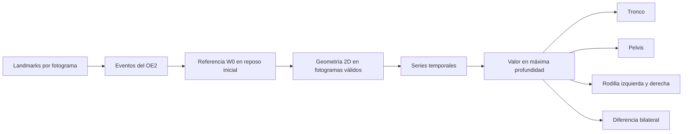
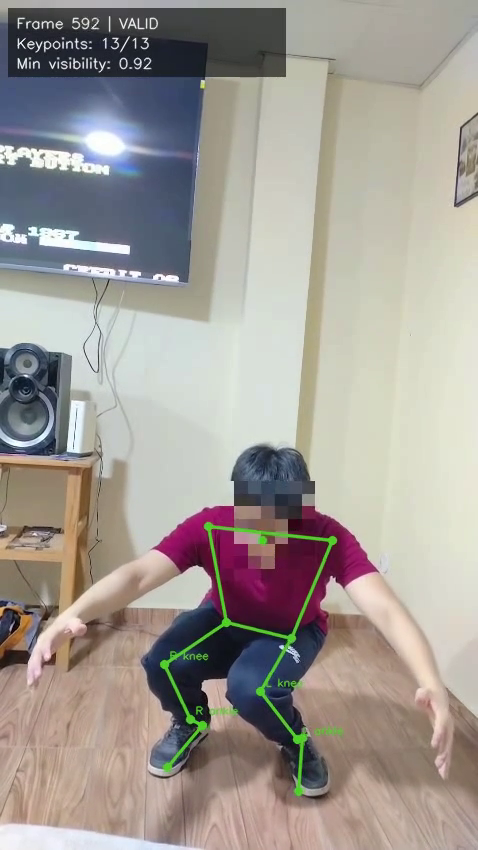
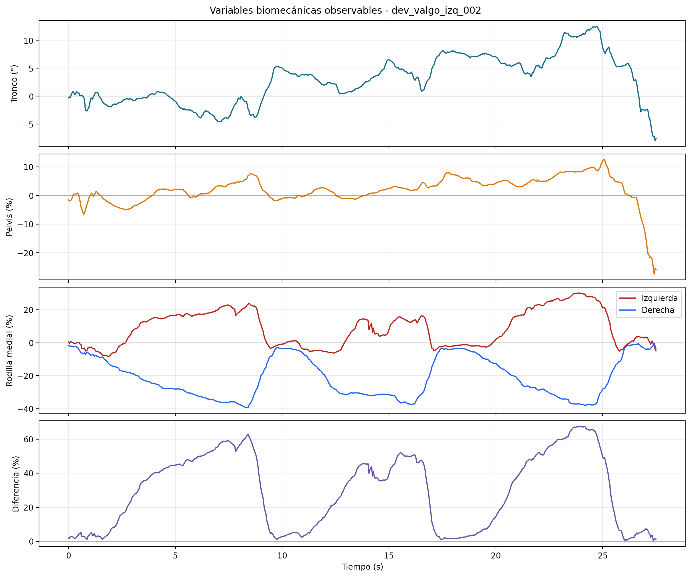

# Evidencia del Objetivo Específico 3: variables biomecánicas observables

## Objetivo vigente

**Definir y calcular variables biomecánicas observables derivadas de los puntos anatómicos clave del cuerpo (landmarks) en 2D y de los eventos temporales de la sentadilla bilateral.**

## Qué debe demostrarse

El objetivo exige transformar coordenadas 2D en medidas geométricas reproducibles, conservar sus series temporales y extraer en cada repetición el valor correspondiente al fotograma de máxima profundidad. La medición debe permanecer separada de la regla que posteriormente clasifica el patrón.

## Cadena de cálculo



## Convenciones necesarias

- La captura es anterior y frontal; `x` aumenta hacia la derecha de la imagen y `y` hacia abajo.
- En vista anterior, la derecha de la imagen corresponde al lado anatómico izquierdo.
- En tronco y pelvis, el signo conserva dirección anatómica, pero la magnitud se compara con los umbrales.
- En rodilla, el signo se ajusta por lado para que positivo siempre signifique desplazamiento medial.
- Las variables son proxies geométricos 2D; no reconstruyen rotaciones ni fuerzas tridimensionales.

## Referencia de escala W0

```text
W0 = mediana(|x_hombro_izquierdo − x_hombro_derecho|)
     en fotogramas válidos del reposo inicial
```

`W0` reduce la dependencia del tamaño de la imagen y de la distancia a cámara. Se usa para normalizar traslaciones, no para la inclinación angular del tronco.

## Variables y fórmulas

### Inclinación lateral del tronco

Sean `S` el centro de hombros y `P` el centro de caderas:

```text
theta_tronco = grados(atan2(Sx − Px, Py − Sy))
```

Mide la desviación del eje hombros-pelvis respecto de la vertical. Se expresa en grados porque describe orientación, no distancia.

### Desplazamiento lateral de pelvis

Sean `P` el centro de caderas y `A` el centro de tobillos:

```text
offset(f) = Px(f) − Ax(f)
pelvis_pct(f) = 100 × (offset(f) − mediana(offset_reposo)) / W0
```

Los tobillos representan una base de apoyo más estable que las rodillas, que se desplazan durante la sentadilla.

### Alineación cadera-rodilla-tobillo

Para cada lado se interpola la posición horizontal esperada de la rodilla sobre la línea cadera-tobillo:

```text
t = (Ky − Hy) / (Ay − Hy)
Kx_esperado = Hx + t × (Ax − Hx)

rodilla_izquierda = −100 × (Kx_real − Kx_esperado) / W0
rodilla_derecha   =  100 × (Kx_real − Kx_esperado) / W0
```

La interpolación lineal responde: a la altura vertical real de la rodilla, ¿qué coordenada `x` tendría si estuviera sobre el eje cadera-tobillo? La diferencia con `Kx_real` cuantifica la desviación frontal observable.

### Diferencia bilateral de alineación de rodillas

```text
diferencia_bilateral =
    |alineación_izquierda − alineación_derecha|
```

Compara dos medidas construidas con la misma geometría, escala y unidad. No afirma una asimetría corporal general ni identifica por sí sola una causa anatómica.

## Evidencia visual





La primera imagen permite corroborar la posición corporal usada en el cálculo. La segunda conserva la evolución completa; la clasificación utiliza el valor del fotograma marcado como `maxima_profundidad`, no el promedio de toda la repetición.

## Ejemplo verificable: repetición 3 de `dev_valgo_izq_002`

| Variable | Valor en F592, 24.628 s |
|---|---:|
| Inclinación lateral del tronco | +12.38° |
| Desplazamiento lateral de pelvis | +9.55 % de W0 |
| Desviación medial de rodilla izquierda | +27.29 % de W0 |
| Desviación de rodilla derecha | −37.39 % de W0 |
| Diferencia bilateral de alineación | 64.67 % de W0 |

Estos valores son evidencia de cálculo. Su conversión en `presente`, `ausente` o `no concluyente` corresponde al OE4.

## Herramientas y artefactos

| Herramienta | Uso |
|---|---|
| pandas | Lee y reorganiza CSV por fotograma, punto, fase y repetición. |
| NumPy | Calcula puntos medios, medianas, ángulos, interpolaciones y normalizaciones. |
| Python | Aplica convenciones de lado, valida valores finitos y construye contratos. |
| Matplotlib | Genera curvas estáticas auditables. |

Artefactos: `biomechanical_frame_metrics.csv`, `biomechanical_repetition_metrics.csv`, `biomechanical_summary.json` y `biomechanical_metrics.png`.

## Criterio de cumplimiento y alcance

El OE3 está implementado mediante fórmulas explícitas, pruebas y salidas por fotograma y repetición. Las medidas representan geometría observable en 2D bajo el protocolo. No son diagnósticos, mediciones clínicas universales ni estimaciones directas de rotación, carga articular o causa anatómica.
