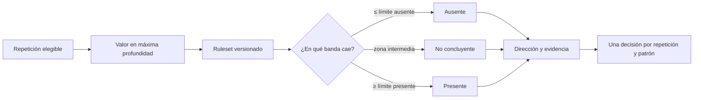

# Evidencia del Objetivo Específico 4: criterios biomecánicos interpretables

## Objetivo vigente

**Diseñar criterios biomecánicos interpretables para detectar inclinación lateral del tronco, desplazamiento lateral de pelvis, valgo dinámico visible y diferencia bilateral de alineación de rodillas.**

## Qué debe demostrarse

Cada valor calculado debe vincularse con una regla explícita, una versión, una banda de decisión, una dirección cuando corresponda y una justificación. El sistema debe admitir simultáneamente varios patrones y conservar la incertidumbre mediante `no concluyente`.

## Flujo de decisión

## Reglas provisionales implementadas

Versión vigente del caso demostrativo: `0.2.0-provisional`.

| Patrón | Medida | Ausente | No concluyente | Presente |
|---|---|---:|---:|---:|
| Inclinación lateral del tronco | Magnitud angular | ≤ 8° | > 8° y < 12° | ≥ 12° |
| Desplazamiento lateral de pelvis | Magnitud normalizada | ≤ 5 % | > 5 % y < 8 % | ≥ 8 % |
| Valgo dinámico visible | Desviación medial positiva por rodilla | ≤ 2 % | > 2 % y < 5 % | ≥ 5 % |
| Diferencia bilateral de alineación | Diferencia absoluta entre rodillas | ≤ 8 % | > 8 % y < 12 % | ≥ 12 % |

Los valores son bandas provisionales de ingeniería y no puntos de corte clínicos. Deben calibrarse y congelarse antes de la evaluación formal.

## Convenciones que evitan ambigüedad

- Tronco y pelvis: la magnitud define la banda; el signo indica dirección anatómica. Positivo corresponde a izquierda y negativo a derecha.
- Valgo: cada rodilla se evalúa por separado. Solo una desviación medial positiva activa la regla; una desviación lateral negativa no se transforma en valgo mediante valor absoluto.
- Diferencia bilateral: la magnitud define presencia y la comparación entre valores puede informar predominio. No equivale a una asimetría corporal general.
- Multietiqueta: detectar un patrón no impide detectar otro en la misma repetición.
- Calidad insuficiente: la repetición o variable se excluye o queda no concluyente; no se imputa una clasificación.

## Ejemplo de trazabilidad

| Repetición | Tronco | Pelvis | Valgo | Diferencia bilateral |
|---:|---|---|---|---|
| 1 | Ausente, −1.01° | No concluyente, +5.57 % | Presente izquierda, +21.37 % | Presente, 60.53 % |
| 2 | Ausente, +3.45° | Ausente, +1.81 % | Presente izquierda, +13.25 % | Presente, 50.35 % |
| 3 | Presente izquierda, +12.38° | Presente izquierda, +9.55 % | Presente izquierda, +27.29 % | Presente, 64.67 % |

El ejemplo muestra por qué la salida se conserva por repetición y patrón. No existe un consenso automático entre repeticiones.

## Artefactos auditables

| Artefacto | Evidencia aportada |
|---|---|
| `config/squat/ruleset_v0_1_provisional.json` | Versión, bandas, unidades y base de calibración. |
| `findings.json` | Clasificaciones estructuradas por repetición. |
| `rule_evidence.csv` | Valor, límites, estado, dirección y justificación. |
| `src/squat/rules.py` | Aplicación determinista sin consumir etiquetas intentadas ni evaluaciones expertas. |
| `tests/squat/test_rules.py` | Casos de dirección, bandas, multietiqueta e incertidumbre. |

## Separación entre desarrollo y evaluación

Usar los mismos casos para ajustar umbrales y reportar el desempeño produciría fuga de información. Las etiquetas intentadas de los videos solo sirven para inspección durante desarrollo; no entran en la clasificación automática.

## Criterio de cumplimiento y alcance

El OE4 tiene una implementación interpretable, reproducible y trazable. Se considera técnicamente demostrado en el prototipo, pero metodológicamente permanece abierto hasta calibrar y congelar los umbrales. Las salidas describen patrones observables; no diagnostican patologías ni explican su causa.
