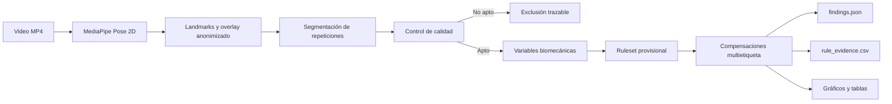

# Evidencia del Objetivo Específico 4: prototipo funcional

## 1. Objetivo

El cuarto objetivo específico consiste en implementar un prototipo funcional
que procese videos de sentadilla bilateral, estime la postura corporal y genere
resultados interpretables sobre las compensaciones posturales y asimetrías
cinemáticas detectadas.

## 2. Flujo funcional disponible

El flujo procesa una entrada real y genera una salida verificable sin utilizar
la etiqueta intentada como parte del análisis.

## 3. Evidencias generadas por caso

- `overlay.mp4`: visualización de puntos anatómicos y anonimización facial;
- `pose_quality.png`: calidad temporal de la pose;
- `segmentation.png`: repeticiones y máxima profundidad;
- `quality_gate_summary.json`: aceptación o exclusión técnica;
- `biomechanical_metrics.png`: evolución de variables;
- `biomechanical_repetition_metrics.csv`: medidas por repetición;
- `findings.json`: clasificación final por patrón;
- `rule_evidence.csv`: regla, valor, banda, dirección y estado.

## 4. Demostración con el segundo lote

El prototipo procesó 12 videos nuevos:

- 11 llegaron desde el video original hasta compensaciones detectadas;
- 1 fue bloqueado correctamente por no cumplir tres repeticiones;
- se conservaron salidas múltiples y estados no concluyentes;
- el sistema distinguió entre etiqueta intentada y evidencia geométrica;
- se identificaron casos exactos, parciales y no evaluables.

Los resultados detallados están documentados en
`docs/evaluacion_lote_piloto_002_multietiqueta.md`.

## 5. Relación con los objetivos

La segmentación, las variables y las reglas corresponden a evidencias
habilitadoras de los objetivos 2 y 3. Su integración en un flujo ejecutable de
entrada a salida constituye evidencia directa del Objetivo Específico 4.

Estas pruebas no demuestran todavía el Objetivo Específico 5. Para ello será
necesario:

1. congelar una versión del conjunto de reglas;
2. utilizar videos finales no empleados en calibración;
3. obtener una referencia independiente de expertos;
4. calcular F1-score, precisión, sensibilidad, especificidad y Kappa.

## 6. Estado actual

El núcleo analítico del prototipo está funcionalmente implementado. Para
fortalecer su demostración ante asesor y jurado aún conviene:

- unificar las etapas en un comando de procesamiento integral;
- generar un reporte legible por caso;
- ofrecer una vista resumida por lote;
- empaquetar overlays, gráficos y decisiones en una presentación local.

Estas mejoras corresponden a usabilidad y demostración. No cambian las
fórmulas ni el alcance metodológico aprobado.
