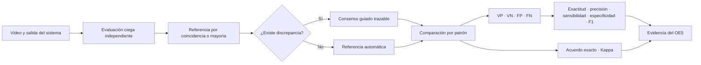

# Evidencia del Objetivo Específico 5: desempeño técnico

## Objetivo demostrado

Evaluar el desempeño técnico del sistema mediante métricas de clasificación y
concordancia frente a un criterio de referencia basado en evaluación experta.

## Flujo implementado

## Unidad de análisis

Cada patrón evaluado dentro de cada video constituye un par independiente:
referencia experta final frente a salida del sistema. Esta organización
permite calcular resultados específicos para tronco, pelvis, valgo y
asimetría bilateral sin que el acierto en una categoría compense un error en
otra.

## Reglas metodológicas implementadas

- Dos evaluadores coincidentes producen una referencia directa.
- Con tres evaluadores, al menos dos coincidencias producen mayoría absoluta.
- Una discrepancia sin mayoría requiere consenso guiado documentado.
- Los pares no concluyentes se contabilizan, pero se excluyen del denominador.
- F1-score utiliza presencia o ausencia del patrón.
- Kappa conserva dirección o lateralidad cuando el patrón la requiere.
- Los denominadores nulos se presentan como no disponibles.

## Evidencia técnica

La ruta `/cases/[caseId]/comparison` presenta:

- evaluaciones enviadas;
- clasificación del sistema;
- referencia final y método de consolidación;
- coincidencias y discrepancias;
- métricas generales y por patrón;
- exportaciones en Excel y PDF.

La lógica detallada, las fórmulas, endpoints y resultados del piloto se
documentan en `evidencia_frontend_fase_f5_comparacion_exportacion.md`.

## Limitación actual

La implementación completa el mecanismo necesario para evaluar el objetivo,
pero los valores del piloto no representan el desempeño definitivo. La
conclusión del OE5 deberá calcularse con la muestra formal y los expertos
definidos en la metodología.
