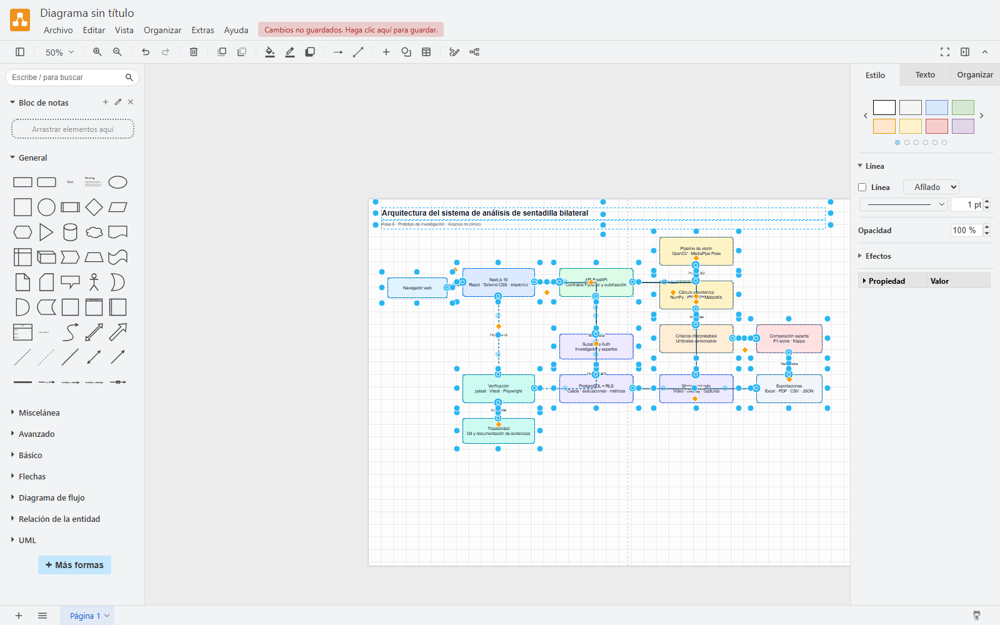
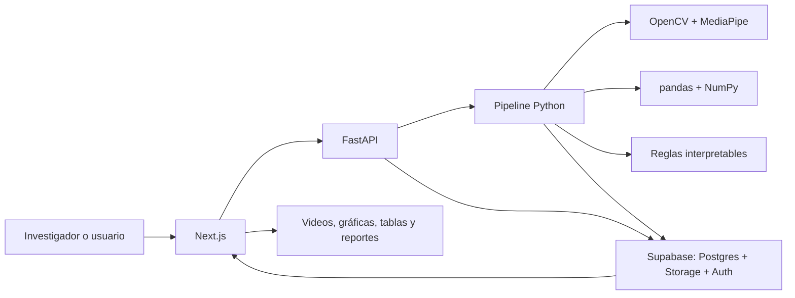
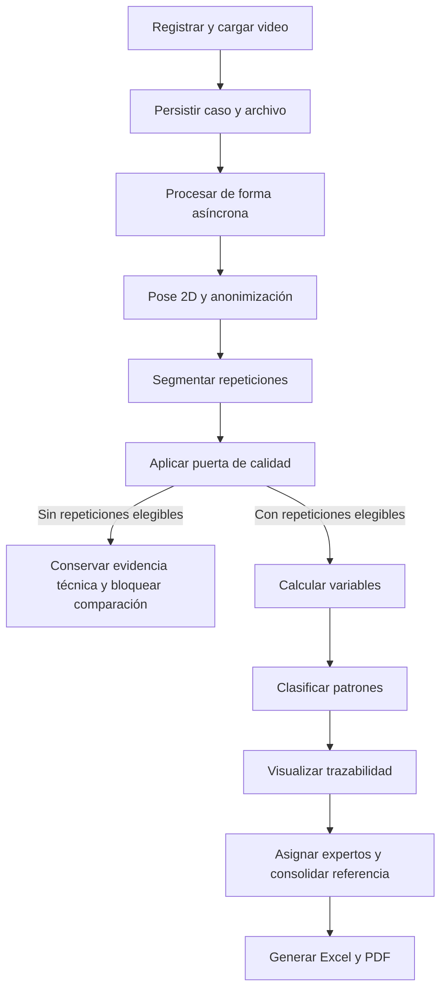
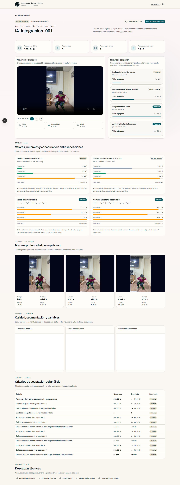
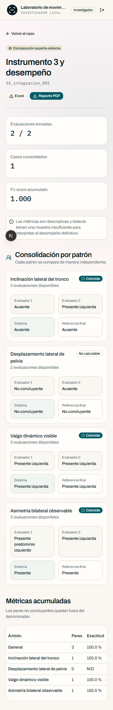

# Evidencia del Objetivo Específico 5: prototipo funcional

## Objetivo vigente

**Implementar un prototipo funcional que integre el registro del caso, procesamiento del video, estimación de pose 2D, segmentación temporal, cálculo biomecánico, clasificación interpretable, visualización y generación de reportes.**

## Qué debe demostrarse

El objetivo no se prueba mostrando una función aislada. Debe existir un flujo ejecutable de entrada a salida que conserve el caso, procese el video, muestre cómo se obtuvo el resultado, permita la evaluación ciega y genere archivos recuperables.

## Arquitectura implementada

## Flujo funcional por caso

## Capacidades demostrables

| Área | Implementación observable |
|---|---|
| Registro | Código trazable, metadatos, carga de MP4 y revisión de protocolo. |
| Procesamiento | Ejecución del pipeline sin depender de que el navegador permanezca abierto. |
| Privacidad | Pixelado facial en artefactos de revisión y almacenamiento con control de acceso. |
| Explicabilidad | Dos overlays, eventos temporales, gráficas sincronizadas, geometría, fórmulas y reglas. |
| Calidad | Exclusión por caso o repetición, sin ocultar ejecuciones válidas restantes. |
| Roles | Investigador, evaluador experto y espacio personal de usuario final. |
| Evaluación ciega | El experto clasifica sin ver la salida automática hasta el cierre del caso. |
| Persistencia | Historial, asignaciones, evaluaciones, referencias y artefactos recuperables. |
| Reportes | Instrumentos Excel, reporte PDF y datos técnicos normalizados. |

## Evidencia visual del prototipo

## Recorridos automatizados verificables

- [Registro y análisis de un caso](evidencias/fase6/playwright/flujo_registro_analisis_caso.webm).
- [Evaluación ciega por experto](evidencias/fase6/playwright/flujo_evaluador_experto.webm).
- [Comparación y descargas](evidencias/fase6/playwright/flujo_comparacion_descargas.webm).

Estos recorridos de Playwright demuestran integración entre interfaz, API y persistencia. Las pruebas unitarias y de integración verifican fórmulas y estados; los recorridos verifican el uso completo en navegador.

## Relación con los instrumentos

- Instrumento 1: registro, captura, admisibilidad y disponibilidad observable.
- Instrumento 2: procesamiento, segmentación, variables, reglas y resultados automáticos.
- Instrumento 3: clasificación experta y comparación con el sistema.

La interfaz digitaliza y organiza estos datos, pero no convierte la base consolidada de análisis en un cuarto instrumento.

## Artefactos de arquitectura y flujo

Los archivos editables se conservan en `docs/diagramas/fase6/`, especialmente:

- `arquitectura_sistema_sentadilla.drawio`;
- `secuencia_procesamiento_video.drawio`;
- `flujo_investigador_sentadilla.drawio`;
- `flujo_experto_instrumento3.drawio`;
- `flujo_video_no_apto_sentadilla.drawio`.

## Criterio de cumplimiento y alcance

El OE5 está funcionalmente implementado y desplegado. La extensión para usuario final permite cargar videos y consultar resultados automáticos, pero no forma parte de la construcción de la referencia experta ni del desempeño formal. El prototipo es una herramienta de apoyo educativo y analítico, no un sistema diagnóstico.
