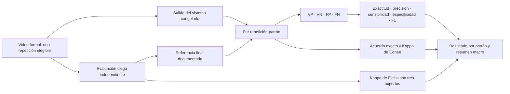

# Evidencia del Objetivo Específico 6: desempeño técnico

## Objetivo vigente

**Evaluar el desempeño técnico del sistema propuesto mediante métricas de clasificación y concordancia frente a un criterio de referencia basado en evaluación experta.**

## Qué debe demostrarse

El sistema debe comparar su clasificación con una referencia experta final mediante una unidad analítica explícita, conservar coincidencias y discrepancias, excluir de forma transparente los pares no concluyentes y calcular métricas por patrón sin que una categoría compense a otra.

## Flujo de evaluación



## Unidad de análisis

Cada combinación `video-repetición-patrón` constituye un par independiente entre sistema y referencia experta. En la muestra formal habrá una repetición elegible por video; por tanto, cada video aportará cuatro pares potenciales: tronco, pelvis, valgo y diferencia bilateral de alineación de rodillas.

## Construcción de la referencia

1. Dos evaluadores clasifican de forma independiente y ciega.
2. Si coinciden, su clasificación se adopta directamente.
3. Si discrepan, se realiza revisión documentada o se incorpora un tercer evaluador.
4. Con tres evaluadores se aplica mayoría absoluta.
5. Si la discrepancia no se resuelve, el par queda como no concluyente y no entra en las métricas binarias.

Las observaciones y la confianza permanecen disponibles como contexto, pero no sustituyen la clasificación nominal.

## Métricas implementadas

```text
Exactitud    = (VP + VN) / (VP + VN + FP + FN)
Precisión    = VP / (VP + FP)
Sensibilidad = VP / (VP + FN)
Especificidad= VN / (VN + FP)
F1           = 2VP / (2VP + FP + FN)

Kappa de Cohen = (Po − Pe) / (1 − Pe)
```

- F1 se calcula sobre presencia o ausencia del patrón.
- El acuerdo exacto y Kappa de Cohen pueden conservar lateralidad cuando corresponda.
- Kappa de Fleiss describe concordancia entre tres expertos antes de consolidar la referencia; no sustituye a Kappa de Cohen sistema-referencia.
- Un denominador nulo se reporta como `N/D`, no como cero inventado.
- Los pares no concluyentes se contabilizan por separado.

## Evidencia funcional existente

La ruta de comparación del prototipo presenta:

- evaluadores asignados y evaluaciones enviadas;
- salida del sistema oculta hasta el momento metodológicamente permitido;
- referencia final editable antes del cierre;
- coincidencia, discrepancia o resultado no calculable por patrón;
- matriz de confusión y métricas generales y por patrón;
- Kappa de Cohen y, cuando existen tres expertos por ítem, Kappa de Fleiss;
- exportaciones en Excel y PDF después del cierre del caso.


El recorrido [comparación y descargas](evidencias/fase6/playwright/flujo_comparacion_descargas.webm) comprueba el mecanismo de extremo a extremo.

## Artefactos auditables

| Artefacto | Evidencia aportada |
|---|---|
| Instrumento 3 | Clasificaciones de cada evaluador y del sistema. |
| Base consolidada interna | Referencia final, coincidencias, discrepancias y exclusiones. |
| Instrumentos Excel | Datos de entrada, procesamiento, comparación y métricas. |
| Reporte PDF | Resumen legible del caso cerrado. |
| Pruebas de comparación | Validación de fórmulas, ciclos de referencia y estados de cierre. |

## Estado real del objetivo

El mecanismo de evaluación está implementado y probado con datos de desarrollo. **El OE6 todavía no debe declararse concluido**, porque faltan la muestra formal, los evaluadores independientes y el ruleset congelado. Los valores de pilotos o fixtures demuestran funcionamiento del cálculo, no el desempeño definitivo de la tesis.

El cierre metodológico requerirá reportar, por patrón y de forma macro:

1. tamaño total y efectivo de pares;
2. VP, VN, FP y FN;
3. exactitud, precisión, sensibilidad, especificidad y F1;
4. Kappa de Cohen sistema-referencia;
5. Kappa de Fleiss entre tres expertos, cuando corresponda;
6. cantidad y motivo de pares excluidos o no concluyentes.
