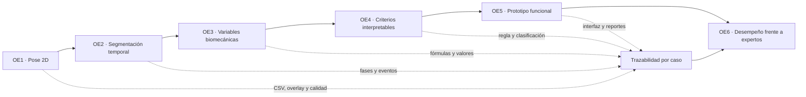

# Matriz de evidencias de los objetivos específicos

## Propósito

Este índice relaciona los seis objetivos específicos vigentes con la evidencia que permite demostrarlos. La numeración corresponde a la versión actual de [Plantilla_proyecto_de_tesis_completada.md](markdown-snapshots/Plantilla_proyecto_de_tesis_completada.md). La inserción del objetivo de segmentación temporal desplazó la numeración anterior de variables, criterios, prototipo y desempeño.

| Objetivo | Producto que lo demuestra | Evidencia principal | Estado |
|---|---|---|---|
| OE1. Identificar puntos anatómicos clave 2D | Coordenadas, visibilidad, calidad y overlay por fotograma | [Evidencia OE1](evidencia_objetivo_1_estimacion_pose_2d.md) | Implementado; validación formal pendiente |
| OE2. Establecer la segmentación temporal | Repeticiones, fases y fotograma de máxima profundidad | [Evidencia OE2](evidencia_objetivo_2_segmentacion_temporal.md) | Implementado y probado con casos de desarrollo |
| OE3. Definir y calcular variables biomecánicas | Series temporales y valores en máxima profundidad | [Evidencia OE3](evidencia_objetivo_3_variables_biomecanicas.md) | Implementado; fórmulas trazables |
| OE4. Diseñar criterios interpretables | Regla, banda, lateralidad y decisión por patrón | [Evidencia OE4](evidencia_objetivo_4_criterios_interpretables.md) | Implementado con umbrales provisionales |
| OE5. Implementar el prototipo funcional | Flujo web/API, persistencia, visualización y reportes | [Evidencia OE5](evidencia_objetivo_5_prototipo_funcional.md) | Implementado y desplegado |
| OE6. Evaluar el desempeño técnico | Comparación experta-sistema y métricas | [Evidencia OE6](evidencia_objetivo_6_desempeno_tecnico.md) | Mecanismo implementado; resultado formal pendiente |

## Cadena completa de demostración

## Caso demostrativo común

Los OE1 a OE4 utilizan `dev_valgo_izq_002` como caso explicativo porque conserva artefactos completos y tres repeticiones. Es un caso de desarrollo, no una observación de la muestra formal ni evidencia del desempeño definitivo. El OE5 utiliza capturas y recorridos automatizados del prototipo. El OE6 solo podrá cerrarse con la muestra formal, evaluadores independientes y la versión congelada de las reglas.

## Fuentes de detalle

- [Análisis interno de las fases 2 a 5](analisis_caso_dev_valgo_izq_002_fases_2_5.md).
- [Explicación visual de limpieza, prominencia y recuperación](explicacion_visual_limpieza_prominencia_segmentacion.md).
- [Definición del indicador de puntos anatómicos](explicacion_ajuste_indicador_puntos_anatomicos.md).
- [Guion de la presentación del proceso interno](guion_presentacion_proceso_interno_sentadilla.md).
- [Protocolo de participación y grabación](protocolo_participacion_grabacion_sentadilla.md).
