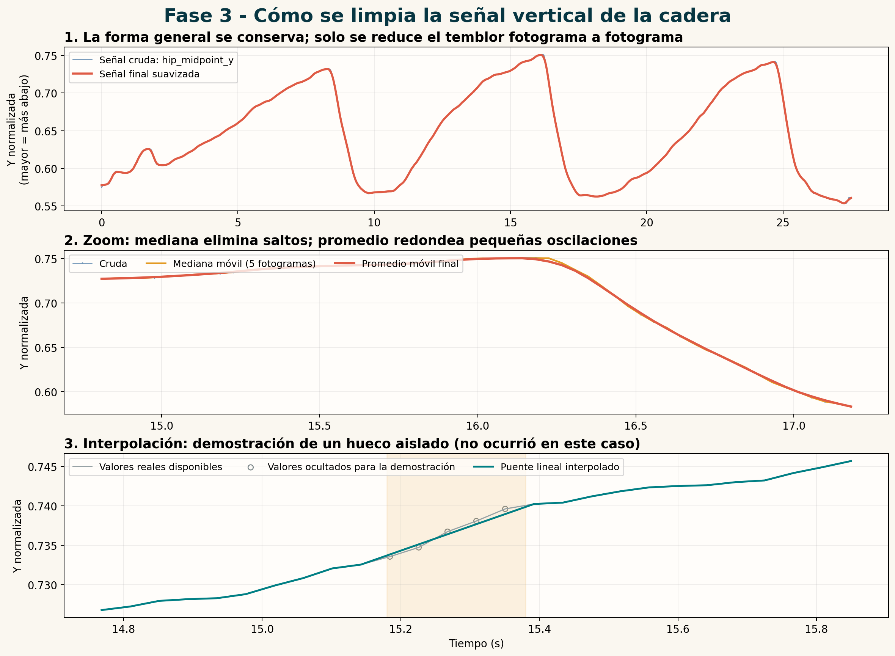
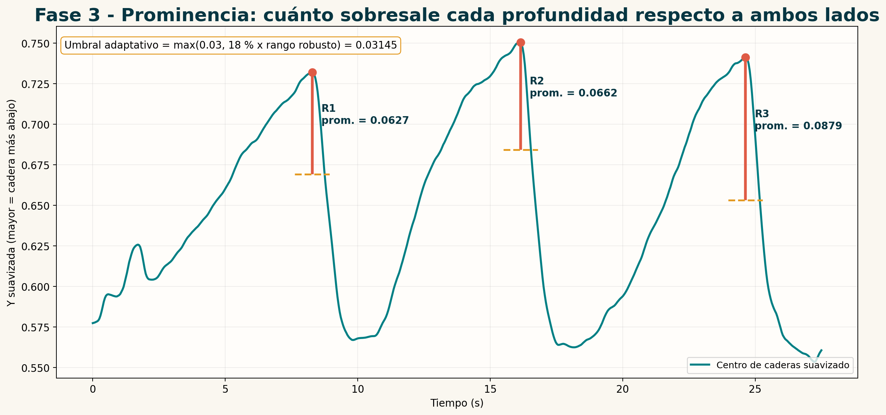
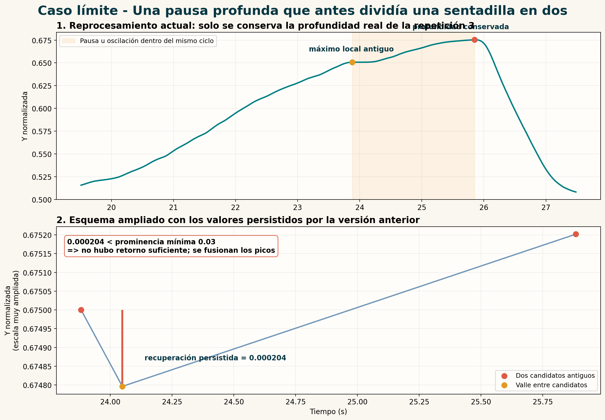

# Explicación visual de la limpieza, prominencia y separación de repeticiones

## 1. Propósito

Este documento profundiza los puntos 5.2 y 5.3 del análisis técnico del caso `dev_valgo_izq_002`. Su objetivo es explicar cómo una secuencia de coordenadas producida por MediaPipe Pose se transforma en una señal temporal suficientemente estable para localizar repeticiones de sentadilla.

La idea central es separar responsabilidades:

- **MediaPipe Pose** estima puntos anatómicos clave en cada fotograma.
- **Pandas y el procesamiento de señales** completan pérdidas numéricas aisladas y reducen ruido.
- **La detección de máximos y la prominencia** identifican profundidades que sobresalen de las oscilaciones menores.
- **Las reglas temporales y biomecánicas** deciden si dos máximos corresponden a dos repeticiones o a una pausa dentro de la misma sentadilla.

Por tanto, la prominencia no es una operación de OpenCV ni de MediaPipe. Es un concepto de procesamiento de señales unidimensionales.

## 2. Señal analizada

Para cada fotograma `f`, se calcula la coordenada vertical del centro de las caderas:

```text
hip_midpoint_y[f] = (y_cadera_izquierda[f] + y_cadera_derecha[f]) / 2
```

Las coordenadas están normalizadas respecto al alto de la imagen. En el sistema de coordenadas de video, `y = 0` corresponde a la parte superior y `y = 1` a la inferior. Por eso:

- un valor menor representa una cadera más alta;
- un valor mayor representa una cadera más baja;
- la máxima profundidad de la sentadilla aparece como un **máximo** de la señal.

Esta convención explica por qué el algoritmo busca picos y no valles.

## 3. Punto 5.2: limpieza de la señal



### 3.1. Por qué es necesaria

Aunque la persona se mueva de forma continua, la estimación de pose no es perfectamente estable. Entre fotogramas consecutivos pueden aparecer:

- pequeñas variaciones de posición producidas por el modelo;
- un valor atípico aislado;
- una coordenada ausente (`NaN`) por pérdida momentánea del punto anatómico;
- ruido visual causado por desenfoque, iluminación u oclusión parcial.

Si se buscan máximos directamente sobre esa señal cruda, una vibración pequeña podría convertirse en un máximo local falso. La limpieza no inventa un movimiento nuevo: intenta conservar la forma general del ciclo y reducir alteraciones breves.

### 3.2. Interpolación lineal

La interpolación estima un valor faltante situado entre dos observaciones disponibles. Si existe un valor conocido `x_a` en el fotograma `a` y otro `x_b` en el fotograma `b`, el valor intermedio `x_k` se calcula como:

```text
x_k = x_a + ((k - a) / (b - a)) x (x_b - x_a)
```

Ejemplo:

```text
fotograma 100: 0.60
fotograma 101: NaN
fotograma 102: 0.64

valor interpolado en 101 = 0.60 + (1 / 2) x (0.64 - 0.60) = 0.62
```

El código vigente utiliza:

```python
interpolated = (
    pd.Series(signal)
    .interpolate(limit_direction="both")
    .ffill()
    .bfill()
)
```

`interpolate()` construye el puente entre datos disponibles. `ffill()` y `bfill()` completan un eventual extremo sin valor usando la observación más cercana.

**Precisión metodológica:** interpolar una coordenada no convierte un fotograma originalmente deficiente en evidencia válida. La variable `valid_for_analysis` conserva el resultado de la puerta de calidad y posteriormente determina si la repetición dispone de suficientes fotogramas válidos.

En `dev_valgo_izq_002` no existían pérdidas en `hip_midpoint_y`; por ello, la tercera parte de la figura es una demostración controlada y no una alteración ocurrida en ese caso.

### 3.3. Mediana móvil

La mediana móvil sustituye cada muestra por la mediana de una ventana centrada alrededor de ella. Es especialmente útil contra saltos aislados.

```text
ventana = [0.60, 0.61, 0.90, 0.62, 0.63]
mediana = 0.62
promedio = 0.672
```

El valor `0.90` arrastra el promedio, pero apenas afecta a la mediana. Por eso la mediana se aplica primero: elimina impulsos sin depender de que estos sean positivos o negativos.

### 3.4. Promedio móvil

Después de la mediana, un promedio móvil reduce pequeñas irregularidades residuales:

```text
media[f] = suma de los valores de la ventana / número de valores
```

La mediana protege contra valores extremos y el promedio redondea el contorno. Son operaciones complementarias, no redundantes.

### 3.5. Tamaño de la ventana

La ventana equivale aproximadamente a `0.20 s`:

```text
ventana = max(3, redondear(fps x 0.20))
```

Para `dev_valgo_izq_002`:

```text
fps = 24.037884
ventana = redondear(24.037884 x 0.20) = 5 fotogramas
```

La ventana es centrada. Cada resultado utiliza muestras anteriores y posteriores, lo cual evita introducir deliberadamente un retraso temporal. Esta decisión es válida porque el análisis se realiza después de grabar el video; no sería directamente aplicable a un sistema estrictamente en tiempo real.

El valor de `0.20 s` es una heurística versionada del prototipo. No representa una duración biomecánica universal.

## 4. Punto 5.3: prominencia



### 4.1. Definición intuitiva

La prominencia responde a esta pregunta:

> ¿Cuánto sobresale este pico con respecto al nivel circundante necesario para reconocerlo como una elevación independiente?

No es:

- la altura absoluta del pico respecto a cero;
- la duración de la repetición;
- una probabilidad de que exista una sentadilla;
- la diferencia exclusiva con el fotograma vecino.

Su analogía es topográfica: una montaña puede ser alta sobre el nivel del mar pero poco prominente si está al lado de una montaña mayor y ambas comparten una meseta alta.

### 4.2. Definición de SciPy

SciPy define la prominencia como la distancia vertical entre la altura de un pico y su línea de contorno más baja. De manera resumida:

1. se extiende una línea horizontal desde el pico hacia ambos lados hasta encontrar un pico más alto o el límite de búsqueda;
2. se encuentra la base mínima a la izquierda y la base mínima a la derecha;
3. la base más alta de las dos determina la línea de contorno;
4. la prominencia es la diferencia vertical entre el pico y esa línea.

Formalmente:

```text
prominencia = altura_pico - max(base_izquierda, base_derecha)
```

Se utiliza el **máximo** de las dos bases porque un pico solo sobresale de forma independiente hasta el lado que ofrece menor separación vertical. Una depresión profunda en un solo lado no basta para reconocer un ciclo completo.

### 4.3. Implementación del proyecto

El proyecto no llama directamente a `scipy.signal.find_peaks`. Implementa una aproximación local del mismo concepto:

```python
if signal[index] >= signal[index - 1] and signal[index] > signal[index + 1]:
    left = signal[max(0, index - window):index]
    right = signal[index + 1:min(len(signal), index + window + 1)]
    prominence = signal[index] - max(left.min(), right.min())
```

Las bases se buscan en una ventana aproximada de tres segundos. En consecuencia, se calcula una **prominencia local**, no necesariamente la prominencia global de toda la grabación.

En la implementación, `P`, `BI` y `BD` son valores de la coordenada vertical normalizada del centro de caderas sobre la señal suavizada:

```text
P  = señal suavizada en el máximo local candidato
BI = mínimo de la señal en los tres segundos anteriores a P
BD = mínimo de la señal en los tres segundos posteriores a P
base de contorno local = max(BI, BD)
prominencia local = P - max(BI, BD)
```

El eje `y` de la imagen aumenta hacia abajo. Por eso, una sentadilla profunda produce un valor `P` mayor, mientras que el retorno hacia la posición alta produce valores menores. `BI` y `BD` no son intersecciones obligatorias con una misma línea horizontal ni equivalen necesariamente al reposo anatómico completo: son los mínimos encontrados de manera independiente a cada lado dentro de la ventana temporal. La línea horizontal dibujada por la interfaz corresponde únicamente a `max(BI, BD)`, es decir, a la base conservadora que limita la prominencia.

Por esta razón, en un caso como `dev_case_1784949757322`, `BD` puede coincidir con el valle `V` situado entre el pico actual y el siguiente. Esto ocurre cuando el menor valor de los tres segundos posteriores al pico es también el menor valor de todo el intervalo entre ambos picos. No representa un error ni exige que `BD` toque otra línea de referencia.

Los tres segundos pertenecen al parámetro versionado `peak_window_seconds=3.0` y limitan solamente la búsqueda local de `BI` y `BD`. Ampliar esa ventana puede permitir encontrar un retorno más lejano, pero también cambia qué oscilaciones se consideran parte del entorno del pico. Por tanto, modificarla altera el algoritmo y requiere repetir las pruebas de segmentación; no es únicamente un cambio gráfico.

La diferencia frente a SciPy es relevante para explicarlo correctamente:

- ambos enfoques comparten el concepto de máximo local, bases laterales y diferencia vertical;
- SciPy aplica un procedimiento general que también considera la intersección con picos más altos;
- este sistema usa los mínimos de una ventana temporal fija porque el dominio está delimitado a ciclos breves de sentadilla.

### 4.4. Umbral adaptativo

Primero se calcula un rango robusto:

```text
rango_robusto = percentil_95(señal) - percentil_05(señal)
```

Se usan percentiles y no `máximo - mínimo` para que uno o dos valores extremos no definan por sí solos el movimiento global.

`P05` y `P95` son los percentiles 5 y 95 de **todos los valores de la señal suavizada del video**. El valor de un pico de máxima profundidad participa en la distribución como cualquier otra muestra, pero `P95` no significa necesariamente "el pico P": es el valor por debajo del cual se encuentra aproximadamente el 95 % de las muestras. Todas estas magnitudes permanecen en coordenadas verticales normalizadas, no son porcentajes ni probabilidades.

Después:

```text
prominencia_mínima = max(0.03, 0.18 x rango_robusto)
```

En `dev_valgo_izq_002`:

```text
percentil 05 = 0.56298
percentil 95 = 0.73770
rango robusto = 0.17472
18 % del rango = 0.03145
prominencia mínima = max(0.03, 0.03145) = 0.03145
```

Las prominencias locales de las tres repeticiones fueron aproximadamente:

| Repetición | Prominencia | Comparación con 0.03145 |
|---|---:|---|
| 1 | 0.0627 | Supera el umbral |
| 2 | 0.0662 | Supera el umbral |
| 3 | 0.0879 | Supera el umbral |

El componente fijo `0.03` impide aceptar oscilaciones diminutas en un video con poco movimiento. El componente relativo `18 %` adapta la exigencia al rango observado. Ambos valores son criterios operativos del prototipo que deberán mantenerse versionados y someterse a validación empírica; no son umbrales clínicos universales.

### 4.5. Prominencia y distancia temporal no significan lo mismo

Una vez obtenidos los candidatos, el sistema exige una separación temporal mínima de dos segundos. Cada regla controla un problema distinto:

- **prominencia:** evita aceptar oscilaciones verticales pequeñas;
- **distancia:** evita contar dos máximos demasiado próximos;
- **recuperación entre máximos:** evita dividir una pausa prolongada en profundidad aunque haya transcurrido suficiente tiempo.

## 5. Relación con el error de cuatro repeticiones



En la versión anterior del caso `dev_case_1784949757322`, los fotogramas 716 y 776 fueron conservados como dos máximos porque estaban separados por `2.002 s`, apenas por encima del mínimo temporal de dos segundos.

Sin embargo, la señal solo descendió desde el menor de ambos máximos hasta el valle intermedio en `0.000204` unidades normalizadas. La persona no había retornado realmente hacia la posición alta: continuaba en el fondo de la misma repetición.

La corrección añade esta prueba:

```text
recuperación(p1, p2) = min(señal[p1], señal[p2])
                       - min(señal entre p1 y p2)
```

Aquí `p1` y `p2` son **dos picos candidatos consecutivos en el tiempo**:

- entre las repeticiones 1 y 2, `p1` es el pico de la repetición 1 y `p2` el de la repetición 2;
- entre las repeticiones 2 y 3 se realiza otra comprobación independiente con esos dos picos;
- para la última repetición, la interfaz puede mostrar la comparación con el pico anterior;
- si el video solo contiene un pico candidato, no existen `p2` ni valle intermedio y la validación de recuperación no aplica.

El término `min(señal[p1], señal[p2])` selecciona el menor valor vertical de los dos picos, es decir, el pico menos profundo en el sistema de coordenadas de imagen. **No es el valle**. El valle se obtiene con `min(señal entre p1 y p2)`, buscando todas las muestras comprendidas entre ambos picos. Tampoco tiene que coincidir exactamente con el inicio formal de la segunda repetición, porque ese inicio se calcula después mediante el cruce del 15 % de amplitud.

Ejemplo conceptual:

```text
señal[p1] = 0.6750
señal[p2] = 0.6900
valle entre ambos = 0.5119

recuperación = min(0.6750, 0.6900) - 0.5119
             = 0.1631
```

Si la recuperación supera la prominencia mínima, hubo un retorno vertical suficiente entre ambos máximos y se conservan como ciclos separados. Si no la supera, el sistema interpreta que se trata de una pausa u oscilación en el fondo y conserva únicamente el pico más profundo.

Regla:

```text
si recuperación >= prominencia_mínima:
    conservar ambos máximos
si recuperación < prominencia_mínima:
    fusionarlos y conservar el máximo más profundo
```

Para el error observado:

```text
recuperación = 0.000204
prominencia mínima = 0.03
0.000204 < 0.03
```

Por tanto, los candidatos pertenecen al mismo ciclo y se conserva únicamente el más profundo.

### 5.1. Diferencia entre prominencia y recuperación

Aunque ambas magnitudes son diferencias verticales, no responden a la misma pregunta:

| Concepto | Pregunta que responde | Comparación |
|---|---|---|
| Prominencia de un pico | ¿El máximo sobresale suficientemente de sus dos alrededores? | Pico contra bases laterales |
| Recuperación entre picos | ¿La persona subió lo suficiente antes de volver a bajar? | Menor pico contra valle intermedio |

La recuperación biomecánica es, por tanto, una segunda validación inspirada en la misma escala mínima de movimiento. Corrige el caso en que dos máximos pueden parecer candidatos individuales por tiempo, pero no existe un retorno espacial suficiente entre ellos.

El reprocesamiento actual conserva tres repeticiones en el video y no cuatro.

## 6. Relación con el punto 5.4

El punto 5.4 usa la salida de las operaciones anteriores:

```text
coordenadas de pose
    -> centro vertical de caderas
    -> interpolación y suavizado
    -> máximos con prominencia suficiente
    -> separación temporal y recuperación suficiente
    -> inicio, profundidad y final de cada repetición
```

Una vez elegido un máximo de profundidad, el sistema busca el valle anterior y posterior. El inicio y final se fijan al cruzar el `15 %` de la amplitud entre cada valle y el pico. Luego las etiquetas `descenso`, `maxima_profundidad`, `ascenso` y `cierre` se asignan por posición temporal. No existe un modelo entrenado que clasifique esas fases.

## 7. Qué demuestra y qué no demuestra

El procedimiento demuestra que el sistema puede transformar una trayectoria 2D en eventos temporales reproducibles mediante reglas explícitas. No demuestra por sí solo que:

- toda pausa profunda sea biomecánicamente incorrecta;
- los parámetros actuales sean óptimos para cualquier persona o velocidad;
- la máxima profundidad 2D equivalga a la flexión articular real en tres dimensiones;
- una repetición detectada constituya una evaluación clínica.

La segmentación es una capa técnica necesaria para calcular posteriormente variables biomecánicas en momentos comparables de cada repetición.

## 8. Código y trazabilidad

La implementación vigente se encuentra en:

- interpolación y suavizado: `D:/sentadilla-biomecanica-release/src/squat/segmentation.py`, líneas 60-71;
- detección de candidatos: mismo archivo, función `_peak_candidates`;
- validación de recuperación: mismo archivo, función `_remove_unseparated_peaks`;
- análisis del error corregido: `D:/sentadilla-biomecanica-release/docs/analisis_error_segmentacion_dev_case_1784949757322.md`.

## 9. Guion breve para una presentación

1. **Entrada:** MediaPipe entrega la posición vertical de ambas caderas en cada fotograma y se calcula su punto medio.
2. **Limpieza:** la interpolación cubre huecos aislados; la mediana elimina saltos; el promedio reduce vibración residual.
3. **Prominencia:** se buscan profundidades que sobresalgan respecto a ambos lados, no cualquier máximo local.
4. **Separación:** dos profundidades solo cuentan como repeticiones distintas si están separadas en tiempo y existe una recuperación vertical suficiente.
5. **Salida:** cada ciclo obtiene inicio, máxima profundidad, ascenso y final; esos eventos permiten calcular las variables en momentos equivalentes.

## 10. Referencias técnicas

- SciPy. [`scipy.signal.peak_prominences`](https://docs.scipy.org/doc/scipy/reference/generated/scipy.signal.peak_prominences.html). Define la prominencia, sus bases laterales y el efecto de limitar la búsqueda mediante una ventana.
- SciPy. [`scipy.signal.find_peaks`](https://docs.scipy.org/doc/scipy/reference/generated/scipy.signal.find_peaks.html). Describe máximos locales, distancia mínima y filtrado por prominencia, además de recomendar suavizado ante señales ruidosas.
- pandas. [`Series.interpolate`](https://pandas.pydata.org/docs/reference/api/pandas.Series.interpolate.html). Documenta la interpolación de valores faltantes usada en la limpieza de la señal.
- pandas. [`Rolling.median`](https://pandas.pydata.org/docs/reference/api/pandas.core.window.rolling.Rolling.median.html) y [`Rolling.mean`](https://pandas.pydata.org/docs/reference/api/pandas.core.window.rolling.Rolling.mean.html). Documentan los filtros móviles aplicados por el sistema.
