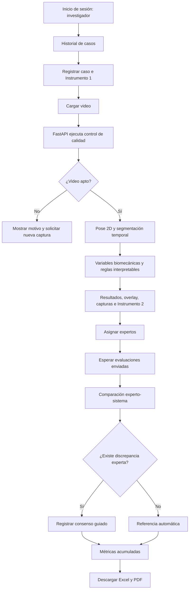
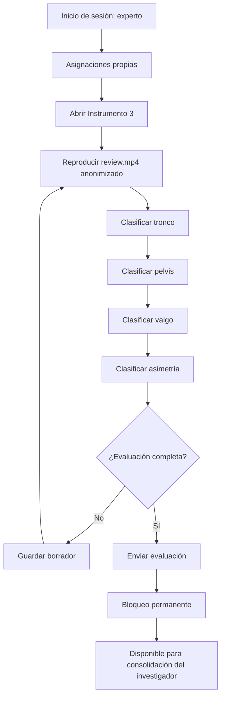
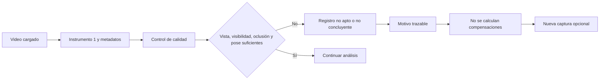
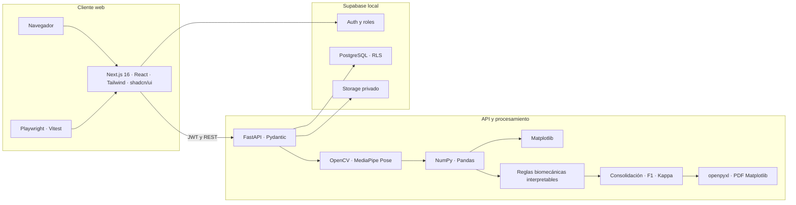

# Flujos del sistema y preparación de diagramas para la fase F6

## 1. Finalidad

Este documento centraliza los casos de uso verificados con Playwright y sirve
como fuente para generar diagramas editables en diagrams.net durante F6.

No es necesario instalar un MCP específico. diagrams.net permite insertar
Mermaid y también importa archivos `.drawio` y XML. Referencias oficiales:

- [Insertar Mermaid en draw.io](https://www.drawio.com/docs/manual/insert/insert-mermaid/)
- [Formatos de importación de draw.io](https://www.drawio.com/docs/manual/import/import-formats/)

En F6 se generaron archivos `.drawio` nativos para la entrega visual y se
mantuvo Mermaid como fuente textual versionable. Los archivos fueron abiertos
en diagrams.net y conservaron cajas, textos y conectores editables.

## 2. Flujo del investigador

### 2.1. Acciones y alcance

El investigador puede:

1. iniciar sesión;
2. consultar el historial paginado;
3. registrar el código y las condiciones del Instrumento 1;
4. cargar el video;
5. esperar el procesamiento;
6. revisar aceptación, calidad, landmarks, segmentación y variables;
7. reproducir el overlay y consultar capturas;
8. asignar hasta tres evaluadores;
9. revisar evaluaciones enviadas;
10. resolver discrepancias mediante consenso guiado;
11. consultar métricas acumuladas;
12. descargar Excel, PDF y artefactos técnicos autorizados.

### 2.2. Diagrama

## 3. Flujo del evaluador experto

### 3.1. Acciones y restricciones

El experto puede:

1. iniciar sesión;
2. consultar únicamente sus casos;
3. reproducir `review.mp4` anonimizado;
4. clasificar los cuatro patrones;
5. registrar confianza y observaciones;
6. guardar un borrador;
7. enviar la evaluación;
8. consultar posteriormente su ficha bloqueada.

No puede visualizar overlay, landmarks, umbrales, variables, hallazgos del
sistema, evaluaciones de otros expertos, métricas ni exportaciones
comparativas antes de emitir su juicio.

### 3.2. Diagrama

## 4. Flujo de video no apto

La elevación del talón y los soportes externos se documentan manualmente para
contextualizar el protocolo, pero no son criterios computacionales
automáticos de rechazo.

## 5. Arquitectura conjunta

## 6. Correspondencia con Playwright

| Caso de uso | Archivo E2E | Evidencia principal |
|---|---|---|
| Acceso público | `home.spec.ts` | Página inicial disponible |
| Autenticación de investigador | `auth.spec.ts` | Sesión SSR y rol |
| Registro de caso | `case-intake.spec.ts` | Instrumento 1 y carga |
| Resultado técnico | `case-results.spec.ts` | Hallazgos, overlay y capturas |
| Evaluación experta ciega | `expert-evaluation.spec.ts` | Borrador, envío y bloqueo |
| Comparación y exportación | `case-comparison.spec.ts` | Instrumento 3, métricas, Excel y PDF |

## 7. Diagramas editables generados en F6

1. `arquitectura_sistema_sentadilla.drawio`
2. `flujo_investigador_sentadilla.drawio`
3. `flujo_experto_instrumento3.drawio`
4. `secuencia_procesamiento_video.drawio`
5. `secuencia_comparacion_metricas.drawio`
6. `trazabilidad_objetivos_evidencias.drawio`
7. `flujo_video_no_apto_sentadilla.drawio`

Cada archivo incluye título, alcance de investigación y relación con el flujo
u objetivo específico correspondiente. Se encuentran en
`docs/diagramas/fase6/` y se regeneran mediante
`scripts/generate_phase6_drawio.py`.
