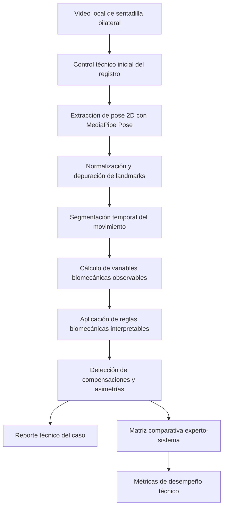
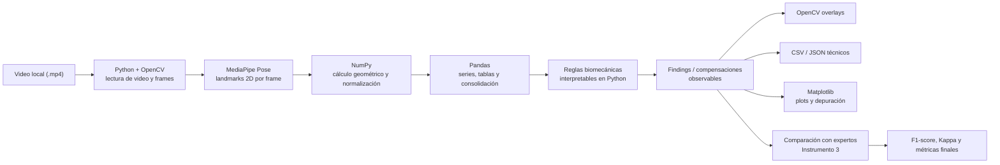

# Plan de desarrollo técnico de la tesis de sentadilla bilateral

## 1. Propósito del documento

Este documento organiza la implementación técnica de la tesis aprobada, tomando como base:

- el alcance metodológico ya definido en [Plantilla_proyecto_de_tesis_completada.docx](/D:/sistema-biomecanico/docs/Plantilla_proyecto_de_tesis_completada.docx),
- la delimitación de captura registrada en [decision_metodologica_captura_sentadilla.md](/D:/sistema-biomecanico/docs/decision_metodologica_captura_sentadilla.md),
- y la base técnica ya existente en el repositorio.

La finalidad es convertir el planteamiento de tesis en una hoja de ruta de desarrollo entendible tanto para ingeniería como para revisión académica.

## 2. Alcance técnico confirmado

El desarrollo se implementará bajo estas decisiones metodológicas ya consolidadas:

- ejercicio objetivo: sentadilla bilateral;
- condición de ejecución: sin carga externa;
- tipo de captura inicial: video local;
- plano de observación principal: plano frontal, con vista anterior;
- enfoque analítico: compensaciones posturales observables y asimetrías cinemáticas observables;
- salida del sistema: hallazgos interpretables y comparables con evaluación experta;
- exclusiones: diagnóstico clínico, reconstrucción 3D, análisis multicámara y determinación de patrones posturales globales tipo Left AIC o PEC.

Esto implica que la tesis no intentará resolver toda la postura corporal ni inferir causas profundas del movimiento. El sistema se centrará en detectar, cuantificar y reportar patrones visibles y explicables dentro de una sola prueba funcional delimitada.

## 3. Qué ya existe en el repositorio y conviene reutilizar

La base actual del proyecto ya contiene componentes útiles para no empezar desde cero:

- capa de extracción de pose en [pose/mediapipe_pose.py](/D:/sistema-biomecanico/pose/mediapipe_pose.py);
- modelos y conversiones de landmarks en [pose/schemas.py](/D:/sistema-biomecanico/pose/schemas.py) y [pose/converters.py](/D:/sistema-biomecanico/pose/converters.py);
- utilidades geométricas y métricas biomecánicas en [biomechanics/geometry.py](/D:/sistema-biomecanico/biomechanics/geometry.py), [biomechanics/models.py](/D:/sistema-biomecanico/biomechanics/models.py) y [biomechanics/movement_metrics.py](/D:/sistema-biomecanico/biomechanics/movement_metrics.py);
- lógica de findings y deficiencies en [detection/findings.py](/D:/sistema-biomecanico/detection/findings.py), [detection/deficiencies.py](/D:/sistema-biomecanico/detection/deficiencies.py), [detection/movement_findings.py](/D:/sistema-biomecanico/detection/movement_findings.py) y [detection/movement_deficiencies.py](/D:/sistema-biomecanico/detection/movement_deficiencies.py);
- umbrales y modelos de detección en [detection/thresholds.py](/D:/sistema-biomecanico/detection/thresholds.py), [detection/models.py](/D:/sistema-biomecanico/detection/models.py) y [detection/deficiency_models.py](/D:/sistema-biomecanico/detection/deficiency_models.py);
- API base con FastAPI en [app/main.py](/D:/sistema-biomecanico/app/main.py) y rutas bajo [api/routes](/D:/sistema-biomecanico/api/routes);
- suite de pruebas que ya establece una disciplina técnica reutilizable en [tests](/D:/sistema-biomecanico/tests).

Conclusión práctica: la tesis debe construirse como una especialización del sistema actual al caso de uso de sentadilla bilateral frontal, no como otro proyecto paralelo.

## 4. Respuesta técnica a la pregunta de valor del sistema

Una observación razonable es: si varias compensaciones notorias pueden verse “a simple vista”, ¿qué aporta realmente el sistema?

El aporte no es “ver lo invisible”, sino formalizar y estabilizar el análisis:

- convierte observación visual en un procedimiento reproducible;
- transforma video en variables medibles y trazables;
- aplica criterios consistentes en todos los casos;
- deja evidencia visual y numérica de por qué se detectó una compensación;
- permite comparar su salida contra expertos con métricas objetivas;
- reduce variabilidad entre observaciones informales.

Por eso el valor de la tesis no está en afirmar un diagnóstico completo, sino en proponer un sistema interpretable, accesible y evaluable para el tamizaje técnico de compensaciones observables durante la sentadilla bilateral.

## 5. Arquitectura técnica propuesta

### 5.1 Flujo general



### 5.2 Capas del sistema

#### Capa 1. Ingreso y control de calidad del video

Responsabilidad:

- registrar metadatos mínimos del video;
- verificar que cumpla el protocolo de captura;
- descartar videos no aptos antes del procesamiento.

Entradas:

- archivo de video;
- identificador del caso;
- datos mínimos del registro.

Salidas:

- video apto o descartado;
- trazabilidad del motivo de exclusión.

#### Capa 2. Estimación de pose 2D

Responsabilidad:

- detectar landmarks corporales relevantes para la sentadilla bilateral.

Landmarks base esperados:

- hombro izquierdo y derecho;
- cadera izquierda y derecha;
- rodilla izquierda y derecha;
- tobillo izquierdo y derecho;
- talón izquierdo y derecho;
- punta del pie izquierda y derecha;
- nariz o referencia facial central, si aporta estabilidad global.

Tecnología principal:

- MediaPipe Pose Landmarker o la variante ya integrada en la base actual.

#### Capa 3. Depuración temporal y normalización

Responsabilidad:

- eliminar fotogramas no utilizables;
- suavizar ruido;
- controlar pérdidas intermitentes de landmarks;
- normalizar variables para comparación entre videos.

Operaciones esperadas:

- filtrado por visibilidad;
- interpolación cauta si hay pérdidas breves;
- suavizado temporal;
- normalización por referencias corporales 2D observables.

#### Capa 4. Segmentación del movimiento

Responsabilidad:

- identificar inicio, descenso, punto más bajo, ascenso y cierre de la sentadilla.

Esto es importante porque varias compensaciones no deben evaluarse en cualquier fotograma, sino en fases concretas del gesto.

#### Capa 5. Cálculo de variables biomecánicas observables

Variables biomecánicas candidatas según la tesis:

- inclinación lateral del tronco;
- desplazamiento lateral de pelvis;
- alineación observacional rodilla-cadera-tobillo;
- diferencias bilaterales entre trayectorias o posiciones relativas.

Estas variables no equivalen por sí mismas a un diagnóstico. Son señales observables sobre las que luego se aplican criterios interpretables.

#### Capa 6. Motor de reglas biomecánicas interpretables

Responsabilidad:

- traducir variables en hallazgos explícitos.

Ejemplos de salidas esperadas:

- inclinación lateral del tronco hacia izquierda o derecha;
- desplazamiento lateral de pelvis hacia izquierda o derecha;
- valgo dinámico visible en rodilla izquierda o derecha;
- asimetría bilateral observable durante la ejecución.

#### Capa 7. Reporte y validación

Responsabilidad:

- generar una salida comprensible;
- comparar la clasificación del sistema con la de expertos;
- calcular F1-score, índice Kappa y otras métricas de desempeño.

### 5.3 Arquitectura general por tecnologías y herramientas

La arquitectura no es un objetivo específico formal de la tesis, pero sí es una evidencia muy útil para explicar cómo el sistema cumple los objetivos y cómo se conectan sus partes técnicas.

| Componente | Tecnología o herramienta | Rol dentro del sistema | Relación con los objetivos |
|---|---|---|---|
| Ingreso y lectura de video | Python + OpenCV | Cargar videos, extraer frames, escribir artefactos de salida | OE4 |
| Estimación de pose 2D | MediaPipe Pose | Detectar landmarks corporales por frame | OE1 |
| Cálculo numérico | NumPy | Operaciones geométricas, normalización, series temporales | OE2 |
| Análisis tabular | Pandas | Construir tablas por frame, por video y para comparación experta | OE2, OE5 |
| Lógica biomecánica interpretable | Módulos Python propios | Convertir variables en compensaciones observables | OE3, OE4 |
| Visualización técnica | OpenCV + Matplotlib | Overlays, gráficos, revisión visual del comportamiento de las métricas | OE1, OE2, OE4 |
| Pruebas | pytest | Verificar fórmulas, flujo y salidas del sistema | OE4, OE5 |
| Exposición futura del motor | FastAPI | Publicar el núcleo analítico como servicio reutilizable | OE4 |
| Control de versiones | Git + GitHub | Trazabilidad del desarrollo, ramas, historial reproducible | Soporte transversal |
| Gestión de archivos académicos | Google Drive | Resguardar entregables sensibles no aptos para un repo público | Soporte transversal |

### 5.4 Flujo operativo con herramientas concretas



## 6. Mapeo entre objetivos específicos y entregables técnicos

| Objetivo específico | Traducción técnica | Evidencia que entiende el asesor |
|---|---|---|
| Identificar landmarks 2D relevantes | Especificación de landmarks y módulo de extracción de pose | Tabla de landmarks, capturas con overlay, videos con puntos detectados |
| Definir variables biomecánicas observables | Fórmulas, convenciones geométricas y módulo de cálculo | Tabla de variables, fórmulas, gráficos frame a frame o por fase |
| Establecer criterios biomecánicos interpretables | Reglas de decisión y umbrales | Matriz variable -> regla -> compensación detectable |
| Implementar el prototipo funcional | Pipeline completo de procesamiento | Demostración con video de entrada y reporte de salida |
| Evaluar el desempeño técnico frente a expertos | Comparación experto-sistema y métricas | Matriz comparativa, F1-score, Kappa, tabla de concordancia |

La segmentación temporal de la Fase 3 funciona como evidencia habilitadora del segundo objetivo: determina las ventanas y fotogramas sobre los que se aplican las fórmulas. La evidencia completa del objetivo enlaza la segmentación con el cálculo de la Fase 4, sin presentar la fase previa como un objetivo independiente.

Esta tabla es clave porque evita explicar el avance con frases como “ya existe esta función” y lo aterriza en evidencias observables.

## 7. Fases de desarrollo recomendadas

### Fase 0. Congelamiento metodológico mínimo

Objetivo:

- fijar definitivamente el alcance operativo antes de programar.

Productos:

- lista final de compensaciones a detectar;
- definición final de landmarks críticos;
- definición final de variables y reglas;
- protocolo de captura definitivo.

### Fase 1. Línea base de datos y casos

Objetivo:

- organizar la muestra en una estructura reproducible.

Tareas:

- crear carpetas estables para videos;
- estandarizar nombres de casos;
- vincular cada caso con sus instrumentos metodológicos;
- separar videos positivos y negativos.

Estructura sugerida:

```text
data/
  sentadilla_bilateral/
    raw/
      caso_001.mp4
    curated/
    metadata/
      casos.csv
    labels_expertos/
    outputs/
      overlays/
      metrics/
      reports/
```

### Fase 2. Extracción base de landmarks

Objetivo:

- lograr que el sistema procese videos frontales y devuelva landmarks confiables por fotograma.

Tareas:

- adaptar la lógica actual de pose de imagen a video;
- exportar landmarks por frame en JSON o CSV;
- construir visualizaciones overlay para depuración;
- medir porcentaje de fotogramas válidos y procesados correctamente.

Resultado esperado:

- un video de prueba procesado de extremo a extremo con landmarks visibles y trazables.

### Fase 3. Segmentación temporal de la sentadilla

Objetivo:

- detectar automáticamente fases relevantes del gesto.

Tareas:

- definir señal base para segmentación;
- detectar inicio del descenso;
- detectar punto mínimo;
- detectar ascenso;
- validar visualmente la coherencia de la segmentación.

Resultado esperado:

- tabla por video con marcas de fase y fotogramas clave.

### Fase 4. Cálculo de variables biomecánicas

Objetivo:

- transformar landmarks en variables observables coherentes con la tesis.

Tareas:

- implementar fórmulas;
- validar signo, dirección y convenciones;
- generar series temporales y valores resumen por fase;
- documentar casos límite.

Resultado esperado:

- archivo de métricas por video y gráficos por variable.

### Fase 5. Reglas interpretables para compensaciones

Objetivo:

- traducir variables en categorías observables.

Tareas:

- definir reglas explícitas;
- asignar umbrales iniciales;
- probar reglas en casos positivos y negativos;
- evaluar cada patrón mediante una regla independiente para permitir salidas multietiqueta;
- emitir `no concluyente` cuando la calidad o cercanía al umbral no permita decidir;
- probar casos combinados después de verificar los patrones aislados;
- justificar cada regla con biomecánica observacional.

Resultado esperado:

- clasificación automática por compensación con trazabilidad.

### Fase 6. Validación frente a expertos

Objetivo:

- medir desempeño técnico del sistema.

Tareas:

- consolidar las fichas expertas;
- alinear salida del sistema con el formato del Instrumento 3;
- calcular tablas de contingencia;
- obtener F1-score, sensibilidad, especificidad, precisión e índice Kappa.

Resultado esperado:

- tabla final de desempeño técnico por compensación y de forma global.

### Fase 7. Prototipo local usable

Objetivo:

- empaquetar el flujo en una herramienta demostrable.

Opciones realistas:

- CLI en Python para procesamiento por lote;
- script reproducible;
- interfaz local mínima con FastAPI;
- visor de resultados con overlays e indicadores.

Resultado esperado:

- demostración funcional para asesor y jurado.

### Fase 8. Integración futura web o móvil

Esta fase no debe ser el foco inicial de la tesis. La prioridad debe ser validar el núcleo analítico.

Ruta recomendada:

1. primero motor analítico local en Python;
2. después API en FastAPI;
3. luego interfaz web en Next.js;
4. finalmente, si hubiese tiempo, cliente móvil.

Justificación:

- el riesgo metodológico de la tesis está en la detección y validación, no en la interfaz;
- una web o app sin motor validado solo agrega complejidad;
- FastAPI permite desacoplar el motor para cualquier frontend posterior.

## 8. Stack técnico recomendado

### Núcleo analítico

- Python;
- OpenCV;
- MediaPipe Pose;
- NumPy;
- Pandas;
- SciPy, si hiciera falta suavizado o procesamiento de señales;
- Matplotlib o Plotly para gráficos técnicos;
- pytest para pruebas.

### Capa de servicio

- FastAPI para exponer el procesamiento;
- Pydantic para contratos de entrada y salida.

### Capa de interfaz futura

- Next.js como opción web más razonable;
- React Native solo como fase posterior si el núcleo ya está estable.

### Gestión de resultados

- CSV y JSON como formato base de exportación;
- imágenes y videos overlay para auditoría visual;
- reportes PDF o HTML como producto demostrable final.

### Control de versiones y colaboración

- Git para control de cambios local;
- GitHub para ramas, commits y respaldo del desarrollo técnico;
- Google Drive para documentos institucionales o sensibles que no deban ir a un repositorio público.

Regla práctica:

- código y markdown técnico: GitHub;
- `.docx`, `.pdf`, `.xlsx` institucionales o con datos sensibles: Google Drive.

### Anonimización facial

Debe incluirse como parte del flujo de salida y resguardo ético.

Ruta técnica recomendada:

- detección de región facial con una solución liviana compatible con OpenCV y MediaPipe;
- anonimización de la cara completa en overlays, videos de revisión y artefactos compartibles;
- preservación del video base solo en entorno local controlado, si fuera necesario para el procesamiento.

## 9. Estrategia de pruebas técnicas

### 9.1 Pruebas unitarias

Aplican a:

- funciones geométricas;
- normalización;
- cálculo de variables;
- reglas de decisión.

Ejemplos:

- verificar signos de inclinación izquierda/derecha;
- verificar desplazamiento lateral positivo/negativo;
- verificar detección de valgo visible bajo configuraciones controladas.

### 9.2 Pruebas de integración

Aplican a:

- video completo -> landmarks;
- landmarks -> variables;
- variables -> compensaciones;
- compensaciones -> reporte final.

### 9.3 Pruebas con casos controlados

Aplican a:

- videos positivos preparados para cada compensación;
- videos negativos sin compensación marcada;
- casos ambiguos para revisar comportamiento límite.

### 9.4 Pruebas de regresión

Aplican a:

- evitar que un cambio rompa resultados previamente aceptados;
- mantener consistencia de métricas entre iteraciones.

### 9.5 Puertas de calidad por fase

La calidad no debe resolverse mediante un único `try/catch` general. Las condiciones esperables de baja calidad deben producir estados estructurados y motivos trazables; los errores inesperados de archivo, dependencia o programación deben conservarse como excepciones y registros técnicos.

| Momento del flujo | Condición controlada | Respuesta esperada | Relación principal |
|---|---|---|---|
| Registro y protocolo | Vista, iluminación, fondo, encuadre, ejecución o apoyo fuera del protocolo | Rechazar antes de pose y registrar motivo en el Instrumento 1 | OE1 y metodología |
| Extracción de pose | Pérdida de puntos críticos, bajo porcentaje válido o procesamiento incompleto | `apto`, `revisión requerida` o `no apto` mediante puerta de calidad | OE1 y OE4 |
| Segmentación | Cantidad distinta de tres repeticiones, ciclo incompleto o máxima profundidad no válida | No continuar al análisis formal; permitir depuración local | OE2 y OE4 |
| Cálculo biomecánico | Referencia de normalización inválida, valores no finitos o variable ausente en fase crítica | Marcar variable o repetición como no calculable; no imputar silenciosamente | OE2 |
| Reglas interpretables | Valor próximo al umbral, señal contradictoria o evidencia insuficiente | Salida `no concluyente` para el patrón afectado | OE3 |
| Salida multietiqueta | Más de una regla positiva en el mismo video | Conservar todas las etiquetas compatibles y su evidencia independiente | OE3 y OE4 |
| Comparación experta | Desacuerdo sin mayoría o consenso | Referencia `no concluyente`; excluir ese patrón del cálculo correspondiente | OE5 |
| Evaluación estadística | Pocos positivos, negativos o casos no concluyentes | No reportar una métrica como estable; declarar tamaño efectivo por patrón | OE5 |
| Reporte y exportación | Artefacto incompleto, identidad visible o inconsistencia entre JSON, CSV y reporte | Bloquear publicación del reporte y registrar el error | OE4 y ética |

Estado actual:

- registro y revisión de protocolo: implementados como contrato y estado manual;
- calidad de pose y segmentación: implementada mediante `quality-check`;
- valores no finitos: rechazados o conservados como nulos explícitos en el módulo de métricas;
- controles de reglas, multietiqueta, referencia experta y reporte: pendientes de sus fases correspondientes.

Esta matriz debe revisarse al cerrar cada fase. Una fase no se considerará terminada solo porque produzca resultados; también deberá demostrar cómo maneja entradas inválidas, resultados incompletos y casos ambiguos.

## 10. Qué artefactos conviene mostrar al asesor

Para que el avance sea entendible sin revisar código, conviene acompañar cada fase con artefactos visibles:

- diagrama de arquitectura general;
- diagrama del pipeline por etapas;
- tabla objetivo específico -> evidencia técnica;
- capturas de video con landmarks superpuestos;
- gráfico temporal de una variable biomecánica;
- tabla de reglas interpretables;
- reporte de un caso ejemplo;
- matriz comparativa experto-sistema;
- tabla de métricas finales.

## 11. Recomendación sobre diagramas

Para trabajar rápido y mantener versionado:

- usar Mermaid dentro de markdown durante el diseño;
- cuando el flujo ya esté estable, migrar los diagramas finales a diagrams.net o draw.io si el asesor prefiere una presentación más formal.

Recomendación práctica:

- para nosotros: Mermaid;
- para entrega visual final: diagrams.net.

Esto evita invertir tiempo temprano en diagramación manual cuando todavía pueden cambiar fases y nombres.

## 12. Riesgos técnicos principales

### Riesgo 1. Pérdida de landmarks en videos reales

Mitigación:

- protocolo de captura estricto;
- descarte temprano con Instrumento 1;
- overlay de depuración;
- métricas de calidad por video.

### Riesgo 2. Variables inestables por ruido fotograma a fotograma

Mitigación:

- suavizado temporal;
- evaluación por fases y no por un solo frame aislado;
- revisión visual de series.

### Riesgo 3. Reglas demasiado sensibles o demasiado laxas

Mitigación:

- calibración iterativa con videos positivos y negativos;
- revisión con expertos;
- documentación clara de umbrales.

### Riesgo 4. Sobrepromesa clínica

Mitigación:

- mantener la salida como compensación observable;
- no traducir automáticamente a diagnóstico;
- dejar explícito que es apoyo técnico y no sustituto clínico.

## 13. Orden recomendado de implementación real

Si comenzamos ya el desarrollo, el orden más eficiente sería:

1. congelar estructura de carpetas para videos y salidas;
2. adaptar pose 2D actual a procesamiento de video frontal;
3. generar overlays y exportación por frame;
4. implementar segmentación de la sentadilla;
5. calcular variables biomecánicas observables;
6. traducir variables a compensaciones;
7. alinear salida con Instrumento 3;
8. calcular métricas frente a expertos;
9. empaquetar en script, API o demo local.

### 13.1 Orden recomendado de versionado

Para trabajar con seguridad en el repo actual:

1. crear una rama específica de sentadilla;
2. hacer un commit de documentación técnica consolidada;
3. crear estructura de módulo `src/squat/`, `tests/squat/` y `data/sentadilla_bilateral/`;
4. avanzar por commits pequeños según pose, segmentación, métricas, reglas, anonimización y pruebas.

## 14. Qué sí y qué no demostraría cada objetivo específico

### Objetivo 1

Se demuestra con:

- landmarks definidos;
- extracción reproducible;
- visualización overlay.

No se demuestra solo porque “MediaPipe ya detecta el cuerpo”.

### Objetivo 2

Se demuestra con:

- fórmulas implementadas;
- resultados consistentes;
- gráficos o tablas por variable.

No se demuestra solo por listar nombres de variables.

### Objetivo 3

Se demuestra con:

- reglas explícitas;
- relación clara entre variable y compensación.

No se demuestra solo con una descripción biomecánica general.

### Objetivo 4

Se demuestra con:

- un flujo ejecutable de entrada a salida;
- reportes interpretables por caso.

No se demuestra solo con módulos aislados.

### Objetivo 5

Se demuestra con:

- comparación formal contra expertos;
- métricas cuantitativas;
- discusión de errores y límites.

No se demuestra solo mostrando ejemplos donde “parece funcionar”.

## 15. Decisión de enfoque para el inicio del desarrollo

La mejor decisión técnica en esta etapa es:

- construir primero un motor local en Python,
- procesar videos frontales de sentadilla bilateral sin carga externa,
- validar el núcleo con expertos,
- y solo después pensar en web o móvil.

Eso mantiene la tesis defendible, viable y alineada con el verdadero aporte del proyecto.

## 16. Estado de implementación inicial

Fecha de corte: 22 de julio de 2026.

La Fase 0 quedó materializada en contratos de software que fijan el alcance aprobado:

- vista anterior en el plano frontal;
- sentadilla bilateral sin carga externa;
- puntos anatómicos críticos de hombros, caderas, rodillas, tobillos, talones y puntas de los pies;
- salidas objetivo limitadas a inclinación lateral del tronco, desplazamiento lateral de pelvis, valgo dinámico visible y asimetría bilateral observable.

La base técnica de la Fase 1 ya cuenta con:

- módulo aislado en `src/squat/`;
- registro CSV validado de casos;
- inspección técnica de video mediante OpenCV;
- contrato JSON versionado para el registro inicial;
- separación explícita entre archivo legible y video aceptado por el protocolo;
- protección en Git de videos, clasificaciones expertas y resultados sensibles;
- comando reproducible `scripts/run_squat_analysis.py`;
- pruebas automatizadas del módulo.

Comandos iniciales:

```powershell
D:\anaconda4\envs\analisis-bio\python.exe scripts\run_squat_analysis.py init

D:\anaconda4\envs\analisis-bio\python.exe scripts\run_squat_analysis.py register `
  --case-id caso_001 `
  --video data\sentadilla_bilateral\raw\caso_001.mp4 `
  --protocol-review-status pendiente
```

Las Fases 2 y 3 quedaron implementadas. La Fase 2 extrae los puntos anatómicos clave por fotograma, calcula la validez de pose y genera el overlay anonimizado. La Fase 3 utiliza el punto medio vertical de ambas caderas para detectar repeticiones, máxima profundidad y fases de descenso, ascenso, cierre y reposo.

La preparación de videos de desarrollo se rige por [guia_tecnica_grabacion_videos_sentadilla.md](/D:/sistema-biomecanico/docs/guia_tecnica_grabacion_videos_sentadilla.md), que complementa el protocolo formal con parámetros reproducibles de cámara, encuadre, iluminación, ropa, ejecución y casos controlados.

La primera evidencia técnica por objetivo quedó documentada en [evidencia_objetivo_1_estimacion_pose_2d.md](/D:/sistema-biomecanico/docs/evidencia_objetivo_1_estimacion_pose_2d.md). Los diagramas se producirán de manera incremental cuando el objetivo correspondiente cuente con implementación y artefactos verificables; al final se consolidarán y migrarán a una herramienta visual para presentación.

El descarte de videos no aptos ya está materializado mediante una puerta posterior a pose y segmentación. Su lógica, estados y relación transversal con los Objetivos Específicos 1 y 4 se documentan en [evidencia_control_calidad_analitica.md](/D:/sistema-biomecanico/docs/evidencia_control_calidad_analitica.md).

La evidencia de la segmentación quedó documentada en [evidencia_fase_3_segmentacion_temporal.md](/D:/sistema-biomecanico/docs/evidencia_fase_3_segmentacion_temporal.md). Este incremento prepara los fotogramas y ventanas temporales sobre los que se calcularán las variables biomecánicas de la Fase 4.

La Fase 4 y la trazabilidad completa del Objetivo Específico 2 quedaron documentadas en [evidencia_objetivo_2_variables_biomecanicas.md](/D:/sistema-biomecanico/docs/evidencia_objetivo_2_variables_biomecanicas.md). El siguiente incremento corresponde a la Fase 5: reglas y umbrales interpretables separados del cálculo geométrico.
