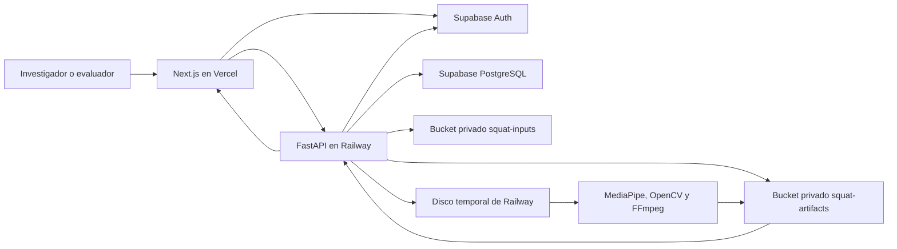
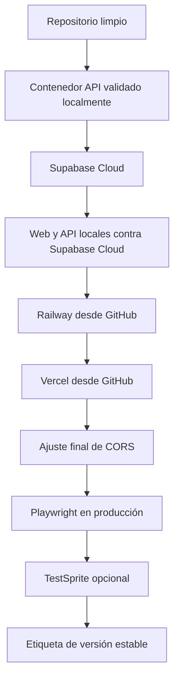

# Plan de extracción y despliegue del sistema de sentadilla bilateral

## 1. Propósito

Este documento define cómo separar y desplegar la solución de sentadilla
bilateral sin publicar los módulos de RAG, Qdrant, análisis posturales ajenos,
documentos institucionales, videos locales ni artefactos generados que existen
en el repositorio de desarrollo.

El plan se ejecutará después de su aprobación. En esta etapa no se crean
repositorios, proyectos cloud ni secretos.

## 2. Decisión final

Se recomienda crear un **repositorio nuevo, privado y con historial limpio**,
organizado como un monorepositorio reducido:

- una aplicación Next.js desplegada en Vercel;
- una API FastAPI desplegada en Railway;
- migraciones, autenticación y almacenamiento privado en Supabase Cloud;
- pruebas unitarias, de integración y de extremo a extremo propias de la tesis.

Nombre propuesto:

```text
chap0308/sentadilla-biomecanica
```

El repositorio actual seguirá siendo la fuente histórica de investigación. El
nuevo repositorio será la fuente operativa para despliegues.

Esta decisión no contradice
`reutilizacion_proyecto_actual_para_sentadilla.md`: aquel documento resolvió la
etapa de desarrollo, cuando reutilizar la infraestructura existente era la
opción más eficiente. La separación se realiza ahora porque el módulo ya está
delimitado, probado y listo para operar de forma independiente.

### 2.1. Por qué no desplegar el repositorio actual

El repositorio actual contiene:

- pipelines RAG y recuperación con Qdrant;
- rutas FastAPI de chat y otros análisis;
- dependencias de Whisper, OCR, Gemini y procesamiento no utilizado;
- documentos institucionales y archivos de tesis;
- datos, videos, salidas, cachés y herramientas locales;
- migraciones Supabase de otros productos.

Aunque Vercel y Railway permiten seleccionar directorios, Railway todavía
necesitaría construir desde una raíz con dependencias y entrypoints acoplados a
esas funciones. El despliegue funcionaría, pero sería más pesado, menos seguro y
más difícil de explicar.

### 2.2. Por qué un solo repositorio nuevo y no dos

La web y la API comparten:

- contratos JSON de los casos;
- versiones coordinadas del pipeline;
- pruebas E2E que atraviesan ambos servicios;
- configuración de Supabase;
- una misma unidad de entrega académica.

Vercel usará `apps/web` como directorio raíz. Railway construirá únicamente la
API mediante un Dockerfile dedicado. Un solo commit identificará de forma
inequívoca qué versiones de web, API y esquema estaban desplegadas.

### 2.3. Por qué no conservar todo el historial con `git filter-repo`

La extracción se realizará como un snapshot limpio del commit aprobado y se
registrará el SHA de origen en el README. Esto evita conservar accidentalmente
archivos eliminados, videos, documentos o secretos que pudieran existir en
commits anteriores.

La trazabilidad académica se mantiene mediante:

- referencia al repositorio y commit de origen;
- etiqueta de versión del pipeline;
- historial nuevo de cambios de producción;
- enlace al repositorio histórico, si se decide mantenerlo público.

## 3. Arquitectura objetivo



El disco de Railway no será el sistema de registro. Solo se utilizará durante la
carga y el procesamiento. Una vez persistido el caso, el original y sus
artefactos se recuperarán desde Supabase Storage.

## 4. Estructura propuesta del repositorio

```text
sentadilla-biomecanica/
  apps/
    web/
  api/
    auth.py
    routes/
      squat.py
    schemas/
      squat_comparison.py
      squat_expert.py
  app/
    config.py
    main.py
  config/
    squat/
  pose/
    schemas.py
  src/
    core/
      ids.py
    squat/
  scripts/
    run_squat_analysis.py
    seed_squat_cloud_accounts.py
  supabase/
    config.toml
    migrations/
    seed.local.sql
  tests/
    squat/
    test_squat_api.py
    test_squat_auth.py
    test_squat_comparison_api.py
    test_squat_expert_api.py
  deploy/
    api.Dockerfile
  .env.example
  .gitignore
  package.json
  package-lock.json
  pyproject.toml
  requirements-api.txt
  README.md
```

### 4.1. Archivos que deben conservarse

- `apps/web`, sin credenciales, reportes de Playwright ni skills locales;
- `src/squat`;
- `src/core/ids.py`;
- `pose/schemas.py`;
- `api/auth.py`;
- `api/routes/squat.py`;
- `api/schemas/squat_comparison.py`;
- `api/schemas/squat_expert.py`;
- `app/config.py`, reducido al sistema de sentadilla;
- `config/squat`;
- scripts exclusivos de sentadilla;
- pruebas exclusivas de sentadilla;
- las cuatro migraciones funcionales de sentadilla, después de consolidar sus
  prerrequisitos;
- documentación técnica estrictamente necesaria.

### 4.2. Archivos que no deben migrarse

- `data`, `debug`, `output`, `tmp` y cachés;
- `docs/archivos-tesis`, Word, PDF, Excel y consentimientos;
- Qdrant, RAG, embeddings, scraping y YouTube;
- chat, Gemini, Whisper, OCR y análisis ajenos;
- `.agents`, `.codex`, `.claude` y configuraciones personales;
- `.env`, tokens, contraseñas, claves de servicio o archivos de autenticación;
- videos crudos y artefactos de participantes;
- migraciones Supabase de RAG o chat.

## 5. Ajustes obligatorios antes del despliegue

### 5.1. API exclusiva

El nuevo `app/main.py` solo incluirá:

- endpoint de salud;
- router de sentadilla;
- CORS restringido;
- configuración de producción.

No importará rutas de chat, análisis generales ni clientes de almacenamiento de
otros módulos.

### 5.2. Dependencias mínimas

Se reemplazará el `requirements.txt` general por `requirements-api.txt` con las
dependencias usadas por FastAPI y `src/squat`.

Se utilizará `opencv-python-headless` en lugar de `opencv-python`. El contenedor
instalará FFmpeg para generar MP4 compatibles con navegador.

No se instalarán:

- Qdrant;
- Whisper;
- SceneDetect;
- pytesseract;
- yt-dlp;
- Gemini;
- Playwright para Python.

### 5.3. Persistencia y limpieza temporal

El procesamiento seguirá este orden:

1. guardar temporalmente el video recibido;
2. ejecutar MediaPipe, OpenCV y las reglas;
3. subir el original a `squat-inputs`;
4. subir resultados a `squat-artifacts`;
5. persistir contratos y metadatos en PostgreSQL;
6. eliminar archivos temporales mediante `finally`.

No se añadirá todavía una cola distribuida. Primero se medirá el tiempo y la
memoria de videos reales en Railway. Si el procesamiento excede de forma
recurrente los límites de una solicitud, se separará posteriormente en un job
asíncrono.

### 5.4. Rutas portables

Actualmente el Instrumento 1 puede conservar una ruta como:

```text
D:\sistema-biomecanico\data\sentadilla_bilateral\uploads\caso.mp4
```

Antes del despliegue se debe garantizar que los contratos persistidos y las
exportaciones solo contengan:

- nombre lógico del archivo;
- ruta de objeto privada, por ejemplo `caso/original.mp4`;
- o una etiqueta como `Almacenamiento privado del estudio`.

No se almacenarán rutas absolutas de Windows ni rutas temporales de Railway.
Tampoco se guardarán URL firmadas porque expiran.

### 5.5. Migraciones Supabase independientes

La primera migración actual de sentadilla supone que ya existen:

- `public.profiles`;
- `public.set_updated_at()`;
- el disparador de creación de perfil desde `auth.users`.

En el repositorio nuevo se creará una migración base independiente que defina
estos elementos. Después se aplicarán las tablas, índices, restricciones,
políticas RLS y ciclo de referencia final de sentadilla.

Los buckets serán privados:

- `squat-inputs`;
- `squat-artifacts`;
- `squat-exports`, solo si finalmente se persisten exportaciones.

Si `squat-exports` continúa sin utilizarse, se eliminará para evitar
infraestructura declarada sin función.

## 6. Variables por servicio

### 6.1. Vercel

```text
NEXT_PUBLIC_SUPABASE_URL
NEXT_PUBLIC_SUPABASE_PUBLISHABLE_KEY
NEXT_PUBLIC_API_URL
NEXT_PUBLIC_ENABLE_DEV_FIXTURES=0
```

`NEXT_PUBLIC_API_URL` apuntará al dominio HTTPS de Railway y terminará en
`/api/v1`.

### 6.2. Railway

```text
APP_NAME
APP_VERSION
API_PREFIX=/api/v1
ENVIRONMENT=production
DEBUG=false
REQUEST_TIMEOUT_SECONDS
CORS_ALLOWED_ORIGINS
SUPABASE_URL
SUPABASE_PUBLISHABLE_KEY
SUPABASE_SECRET_KEY
SQUAT_AUTH_REQUIRED=true
SQUAT_PERSISTENCE_REQUIRED=true
SQUAT_DATA_ROOT=/tmp/sentadilla-bilateral
SQUAT_RULESET_PATH=config/squat/ruleset_v0_1_provisional.json
```

Railway proporcionará `PORT`. El comando de inicio escuchará en
`0.0.0.0:$PORT`.

### 6.3. Secretos de operación local

```text
SUPABASE_ACCESS_TOKEN
SUPABASE_DB_PASSWORD
VERCEL_TOKEN
RAILWAY_TOKEN
```

No todos son necesarios en las aplicaciones. Se usarán solamente para CLI o CI
y nunca se expondrán como variables públicas de Next.js.

La contraseña de PostgreSQL se guardará en el almacén seguro del CLI cuando sea
posible. Como respaldo podrá existir en `.env.deploy.local`, que estará
ignorado por Git. No se registrará en documentación ni commits.

## 7. Fases de ejecución

### Fase D0. Congelar la fuente

1. Confirmar el commit origen de `codex/sentadilla-bilateral-dev`.
2. Ejecutar pruebas Python, Vitest, build de Next.js y Playwright.
3. Generar inventario de archivos permitidos.
4. Buscar secretos y rutas absolutas antes de copiar.

**Puerta de salida:** el commit origen está identificado y todas las pruebas
locales pasan.

### Fase D1. Crear el repositorio limpio

1. Crear `chap0308/sentadilla-biomecanica` como repositorio privado con `gh`.
2. Copiar solo el inventario aprobado.
3. Crear `.gitignore`, README y archivos de entorno de ejemplo.
4. Registrar el SHA del repositorio histórico.
5. Ejecutar nuevamente todas las pruebas.
6. Hacer el primer push a `main`.

No se copiará la carpeta `.git` actual ni se importará el historial completo.

**Puerta de salida:** el repositorio nuevo puede clonarse y validarse sin
depender del repositorio original.

### Fase D2. Preparar API y contenedor

1. Crear el entrypoint FastAPI exclusivo.
2. Reducir configuración y dependencias.
3. Crear `deploy/api.Dockerfile`.
4. Instalar FFmpeg y librerías de ejecución necesarias.
5. Implementar limpieza de archivos temporales.
6. Corregir rutas absolutas en contratos y exportaciones.
7. Construir y ejecutar la imagen con Docker local.
8. Procesar al menos un video válido y uno inválido dentro del contenedor.

**Puerta de salida:** la imagen local responde al health check, procesa videos y
persiste artefactos sin depender de Qdrant o módulos antiguos.

### Fase D3. Supabase Cloud primero

Esta fase precede a Vercel y Railway porque es el principal riesgo de
integración.

1. Actualizar Supabase CLI.
2. Crear el proyecto `sentadilla-biomecanica-tesis`.
3. Generar una contraseña fuerte y almacenarla fuera de Git.
4. Vincular el repositorio nuevo con `supabase link`.
5. Validar migraciones mediante `supabase db reset` local.
6. Ejecutar lint de base de datos y pruebas RLS.
7. Revisar `supabase db push --dry-run`.
8. Aplicar `supabase db push`.
9. Confirmar tablas, índices, funciones, políticas y buckets privados.
10. Crear una cuenta investigadora y hasta tres cuentas expertas mediante un
    script que lea correos y contraseñas desde variables de entorno.
11. Ejecutar web y API local apuntando a Supabase Cloud.
12. Probar autenticación, carga, persistencia, asignación, evaluación, cierre y
    descargas.

No se usará `db reset --linked` una vez que el proyecto contenga datos reales.

**Puerta de salida:** todo el flujo funciona localmente contra Supabase Cloud y
ningún contrato contiene rutas locales.

### Fase D4. Configurar GitHub y CI

El flujo será:

```text
rama de trabajo -> pull request -> CI -> main -> despliegue automático
```

No se añadirá una rama `develop` mientras una sola persona mantenga el proyecto.

CI mínimo:

- pruebas Python de sentadilla;
- ESLint;
- Vitest;
- build de Next.js;
- validación de migraciones;
- Playwright local en el flujo crítico cuando el tiempo de CI lo permita.

**Puerta de salida:** una pull request defectuosa no puede fusionarse a `main`.

### Fase D5. Desplegar API en Railway desde GitHub

1. Crear el proyecto Railway `sentadilla-biomecanica`.
2. Crear el servicio `sentadilla-api`.
3. Conectar el repositorio de GitHub y la rama `main`.
4. Configurar el Dockerfile y patrones de observación de la API.
5. Cargar variables de producción.
6. Generar dominio HTTPS.
7. Validar health check, logs, tiempo, memoria y escritura temporal.

No se creará PostgreSQL ni bucket en Railway; Supabase seguirá siendo el único
sistema de registro.

**Puerta de salida:** la API desplegada autentica tokens de Supabase y persiste
un caso de prueba completo.

### Fase D6. Desplegar web en Vercel desde GitHub

Antes de esta fase debe ejecutarse `vercel login`, porque el token local actual
no es válido.

1. Importar el repositorio GitHub en Vercel.
2. Establecer `apps/web` como Root Directory.
3. Configurar las variables públicas.
4. Desplegar desde `main`.
5. Actualizar CORS de Railway con el dominio definitivo de Vercel.
6. Redeplegar la API y verificar comunicación entre ambos dominios.

**Puerta de salida:** investigador y expertos pueden iniciar sesión y navegar
sin errores de CORS, cookies o rutas.

### Fase D7. Pruebas de producción

Playwright será la suite determinista principal. Usará cuentas y casos E2E
separados, con prefijo `e2e_`.

Flujos mínimos:

1. login y logout por rol;
2. registro y procesamiento de caso;
3. caso válido, parcialmente válido y sin repeticiones válidas;
4. descarga y reproducción de artefactos;
5. asignación de expertos;
6. evaluación ciega;
7. referencia final;
8. cierre de caso;
9. habilitación de Excel y PDF;
10. visualización posterior del resultado por el experto;
11. diseño móvil y navegación.

TestSprite podrá ejecutarse después como exploración complementaria sobre el
sitio desplegado. No sustituirá Playwright, Vitest ni pytest porque no constituye
la especificación reproducible del sistema.

Los datos E2E se eliminarán mediante un script de limpieza con clave de servicio;
el navegador no tendrá permisos administrativos.

**Puerta de salida:** pruebas críticas aprobadas contra los dominios reales y
sin residuos E2E.

### Fase D8. Liberación y operación

1. Etiquetar la primera versión estable.
2. Registrar URLs, SHA, versión del pipeline y reglas.
3. Revisar logs de Railway y despliegues de Vercel.
4. Verificar uso de Storage y base de datos.
5. Documentar restauración, rotación de claves y eliminación de datos.

## 8. Orden de despliegue



## 9. Estado de herramientas verificado

| Herramienta | Estado |
|---|---|
| GitHub CLI | Instalado y autenticado como `chap0308` |
| Vercel CLI | Instalado; token actual inválido, requiere nuevo login |
| Railway CLI | Instalado y autenticado; sin proyecto vinculado |
| Supabase CLI | Instalado y autenticado; conviene actualizarlo antes de crear el proyecto |
| Docker CLI | Cliente y Docker Desktop operativos |

## 10. Riesgos principales

| Riesgo | Tratamiento |
|---|---|
| Migración de sentadilla depende de tablas antiguas | Crear una migración base independiente |
| Procesamiento consume más memoria o tiempo en Railway | Medir con videos reales antes de agregar colas |
| Pérdida de archivos temporales | Persistir en Supabase antes de responder y limpiar al finalizar |
| Rutas de Windows en Excel o JSON | Persistir nombres y object paths portables |
| Exposición de videos | Buckets privados y acceso mediado por API autenticada |
| Pruebas contaminan datos reales | Cuentas E2E, prefijos y limpieza administrativa |
| CORS entre Vercel y Railway | Lista explícita de orígenes y validación final |
| Secretos en Git | Escaneo previo, archivos locales ignorados y variables de plataforma |

## 11. Criterio de finalización

El despliegue estará completo cuando:

- el repositorio nuevo contenga únicamente la solución de sentadilla;
- Supabase Cloud aplique migraciones reproducibles y RLS verificada;
- Vercel y Railway desplieguen automáticamente desde GitHub;
- originales y artefactos estén en buckets privados;
- no existan rutas locales en contratos o exportaciones;
- el flujo investigador-experto funcione en producción;
- pytest, Vitest, build y Playwright estén aprobados;
- una versión etiquetada identifique el código desplegado.

## 12. Referencias operativas

- Supabase CLI:
  <https://supabase.com/docs/reference/cli/supabase-projects-create>
- Flujo local y migraciones Supabase:
  <https://supabase.com/docs/guides/local-development/cli-workflows>
- Monorepos en Vercel:
  <https://vercel.com/docs/monorepos>
- Despliegues Vercel desde Git:
  <https://vercel.com/docs/git>
- Monorepos en Railway:
  <https://docs.railway.com/deployments/monorepo>
- Despliegues Railway:
  <https://docs.railway.com/cli/deploying>
