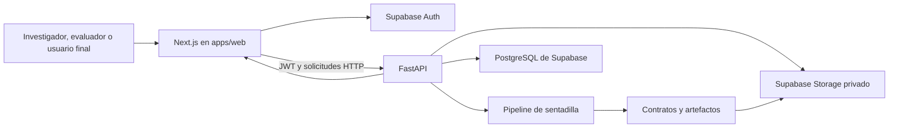

# Plan de desarrollo del frontend web para sentadilla bilateral

## 1. Propósito

Este documento define la implementación de una interfaz web para el sistema de análisis de sentadilla bilateral. La aplicación debe permitir registrar videos, ejecutar el análisis computacional, consultar resultados persistentes y realizar la evaluación comparativa con expertos sin convertir el proyecto de tesis en una plataforma clínica o comercial de gran alcance.

La interfaz se construirá sobre la API FastAPI existente y utilizará los contratos `case_record.json` y `case_report.json`. El frontend no volverá a calcular variables biomecánicas, aplicar umbrales ni clasificar compensaciones. Esas responsabilidades permanecerán en el backend Python para conservar una única fuente de verdad metodológica.

## 2. Decisión resumida

**Estado de implementación:** las fases F0, F1, F2, F3, F4 y F5 se
encuentran completadas. La evidencia técnica de las fases recientes se
documenta en `evidencia_frontend_fase_f4_evaluacion_experta.md` y
`evidencia_frontend_fase_f5_comparacion_exportacion.md`. La autenticación, la
carga, el procesamiento, la persistencia, la evaluación ciega, la
consolidación, las métricas y las exportaciones fueron comprobadas con
servicios locales reales.

| Decisión | Elección |
|---|---|
| Framework web | Next.js con App Router y TypeScript |
| Ubicación inicial | Monorepositorio actual, en `apps/web/` |
| Backend | FastAPI existente |
| Gestor de paquetes | npm, conservando el `package-lock.json` existente |
| Interfaz | Tailwind CSS y componentes de shadcn/ui |
| Carga de videos | `react-dropzone` sobre un control de archivo accesible |
| Estado remoto | Server Components y URL; TanStack Query solo para sondeo de procesamiento |
| Validación de formularios | Zod y React Hook Form |
| Gráficas | PNG reproducibles generados con Matplotlib y barras CSS; Recharts solo si se requiere interacción temporal |
| Base de datos local | PostgreSQL mediante Supabase CLI y Docker |
| Autenticación | Supabase Auth con correo y contraseña |
| Archivos | Buckets privados de Supabase Storage |
| Pruebas unitarias e integración de UI | Vitest y React Testing Library |
| Pruebas de extremo a extremo | Playwright |
| Aplicación móvil | Fuera del alcance de esta fase |

## 3. Evaluación de las alternativas

### 3.1. Next.js

Es la alternativa recomendada porque el alcance incluye rutas dinámicas, autenticación, pantallas diferenciadas por rol, historial paginado, estados de carga y páginas de detalle por caso. El App Router proporciona una estructura directa para layouts, segmentos dinámicos, estados de carga y manejo de errores.

Next.js se utilizará como capa de presentación. No se crearán reglas biomecánicas, exportadores ni una segunda API de dominio dentro de Route Handlers o Server Actions.

### 3.2. React con Vite

Sería suficiente para una única pantalla de carga y resultados. Sin embargo, al incorporar historial, rutas protegidas, evaluaciones expertas y páginas dinámicas, requeriría decidir e integrar por separado más piezas de enrutamiento y sesión. Sigue siendo viable, pero no ofrece una simplificación clara frente a Next.js para el alcance confirmado.

### 3.3. Astro

No se recomienda. Astro es adecuado para sitios centrados en contenido y páginas mayormente estáticas. Esta aplicación estará dominada por formularios, estados de procesamiento, autenticación, tablas, reproducción de video y flujos interactivos.

### 3.4. pnpm y Bun

No se migrará a pnpm ni a Bun durante el inicio. El repositorio ya utiliza npm, posee `package-lock.json` y mantiene Supabase CLI como dependencia de desarrollo. Cambiar el gestor de paquetes generaría modificaciones de infraestructura sin mejorar la validez del prototipo.

Si el frontend se extrae posteriormente a otro repositorio o aparecen varios paquetes JavaScript compartidos, podrá reevaluarse pnpm. Bun no es necesario para este proyecto.

### 3.5. `npx autoskills`

No se ejecutará automáticamente. El repositorio ya dispone de skills específicas para Next.js, diseño frontend, shadcn/ui, Playwright, Vitest, FastAPI y calidad. Instalar skills adicionales no constituye una dependencia del producto y puede introducir instrucciones redundantes o no revisadas.

Solo se buscará o instalará una skill nueva cuando exista una carencia concreta, verificando previamente su origen y contenido.

## 4. Alcance funcional

### 4.1. Incluido en el prototipo web

1. Inicio de sesión con correo y contraseña para todos los roles, registro público por contraseña y Google OAuth para usuarios finales.
2. Registro de un caso y carga del video.
3. Captura de los datos manuales del Instrumento 1.
4. Ejecución del análisis mediante FastAPI.
5. Persistencia del caso, estado, contratos y artefactos.
6. Historial paginado y filtrable.
7. Ruta dinámica para volver a consultar un análisis.
8. Visualización del resultado principal y de los patrones independientes.
9. Reproducción del video original anonimizado y del overlay.
10. Visualización de eventos temporales, capturas y métricas.
11. Vista técnica asociada con el Instrumento 2.
12. Asignación de casos a evaluadores.
13. Evaluación experta ciega mediante el Instrumento 3.
14. Comparación posterior entre referencia experta y sistema.
15. Exportación de instrumentos y evidencia en Excel; PDF como segundo incremento.
16. Manejo visible de videos no incorporados, errores y resultados no concluyentes.
17. Espacio personal para que un usuario final cargue videos, consulte su historial y reciba resultados automáticos con orientaciones generales no diagnósticas.
18. Eliminación de análisis propios y sus archivos asociados por parte del usuario final.

### 4.2. Fuera del alcance inicial

1. Diagnóstico clínico o recomendación terapéutica.
2. Confirmación de correo, recuperación de contraseña, enlaces mágicos u OTP por correo.
3. Aplicación móvil.
4. Procesamiento en tiempo real desde la cámara.
5. Análisis de vistas diferentes de la vista anterior en el plano frontal.
6. Ajuste automático de umbrales mediante aprendizaje automático.
7. Colas distribuidas con Redis, Celery u otra infraestructura adicional.
8. Despliegue multiinstitucional o administración compleja de organizaciones.
9. Notificaciones por correo, SMS, WhatsApp o tiempo real.
10. Inicio de sesión por teléfono durante este incremento.

## 5. Roles y reglas de acceso

### 5.1. Investigador

El investigador podrá:

- registrar y cargar casos;
- completar y revisar el Instrumento 1;
- ejecutar el análisis;
- consultar todos los casos y artefactos;
- asignar casos a evaluadores;
- consultar evaluaciones enviadas;
- consolidar la referencia experta;
- acceder a la comparación final;
- descargar instrumentos y evidencia.

### 5.2. Evaluador experto

Cada experto podrá:

- consultar únicamente los casos que le hayan sido asignados;
- reproducir el video necesario para emitir su valoración;
- completar sus campos del Instrumento 3;
- guardar un borrador;
- enviar y bloquear su evaluación;
- consultar la comparación solo después de enviar su propia valoración y cuando la fase metodológica lo permita.

### 5.3. Evaluación ciega

El experto no debe recibir, antes de enviar su evaluación:

- compensaciones detectadas por el sistema;
- valores biomecánicos calculados;
- umbrales aplicados;
- evidencia de reglas;
- respuestas de otros evaluadores;
- referencia final consolidada.

Esta restricción no debe depender únicamente de ocultar componentes en la interfaz. La API y las políticas de acceso deben impedir que esos datos sean devueltos al rol experto antes de la entrega de su juicio.

Se crearán inicialmente cuatro cuentas: una para el investigador y tres para evaluadores. El diseño no codificará el número cuatro como límite permanente.

### 5.4. Usuario final

El usuario final se autenticará mediante Google y podrá:

- consultar la guía de grabación antes de cargar un video;
- registrar uno o varios análisis propios;
- adjuntar videos con una o varias repeticiones;
- seguir el estado del procesamiento;
- consultar únicamente sus propios videos, resultados y archivos;
- visualizar calidad, repeticiones válidas, variables, patrones y evidencia explicativa;
- recibir orientaciones generales vinculadas con el resultado y sus limitaciones;
- eliminar un análisis propio junto con los objetos almacenados que le pertenezcan.

El usuario final no podrá:

- acceder a casos de investigación ni a videos de otras personas;
- asignar evaluadores o consultar evaluaciones expertas;
- consolidar referencias finales o ver métricas del estudio;
- modificar umbrales, reglas o resultados del pipeline;
- recibir diagnósticos, causas anatómicas, prescripciones terapéuticas o afirmaciones clínicas.

La interfaz utilizará la denominación **Mis análisis**, no **Casos**, porque
para este rol el contenido representa una consulta personal y no una unidad del
estudio. Internamente se podrá reutilizar `squat_cases`, siempre que el esquema
diferencie de forma obligatoria el propósito y el propietario del registro.

## 6. Arquitectura propuesta



### 6.1. Fronteras de responsabilidad

| Capa | Responsabilidad |
|---|---|
| Next.js | Rutas, formularios, navegación, visualización, interacción y sesión |
| FastAPI | Autorización de operaciones, orquestación del análisis, contratos, exportaciones y acceso a artefactos |
| Pipeline Python | Pose 2D, calidad, segmentación, variables, reglas y evidencia |
| Supabase Auth | Identidad y sesión |
| PostgreSQL | Casos, estados, asignaciones, evaluaciones y metadatos |
| Supabase Storage | Videos y artefactos privados |

El navegador utilizará Supabase para iniciar y mantener la sesión. Las operaciones del estudio se realizarán mediante FastAPI enviando el token de acceso. No se implementará una segunda lógica de negocio dentro de Next.js.

## 7. Estructura del repositorio

Se conservará el repositorio actual durante el desarrollo de la tesis:

```text
sistema-biomecanico/
├── api/                         # FastAPI existente
├── src/squat/                   # Motor analítico existente
├── apps/
│   └── web/                     # Nueva aplicación Next.js
├── config/squat/schemas/        # Contratos canónicos
├── supabase/
│   ├── migrations/              # Esquema y políticas
│   └── seed.sql                 # Usuarios y datos de prueba locales
├── tests/                       # Pruebas Python existentes
└── docs/
```

No se moverá ahora el backend a `apps/api/`, porque ese cambio no aporta funcionalidad y aumentaría el riesgo de romper módulos existentes. La separación a otro repositorio se evaluará cuando el prototipo y los contratos estén estables.

El `package.json` raíz podrá configurarse como workspace npm para ejecutar el frontend y conservar Supabase CLI sin mantener dos gestores ni dos archivos de bloqueo incompatibles.

## 8. Modelo de persistencia mínimo

Se priorizarán tablas pequeñas y contratos JSON ya existentes. No es necesario normalizar cada métrica biomecánica en una tabla distinta durante el MVP.

### 8.1. Tablas

| Tabla | Finalidad |
|---|---|
| `profiles` | Relacionar el usuario autenticado con su rol |
| `squat_cases` | Identificación, estado, datos resumidos del Instrumento 1 y ubicación del video |
| `squat_analysis_runs` | Estado de cada ejecución, versiones, errores y `case_report` |
| `squat_artifacts` | Metadatos y rutas privadas de overlays, CSV, JSON, imágenes y gráficas |
| `squat_expert_assignments` | Relación entre caso y evaluador |
| `squat_expert_evaluations` | Cabecera, borrador, envío y bloqueo de la evaluación |
| `squat_expert_evaluation_items` | Clasificación independiente por patrón |

La referencia final experta podrá derivarse y almacenarse dentro del proceso de análisis comparativo. No se presentará como un cuarto instrumento.

Para incorporar el tercer rol se añadirá `user` al dominio de roles y se
agregarán, como mínimo, los siguientes campos a `squat_cases`:

- `owner_id`: propietario autenticado del registro;
- `case_purpose`: `research` o `self_service`;
- `consent_version`: versión del consentimiento o aviso aceptado;
- `deleted_at`: borrado lógico mientras se completa la eliminación de objetos;
- `recommendation_version`: versión del conjunto de orientaciones mostrado.

No se creará una tabla de participantes para el autoservicio. La identidad será
la cuenta de Supabase Auth y el análisis conservará únicamente los datos
necesarios para operar, auditar y eliminar el resultado.

### 8.2. Campos que conviene normalizar

Los siguientes campos deben ser columnas consultables porque se utilizarán en historial, filtros o control de acceso:

- identificador del caso;
- estado;
- fecha de creación;
- usuario que lo registró;
- decisión de incorporación;
- versión del pipeline;
- versión de reglas;
- estado de evaluación experta.

Los contratos completos de los instrumentos 1 y 2 pueden conservarse además en columnas `jsonb`, validados contra los esquemas canónicos.

### 8.3. Almacenamiento de archivos

Se utilizarán buckets privados:

```text
squat-inputs/{case_id}/original.ext
squat-artifacts/{case_id}/{run_id}/overlay.mp4
squat-artifacts/{case_id}/{run_id}/events/...
squat-artifacts/{case_id}/{run_id}/tables/...
squat-exports/{case_id}/...
```

La base de datos almacenará rutas de objetos y metadatos, no archivos binarios. La entrega al navegador se realizará mediante respuestas autenticadas o enlaces firmados de duración limitada.

El límite local actual de Storage es de 50 MiB. Antes de modificarlo se medirán los videos reales. Si el tamaño habitual lo supera, se ajustará el límite de forma explícita y se documentará el máximo aceptado por el protocolo.

### 8.4. Seguridad

Todas las tablas expuestas deberán tener Row Level Security. Las políticas mínimas serán:

- el investigador puede gestionar todos los casos del estudio;
- el experto solo puede leer asignaciones propias;
- el experto solo puede crear o modificar su evaluación mientras sea borrador;
- una evaluación enviada no puede editarse desde la interfaz;
- los resultados computacionales permanecen ocultos al experto hasta cumplir la condición de desbloqueo;
- ningún video o artefacto será público.
- el usuario final solo puede crear, leer y eliminar registros `self_service`
  cuyo `owner_id` corresponda a `auth.uid()`;
- los registros `self_service` no pueden asignarse a expertos ni incorporarse
  automáticamente a la muestra de investigación;
- las cuentas creadas mediante Google recibirán el rol `user` por una función
  controlada en base de datos;
- ningún flujo público podrá establecer `investigator` o `expert` mediante
  `raw_user_meta_data`; esos roles se aprovisionarán únicamente por un proceso
  administrativo confiable;
- el usuario no podrá actualizar directamente su columna de rol.

## 9. Estados del caso

Se definirá una máquina de estados simple:

```text
borrador
→ cargado
→ en_revision
→ en_procesamiento
→ completado
```

Salidas alternativas:

```text
en_revision → no_incorporado
en_procesamiento → error
en_procesamiento → no_concluyente
```

Los nombres internos podrán permanecer en inglés en el código, pero la interfaz utilizará denominaciones formales en español. El historial debe mostrar siempre el estado actual y, cuando corresponda, el motivo.

## 10. API necesaria

### 10.1. Endpoints existentes que se reutilizarán

- `POST /api/v1/squat/cases`
- `GET /api/v1/squat/cases/{case_id}`
- `GET /api/v1/squat/cases/{case_id}/record`
- `GET /api/v1/squat/cases/{case_id}/assets/{filename}`

### 10.2. Endpoints que deberán añadirse

| Operación | Endpoint propuesto |
|---|---|
| Historial paginado | `GET /api/v1/squat/cases` |
| Actualizar revisión manual | `PATCH /api/v1/squat/cases/{case_id}/record` |
| Consultar estado | `GET /api/v1/squat/cases/{case_id}/status` |
| Asignar evaluadores | `POST /api/v1/squat/cases/{case_id}/assignments` |
| Listar asignaciones propias | `GET /api/v1/squat/expert/assignments` |
| Consultar caso ciego | `GET /api/v1/squat/expert/assignments/{assignment_id}` |
| Guardar borrador experto | `PUT /api/v1/squat/expert/assignments/{assignment_id}/evaluation` |
| Enviar evaluación | `POST /api/v1/squat/expert/assignments/{assignment_id}/submit` |
| Consultar comparación | `GET /api/v1/squat/cases/{case_id}/comparison` |
| Exportar instrumento | `GET /api/v1/squat/cases/{case_id}/exports/{instrument}` |

### 10.3. Tipos compartidos

Los esquemas JSON y OpenAPI del backend serán la fuente canónica. Se generarán tipos TypeScript para el cliente en lugar de mantener interfaces manuales que puedan divergir.

## 11. Procesamiento y actualización de estado

El endpoint actual es síncrono y se conservará para la primera integración técnica. Esto permite demostrar la carga y obtener un resultado sin introducir infraestructura adicional.

Antes de habilitar uso multiusuario se aplicará una mejora local:

1. la API crea el caso y devuelve un identificador;
2. el análisis se ejecuta como tarea de fondo local;
3. el estado se persiste en PostgreSQL;
4. el frontend consulta el estado periódicamente con TanStack Query cuando exista un proceso asíncrono real;
5. al finalizar, recupera el reporte.

Para el prototipo local puede utilizarse `BackgroundTasks` de FastAPI con manejo explícito de interrupciones. No se incorporarán Redis, Celery ni otra cola distribuida hasta que exista una necesidad comprobada de concurrencia o recuperación de trabajos.

## 12. Rutas y pantallas

### 12.1. Acceso

- `/login`
- `/sign-up`
- `/auth/callback`

`/login` conservará correo y contraseña para todos los roles y añadirá
**Continuar con Google** para usuarios finales. `/sign-up` permitirá crear
cuentas `user` con correo, contraseña y confirmación local de contraseña. No se
implementarán confirmación por correo, recuperación de contraseña ni otras
notificaciones durante este incremento. El callback intercambiará el
código PKCE por una sesión en cookies, consultará el rol en `profiles` y
redirigirá a la página inicial correspondiente. La autorización no dependerá
del rol almacenado en `user_metadata`.

#### Configuración OAuth por entorno

Para el proyecto alojado de Supabase se utilizará esta configuración:

| Sistema | Campo | Valor recomendado |
|---|---|---|
| Supabase Auth | Site URL | `https://sentadilla-biomecanica-web.vercel.app` |
| Supabase Auth | Redirect URL de producción | `https://sentadilla-biomecanica-web.vercel.app/auth/callback` |
| Supabase Auth | Redirect URL local canónica | `http://localhost:3000/auth/callback` |
| Supabase Auth | Redirect URL local alternativa | `http://127.0.0.1:3000/auth/callback`, solo si se prueba deliberadamente con ese origen |
| Google Cloud | Origen JavaScript de producción | `https://sentadilla-biomecanica-web.vercel.app` |
| Google Cloud | Origen JavaScript local | `http://localhost:3000` |
| Google Cloud | URI autorizada de redirección | `https://nibyzrkwnyaunynyrfcr.supabase.co/auth/v1/callback` |

Google redirige hacia el callback de Supabase y Supabase devuelve el navegador
a `/auth/callback` en la aplicación. Por ello, la URI de Vercel no reemplaza al
callback de Supabase dentro de Google Cloud. Los comodines `/**` admitidos por
Supabase pueden conservarse durante pruebas, pero antes de abrir el acceso
público se preferirán rutas exactas para reducir destinos innecesarios.

Se adoptará `localhost` como origen local canónico. Alternar una misma sesión
entre `localhost` y `127.0.0.1` puede separar cookies y el verificador PKCE por
tratarse de orígenes distintos. El callback local de Supabase
`http://127.0.0.1:54321/auth/v1/callback` solo será necesario si en el futuro se
ejecuta Supabase Auth local; no corresponde al desarrollo actual contra
Supabase Cloud.

### 12.2. Investigador

- `/cases`: historial paginado, filtros y estados.
- `/cases/new`: registro del caso, Instrumento 1 y carga.
- `/cases/[caseId]`: resumen principal.
- `/cases/[caseId]/technical`: Instrumento 2, calidad y artefactos.
- `/cases/[caseId]/comparison`: evaluaciones, referencia final y métricas.

### 12.3. Evaluador

- `/expert/assignments`: casos pendientes y enviados.
- `/expert/assignments/[assignmentId]`: video y formulario ciego del Instrumento 3.

### 12.4. Usuario final

Rutas recomendadas:

- `/my-analyses`: espacio personal con historial paginado y acción para iniciar
  un análisis;
- `/my-analyses/new`: guía, consentimiento, carga y validación inicial;
- `/my-analyses/[analysisId]`: procesamiento y resultados del análisis propio.

En la interfaz se mostrarán como **Mis análisis**, **Nuevo análisis** y
**Resultado del análisis**. No se recomienda usar `/cases` para este rol porque
esa denominación está asociada al estudio y a la evaluación experta.

Se evaluaron tres alternativas de navegación:

| Alternativa | Ventaja | Limitación | Decisión |
|---|---|---|---|
| Lista tradicional y páginas separadas | Convención simple para historiales | Se siente administrativa y separa demasiado carga, espera y resultado | No elegida como experiencia principal |
| Una sola página con todo el historial y el formulario | Reduce cambios de ruta | Crece rápidamente, dificulta enlaces directos, recuperación de estado y carga incremental | Descartada |
| Espacio de análisis inspirado en chat | Mantiene contexto, historial cercano y continuidad entre carga y resultado | Requiere un shell responsive bien delimitado | **Recomendada** |

La experiencia tomará la estructura útil de una aplicación conversacional sin
convertirse en un chat real:

1. en escritorio, una barra lateral mostrará el historial y el panel principal
   contendrá la guía, carga, progreso o resultado seleccionado;
2. en móvil, el historial se abrirá mediante un panel lateral y el contenido
   conservará una sola columna;
3. el estado vacío permitirá cargar el primer video;
4. después del procesamiento, el mismo panel se transformará en una narración
   secuencial: calidad de captura, repeticiones, resultados, explicación y
   orientaciones generales;
5. no se implementarán mensajes, canales ni Realtime Chat, porque el caso de
   uso es un análisis persistente y no una conversación entre personas.

### 12.5. Detalle del caso

La vista principal tendrá:

1. encabezado con identificador, estado y versión;
2. tarjetas independientes para tronco, pelvis, valgo y asimetría;
3. reproductor con overlay;
4. línea temporal de fases;
5. selector de repetición;
6. capturas de inicio, máxima profundidad y final;
7. valores y umbrales aplicados;
8. sección expandible de calidad;
9. descargas y exportaciones.

Un video podrá mostrar ninguna, una o varias compensaciones. La interfaz no impondrá una clasificación única por caso.

## 13. Visualizaciones

### 13.1. Visualizaciones principales

1. Barras por repetición y patrón con bandas de ausencia, ambigüedad y presencia.
2. Línea temporal de reposo, descenso, máxima profundidad y ascenso.
3. Porcentaje de fotogramas válidos y promedio de puntos anatómicos clave detectados por fotograma.
4. Comparación izquierda-derecha para las medidas que correspondan.
5. Evidencia de regla con valor, umbral, versión y decisión.

### 13.2. Visualizaciones avanzadas

1. Serie temporal biomecánica sincronizada con el video.
2. Curva utilizada para la segmentación de repeticiones.
3. Matriz de confusión por patrón.
4. Precisión, sensibilidad, especificidad, F1-score y Kappa cuando exista referencia experta.

Las visualizaciones avanzadas no se mostrarán todas al abrir un caso. El resultado y su explicación tendrán prioridad; el detalle quedará en pestañas o secciones expandibles.

## 14. Exportación de instrumentos y evidencia

La exportación debe construirse en FastAPI, porque el backend posee los datos canónicos, las versiones del pipeline y las reglas metodológicas.

### 14.1. Excel

Será el primer formato implementado:

- Instrumento 1 con datos manuales, técnicos y decisión de incorporación;
- Instrumento 2 con procesamiento, calidad, variables y resultados;
- Instrumento 3 con evaluaciones, referencia final y salida del sistema, únicamente después de completar la fase comparativa;
- libro consolidado del estudio para análisis posterior.

Se reutilizarán las cabeceras validadas de los instrumentos. `openpyxl` es suficiente para completar plantillas y aplicar formato sin incorporar un servicio externo.

### 14.2. PDF

Se implementará después de validar la exportación Excel. El PDF será un reporte legible por caso, no un reemplazo de los archivos técnicos. Debe incluir:

- identificación y estado;
- resumen de calidad;
- compensaciones detectadas;
- capturas representativas;
- métricas resumidas;
- reglas aplicadas;
- versiones;
- nota sobre los umbrales provisionales cuando corresponda.

La decisión entre una plantilla HTML convertida a PDF o una generación directa en Python se tomará mediante una prueba pequeña en Windows. No se añadirá una dependencia pesada antes de comprobar su compatibilidad.

### 14.3. Permisos de exportación

- El investigador puede exportar los instrumentos 1 y 2 al terminar el análisis.
- El Instrumento 3 solo puede exportarse completo cuando existan evaluaciones enviadas y referencia final.
- El experto no puede descargar una versión que revele el resultado del sistema antes de enviar su evaluación.
- Los archivos técnicos por fotograma se ofrecerán como descarga avanzada.

## 15. Dirección de diseño

La interfaz seguirá una dirección de **laboratorio de movimiento**, clara y técnica, sin apariencia clínica genérica.

- Tema principal claro.
- Fondo marfil o gris cálido con textura geométrica muy sutil.
- Color dominante azul petróleo.
- Acentos distintos para estados: ámbar para revisión, rojo controlado para presencia y verde para ausencia.
- Tipografía de lectura con personalidad, acompañada de una tipografía monoespaciada para valores y versiones.
- Tarjetas con jerarquía fuerte, no una cuadrícula uniforme de paneles intercambiables.
- Animaciones limitadas a la carga del análisis, aparición progresiva de resultados y sincronización del cursor.
- Diseño responsive para revisión en escritorio y consulta en móvil, sin intentar sustituir todavía una aplicación móvil nativa.

La accesibilidad mínima incluirá navegación por teclado, etiquetas explícitas, contraste suficiente, estados no dependientes solo del color, subtítulos descriptivos de gráficas y alternativas tabulares.

## 16. Estrategia de pruebas

### 16.1. Vitest

Se utilizará para:

- validadores de formularios;
- transformación de respuestas API a modelos de vista;
- formateo de estados, métricas y umbrales;
- autorización visible por rol;
- componentes de resultados y tablas;
- estados vacío, carga, error y no incorporado.

Las solicitudes podrán simularse inicialmente con `vi.fn()` sobre el cliente HTTP. MSW solo se añadirá si la cantidad de escenarios hace frágiles los mocks simples.

### 16.2. Playwright

Se crearán tres recorridos principales:

1. **Caso apto:** inicio de sesión del investigador, registro, carga, procesamiento, consulta de resultados y descarga.
2. **Evaluación experta:** inicio de sesión del experto, acceso a un caso asignado, confirmación de que no ve el resultado del sistema, evaluación, envío y desbloqueo posterior.
3. **Caso no incorporado:** inicio de sesión del investigador, carga de un video que incumple condiciones críticas y visualización del motivo.

Se añadirá un cuarto recorrido para un caso con múltiples patrones cuando el conjunto piloto quede estable.

Existirá una prueba independiente del formulario de inicio de sesión. Los demás escenarios reutilizarán estados de autenticación de Playwright por rol para reducir tiempo y fallos, salvo un recorrido completo por rol que verificará el acceso real.

Los videos reales se reservarán para pruebas de integración etiquetadas como lentas. Las pruebas unitarias no ejecutarán el pipeline completo.

### 16.3. Criterios de aceptación

- ninguna vista de experto recibe resultados antes del envío;
- un caso persiste después de recargar el navegador;
- el historial recupera el caso por su ruta dinámica;
- los estados de procesamiento y error son comprensibles;
- los valores mostrados coinciden con `case_report.json`;
- las descargas contienen los campos del instrumento correspondiente;
- la interfaz no presenta diagnósticos clínicos;
- el overlay y las capturas preservan la anonimización prevista.

## 17. Fases de implementación y commits

### Fase F0. Preparación

- crear `apps/web/`;
- configurar Next.js, TypeScript, Tailwind y shadcn/ui;
- definir variables de entorno;
- generar tipos desde OpenAPI;
- establecer layout y tokens visuales.

Commit sugerido:

```text
feat(web): scaffold squat analysis frontend
```

### Fase F1. Persistencia y autenticación

- crear migraciones de tablas y políticas;
- configurar Supabase Auth;
- crear roles y datos locales de prueba;
- verificar JWT en FastAPI;
- proteger rutas.

La ampliación OAuth de esta fase deberá:

- extender `SquatRole` a `investigator | expert | user` en PostgreSQL,
  FastAPI y TypeScript;
- dejar de decidir la navegación a partir de `user_metadata` y consultar el rol
  efectivo de `profiles`;
- crear `/auth/callback` para intercambiar el código PKCE por una sesión SSR;
- asignar `user` de forma segura a las altas de Google;
- mantener las cuentas internas existentes con correo y contraseña;
- impedir que una alta pública solicite los roles privilegiados.

Commit sugerido:

```text
feat(web): add squat auth and persistent case model
```

### Fase F2. Registro, carga e historial

- implementar `/cases`, `/cases/new` y `/cases/[caseId]`;
- integrar `react-dropzone`;
- representar el Instrumento 1;
- persistir video y metadatos;
- añadir paginación y filtros;
- manejar casos no incorporados.

Commit sugerido:

```text
feat(web): add case intake upload and history
```

### Fase F3. Procesamiento y resultados

- integrar el endpoint de análisis; **implementado**;
- persistir el resultado y los artefactos privados; **implementado**;
- mostrar espera, errores y resultado; **implementado para el procesamiento síncrono actual**;
- reproducir overlay; **implementado**;
- representar eventos, capturas y gráficas; **implementado**;
- completar la vista técnica del Instrumento 2; **implementado**.

El sondeo periódico se mantiene diferido. Se incorporará únicamente si el
procesamiento pasa a ejecutarse en segundo plano o si los tiempos medidos
justifican separar la solicitud de carga de la ejecución analítica.

Commit sugerido:

```text
feat(web): visualize squat analysis evidence
```

### Fase F4. Evaluación experta ciega

- asignar casos; **implementado**;
- construir la vista restringida; **implementado**;
- generar y servir un video anonimizado sin superposiciones para la revisión
  experta; **implementado**;
- guardar borradores; **implementado**;
- bloquear evaluaciones enviadas; **implementado**;
- impedir desde la API y la interfaz el acceso previo a resultados;
  **implementado**;
- verificar el flujo completo con dos cuentas y una prueba E2E;
  **implementado**.

La evidencia de esta fase se encuentra en
`docs/evidencia_frontend_fase_f4_evaluacion_experta.md`. La comparación entre
evaluadores, la consolidación de la referencia final y el cálculo de métricas
pertenecen a la fase F5 y no forman parte del formulario ciego.

Commit sugerido:

```text
feat(web): add blinded expert evaluation flow
```

### Fase F5. Comparación y exportación

- consolidar automáticamente coincidencia directa y mayoría absoluta;
  **implementado**;
- registrar consenso guiado cuando existe discrepancia; **implementado**;
- mostrar coincidencias y discrepancias por patrón; **implementado**;
- calcular matriz binaria, exactitud, precisión, sensibilidad, especificidad,
  F1-score, acuerdo exacto y Kappa; **implementado**;
- excluir y contabilizar pares no concluyentes; **implementado**;
- exportar Instrumentos 1, 2 y 3, matriz de análisis y métricas en Excel;
  **implementado**;
- generar reporte comparativo PDF; **implementado**;
- verificar comparación y descargas con Playwright; **implementado**.

La evidencia se encuentra en
`docs/evidencia_frontend_fase_f5_comparacion_exportacion.md`.

Commit sugerido:

```text
feat(web): add expert comparison and instrument exports
```

### Fase F6. Verificación

- completar Vitest; **implementado**;
- completar Playwright; **implementado**;
- revisar accesibilidad y responsive; **implementado para presentación móvil,
  estructura principal y navegación por teclado**;
- validar trazabilidad con los objetivos específicos; **implementado**;
- preparar evidencias y diagramas para el asesor; **implementado**;
- consolidar en Mermaid los flujos de investigador, experto y video no apto;
  **implementado**;
- generar archivos `.drawio` editables con la arquitectura conjunta de
  Next.js, FastAPI, Supabase y el pipeline de visión por computadora;
  **implementado**;
- generar un diagrama de secuencia para carga, procesamiento y persistencia;
  **implementado**;
- generar un diagrama de secuencia para evaluación ciega, consenso y métricas;
  **implementado**;
- relacionar cada prueba Playwright con su caso de uso y evidencia visual;
  **implementado**.

El inventario inicial de flujos y diagramas se encuentra en
`docs/flujos_sistema_roles_y_evidencias_fase6.md`. No se requiere instalar un
MCP específico para diagrams.net: el editor importa Mermaid y archivos
`.drawio` o XML. Durante F6 se conservarán ambas versiones para facilitar la
edición manual y la trazabilidad en Git.

La evidencia final se encuentra en
`docs/evidencia_frontend_fase_f6_verificacion.md` y los diagramas editables en
`docs/diagramas/fase6/`.

Commit sugerido:

```text
test(web): verify squat research workflows
```

### Fase F7. Portal de autoservicio para usuarios

#### F7.1. Autenticación y autorización

- implementar el botón **Continuar con Google** mediante
  `signInWithOAuth({ provider: "google" })`;
- implementar `/sign-up` con correo, contraseña y repetición de contraseña;
- validar el formulario con React Hook Form y Zod, incluyendo coincidencia y
  longitud mínima de contraseñas;
- crear la cuenta mediante `signUp` con rol efectivo `user`, sin aceptar roles
  enviados por el navegador;
- desactivar la confirmación de correo en Supabase Auth para que el registro
  establezca la sesión inmediatamente;
- enlazar `/sign-up` desde `/login` y ofrecer retorno a `/login` para cuentas
  existentes;
- utilizar `redirectTo` con `/auth/callback` y validar `next` como ruta relativa;
- crear el perfil `user` al primer acceso;
- actualizar el proxy de sesión, layouts protegidos y redirección por rol;
- aplicar RLS y validaciones FastAPI para propiedad y propósito del análisis;
- conservar sin cambios funcionales el login por contraseña de investigador y
  expertos.

No se mostrarán enlaces de recuperación de contraseña porque el proyecto no
configura SMTP ni notificaciones de correo. Esta limitación se indicará junto al
registro y deberá reevaluarse antes de tratar el autoservicio como servicio
público permanente.

#### F7.2. Espacio personal

- construir el shell responsive de `/my-analyses`;
- mostrar historial paginado propio en barra lateral o panel móvil;
- implementar `/my-analyses/new` con guía, aceptación informada y carga;
- autogenerar los códigos técnicos sin solicitar identidad adicional;
- admitir una o varias repeticiones, conservando resultados independientes por
  repetición;
- impedir que un análisis de autoservicio sea asignado a expertos.

#### F7.3. Resultado y orientaciones

- reutilizar los componentes de calidad, segmentación, resultados y
  explicabilidad sin mostrar controles de investigación;
- presentar primero un resumen comprensible y dejar el detalle técnico en
  secciones expandibles;
- generar orientaciones generales mediante una tabla de reglas versionada,
  basada en los patrones concluyentes;
- mostrar advertencias ante resultados no concluyentes o videos no aptos;
- incluir el alcance no clínico y recomendar evaluación profesional cuando el
  resultado o la calidad lo justifiquen;
- no atribuir causas anatómicas ni recomendar ejercicios correctivos
  individualizados durante este incremento.

#### F7.4. Privacidad y ciclo de vida

- almacenar videos y artefactos en rutas privadas por propietario;
- servir archivos mediante autorización o URL firmada de corta duración;
- registrar la versión del aviso aceptado;
- permitir eliminación del análisis y limpieza de archivos derivados;
- definir una política de retención antes de abrir el acceso público.

#### F7.5. Pruebas

- Vitest: selección de destino por rol, generación de callback seguro,
  validación de registro, traducción de estados y reglas de orientaciones;
- pruebas de integración: perfil OAuth, RLS de propiedad y rechazo de
  asignaciones sobre análisis personales;
- Playwright: registro por contraseña, login Google simulado o sesión
  preautenticada, carga, progreso, resultado, historial y eliminación;
- Playwright negativo: un usuario no puede abrir el análisis de otro ni rutas de
  investigador o experto;
- prueba responsive del shell tipo espacio de análisis en escritorio y móvil.

Commits sugeridos:

```text
feat(auth): add google login and self-service user role
feat(auth): add password signup for self-service users
feat(web): add personal squat analysis workspace
feat(api): authorize user-owned squat analyses
test(web): verify self-service analysis workflows
```

Esta fase reutilizará el pipeline, el contrato de resultados y los componentes
visuales actuales. No se duplicará una segunda aplicación ni se añadirá una
infraestructura de chat.

Cada fase se confirmará y enviará en la rama `codex/sentadilla-bilateral-dev`, incluyendo únicamente archivos relacionados con la implementación.

## 18. Evidencias para los objetivos específicos

| Evidencia web | Relación con la tesis |
|---|---|
| Overlay y panel de calidad | Identificación y disponibilidad de puntos anatómicos |
| Línea temporal y capturas de eventos | Segmentación necesaria para comparar fases |
| Gráficas y valores por repetición | Cálculo de variables biomecánicas |
| Valor, umbral, versión y decisión | Criterios biomecánicos interpretables |
| Flujo carga-procesamiento-resultado | Implementación del prototipo |
| Evaluación ciega, comparación y métricas | Desempeño técnico frente a referencia experta |

## 19. Riesgos y controles

| Riesgo | Control |
|---|---|
| Duplicar lógica entre frontend y backend | Generar tipos y consumir contratos; no recalcular en React |
| Filtrar resultados a expertos | Autorización en FastAPI y RLS, no solo ocultamiento visual |
| Videos grandes | Medir casos reales y ajustar límite antes de ampliar dependencias |
| Procesamiento prolongado | Estado persistente y consulta periódica; cola distribuida solo si es necesaria |
| Divergencia de instrumentos | Exportar desde los mismos contratos y plantillas validadas |
| Pruebas lentas | Separar pruebas UI de las pruebas con pipeline real |
| Sobredimensionamiento | Mantener un solo frontend, una API y el mínimo de tablas |
| Escalada de privilegios en altas OAuth | Asignar `user` en base de datos y reservar roles internos para aprovisionamiento administrativo |
| Exposición de videos personales | RLS por propietario, buckets privados, URLs firmadas y eliminación verificable |
| Orientaciones interpretadas como diagnóstico | Lenguaje educativo, reglas versionadas, incertidumbre visible y alcance no clínico |
| Abuso de carga o procesamiento | Límites de tamaño, frecuencia, cantidad de análisis y controles antiabuso antes de apertura pública |

## 20. Orden inmediato recomendado

1. Ampliar el dominio de roles y endurecer la creación de perfiles para que toda alta pública reciba `user` sin poder solicitar privilegios.
2. Crear `/auth/callback`, integrar **Continuar con Google** y verificar la redirección SSR por rol.
3. Incorporar propiedad y propósito a los análisis, junto con RLS, autorización FastAPI y rutas privadas de Storage.
4. Construir `/my-analyses`, `/my-analyses/new` y `/my-analyses/[analysisId]` reutilizando el flujo de carga y los componentes de resultados existentes.
5. Implementar orientaciones generales versionadas, alcance no clínico, eliminación y política de retención.
6. Ejecutar pruebas unitarias, de integración, RLS, Playwright y responsive antes de habilitar el acceso público en producción.

La demostración de este incremento deberá permitir que un usuario acceda con
Google, cargue un video propio, siga el procesamiento, consulte resultados y
orientaciones generales, vuelva a encontrarlos en **Mis análisis** y elimine el
registro. En paralelo se comprobará que no pueda acceder a rutas del estudio,
datos ajenos, asignaciones expertas ni métricas de validación.

## 21. Referencias técnicas oficiales

- [Next.js App Router](https://nextjs.org/docs/app)
- [Supabase Local Development](https://supabase.com/docs/guides/local-development)
- [Supabase Auth](https://supabase.com/docs/guides/auth)
- [Supabase: Login with Google](https://supabase.com/docs/guides/auth/social-login/auth-google)
- [Supabase: Redirect URLs](https://supabase.com/docs/guides/auth/redirect-urls)
- [Supabase: Phone Login](https://supabase.com/docs/guides/auth/phone-login)
- [Supabase Row Level Security](https://supabase.com/docs/guides/database/postgres/row-level-security)
- [Supabase Storage](https://supabase.com/docs/guides/storage)
- [shadcn/ui](https://ui.shadcn.com/docs)
- [TanStack Query para React](https://tanstack.com/query/latest/docs/framework/react/overview)
- [Playwright: buenas prácticas](https://playwright.dev/docs/best-practices)
- [Playwright: autenticación](https://playwright.dev/docs/auth)
- [Vitest](https://vitest.dev/guide/)
- [react-dropzone](https://react-dropzone.js.org/)
