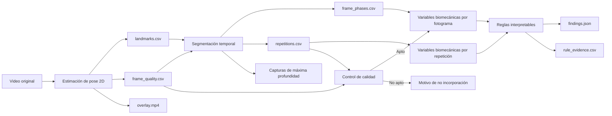
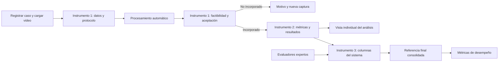

# Uso de los artefactos de salida e integración en una interfaz

## 1. Propósito

Este documento explica para qué sirve cada archivo generado en `data/sentadilla_bilateral/outputs/`, cómo se relaciona con el video overlay y cómo puede presentarse el análisis en una interfaz web o móvil.

Los artefactos no son resultados aislados. En conjunto forman una cadena de evidencia que permite responder cinco preguntas:

1. ¿El sistema pudo estimar la pose de manera suficiente?
2. ¿Cuántas repeticiones detectó y en qué momentos ocurrieron?
3. ¿Qué valores biomecánicos calculó en cada repetición?
4. ¿Qué criterios aplicó para clasificar cada patrón?
5. ¿Qué compensaciones o asimetrías detectó finalmente?

El resultado principal para el usuario será la clasificación de las compensaciones observables. El overlay, las capturas, las gráficas, los CSV y los JSON permitirán explicar y verificar cómo se obtuvo ese resultado.

## 2. Relación general entre los archivos

Todos los archivos de una carpeta de salida pertenecen al mismo caso y se relacionan mediante:

- el identificador del caso;
- el número de fotograma;
- el tiempo en segundos;
- el número de repetición;
- la fase del movimiento.



El overlay muestra visualmente dónde ubicó el sistema los puntos anatómicos. Los CSV conservan los valores detallados utilizados en los cálculos. Los JSON resumen el estado de cada etapa y las decisiones finales. Las imágenes facilitan la revisión humana y la presentación de resultados.

## 3. Inventario y utilidad de los artefactos

### 3.1. Estimación de pose y calidad

| Archivo | Contenido | Utilidad técnica | Representación en interfaz |
|---|---|---|---|
| `overlay.mp4` | Video anonimizado con puntos anatómicos, segmentos corporales y estado del fotograma | Permite verificar visualmente si la pose sigue correctamente el movimiento | Reproductor principal del análisis |
| `landmarks.csv` | Coordenadas X, Y y Z estimada, visibilidad y presencia de cada punto anatómico por fotograma | Fuente primaria para segmentación y cálculos biomecánicos | No se muestra completo por defecto; puede ofrecerse como descarga técnica |
| `frame_quality.csv` | Detección de pose, cantidad de puntos detectados, visibilidad mínima, validez y motivo de invalidez por fotograma | Permite identificar pérdidas temporales de referencias y decidir qué fotogramas pueden analizarse | Línea de calidad sincronizada con el reproductor |
| `pose_summary.json` | Totales y porcentajes de procesamiento, fotogramas con pose, fotogramas válidos y promedio de puntos detectados | Resumen estructurado para la API y las tarjetas de calidad | Tarjeta “Calidad de estimación” |
| `pose_quality.png` | Evolución temporal de la visibilidad mínima y cantidad de puntos detectados | Evidencia visual rápida de estabilidad de pose | Gráfica secundaria o sección técnica |

### 3.2. Segmentación temporal

| Archivo | Contenido | Utilidad técnica | Representación en interfaz |
|---|---|---|---|
| `frame_phases.csv` | Repetición y fase asignada a cada fotograma, junto con la señal de profundidad | Permite sincronizar el video con reposo, descenso, máxima profundidad y ascenso | Línea temporal coloreada debajo del reproductor |
| `repetitions.csv` | Inicio, máxima profundidad, final y duración de cada repetición | Resume los ciclos detectados y permite navegar directamente a cada evento | Selector de repetición y tabla de tiempos |
| `segmentation_summary.json` | Resumen estructurado de las repeticiones detectadas y sus tiempos | Fuente de eventos para una API o reproductor interactivo | Marcadores clicables en la línea temporal |
| `segmentation.png` | Curva suavizada del centro de caderas y máximos de profundidad | Demuestra cómo el sistema separó las repeticiones | Gráfica explicativa de la segmentación |
| `peak_rep_1.png`, `peak_rep_2.png`, `peak_rep_3.png` | Captura del fotograma de máxima profundidad de cada repetición | Facilita la comparación visual en el momento biomecánicamente más relevante | Galería comparativa de repeticiones |

Actualmente se generan capturas de máxima profundidad. A partir de `repetitions.csv` también es posible generar posteriormente capturas del inicio del descenso y del final del ascenso sin modificar el algoritmo de segmentación.

### 3.3. Variables biomecánicas

| Archivo | Contenido | Utilidad técnica | Representación en interfaz |
|---|---|---|---|
| `biomechanical_frame_metrics.csv` | Valores por fotograma de tronco, pelvis, desviación medial de cada rodilla y diferencia bilateral | Permite revisar la evolución completa y detectar en qué fase aumenta cada señal | Gráficas temporales sincronizadas con el video |
| `biomechanical_repetition_metrics.csv` | Valores en máxima profundidad y máximos observados por repetición | Permite revisar diferencias entre ejecuciones sin fusionar sus clasificaciones | Tabla comparativa y barras por repetición |
| `biomechanical_summary.json` | Convenciones, normalización, resúmenes por repetición y rutas de artefactos | Contrato estructurado para consumir resultados desde una API | Fuente de tarjetas y tablas resumidas |
| `biomechanical_metrics.png` | Evolución temporal de las cuatro variables biomecánicas | Evidencia visual conjunta del comportamiento durante el ejercicio | Panel de gráficas avanzadas |

### 3.4. Control de calidad analítica

| Archivo | Contenido | Utilidad técnica | Representación en interfaz |
|---|---|---|---|
| `quality_gate_summary.json` | Estado de aptitud, verificaciones realizadas, valores observados, requisitos, advertencias y motivos de exclusión | Impide calcular compensaciones cuando el registro no cumple los requisitos técnicos implementados | Estado “Apto para análisis” o explicación formal del motivo de no incorporación |

Cuando un video no supera el control de calidad, el pipeline conserva los artefactos generados hasta esa etapa, pero no produce variables biomecánicas ni hallazgos. Esto evita mostrar una clasificación basada en evidencia insuficiente.

Las condiciones de apoyo de los talones y la presencia de soportes externos pertenecen al control manual del protocolo y del Instrumento 1. No forman parte de este control automático.

### 3.5. Criterios interpretables y resultado final

| Archivo | Contenido | Utilidad técnica | Representación en interfaz |
|---|---|---|---|
| `rule_evidence.csv` | Patrón, estado, dirección, métrica, valor agregado, valores por repetición, banda de decisión y fundamento de la regla | Hace trazable la relación entre medición, criterio y resultado | Panel “¿Por qué se obtuvo este resultado?” |
| `findings.json` | Decisiones de los cuatro patrones, hallazgos presentes, resultados no concluyentes, versión del conjunto de reglas y notas | Resultado estructurado principal del análisis | Tarjetas de compensaciones detectadas |

El valor agregado y la distancia respecto al umbral no deben presentarse como una probabilidad ni como un porcentaje de confianza. Los umbrales actuales son provisionales y describen bandas de decisión interpretables, no puntos de corte clínicos.

## 4. Relación con los instrumentos metodológicos

Los instrumentos representan cómo se recolectan y organizan los datos de la investigación. La interfaz no necesita reproducir las hojas de Excel de forma literal, pero sí debe conservar todos sus campos, reglas y relaciones.

La correspondencia funcional será:

| Instrumento | Función metodológica | Traducción a la interfaz |
|---|---|---|
| Instrumento 1 | Registrar el video, sus condiciones de captura, la disponibilidad de puntos anatómicos y su aceptación | Formulario de registro, revisión técnica y decisión de incorporación |
| Instrumento 2 | Registrar la salida computacional, las variables biomecánicas y los criterios aplicados | Panel automático de procesamiento, métricas, reglas y visualizaciones |
| Instrumento 3 | Comparar las clasificaciones de los expertos con las del sistema | Módulo restringido de evaluación experta y consolidación |

### 4.1. Instrumento 1 como entrada y control del caso

El Instrumento 1 debe transformarse en el primer paso de la interfaz. Su finalidad no es mostrar compensaciones, sino crear un caso trazable y determinar si el video puede incorporarse al análisis.

#### Datos ingresados o confirmados por el investigador

- código del video;
- fecha de registro;
- fuente del video;
- enlace o ruta del archivo;
- edad y sexo del participante;
- vista de captura;
- dispositivo utilizado;
- iluminación;
- fondo visual;
- visibilidad corporal;
- presencia de oclusiones;
- observación de una sentadilla completa;
- condiciones manuales del protocolo, incluido el apoyo de los talones cuando estos campos se incorporen formalmente al instrumento.

#### Datos que pueden obtenerse automáticamente

- ruta del archivo cargado;
- resolución;
- frecuencia de video;
- cantidad de fotogramas;
- disponibilidad de pose;
- disponibilidad de puntos anatómicos clave;
- porcentaje de fotogramas procesados y válidos;
- motivos técnicos detectados por el control automático de calidad.

Los datos obtenidos automáticamente deben poder ser revisados por el investigador antes de confirmar la aceptación. Las condiciones que el sistema no evalúa, como la presencia de soportes debajo de los talones, permanecerán como verificaciones manuales.

#### Pantalla propuesta

El módulo puede dividirse en tres bloques:

1. **Registro del caso:** código, fecha, fuente, participante y archivo.
2. **Condiciones de captura:** vista, dispositivo, iluminación, fondo, visibilidad, oclusiones y cumplimiento manual del protocolo.
3. **Factibilidad analítica:** disponibilidad de puntos anatómicos, sentadilla completa, resultado del control técnico y motivo de no incorporación cuando corresponda.

La decisión final de este módulo será “registro incorporado al análisis” o “registro no incorporado”, acompañada por su justificación. Esta decisión no debe confundirse con la detección de una compensación.

#### Relación del Instrumento 1 con los outputs

| Campo del Instrumento 1 | Fuente principal |
|---|---|
| Código del video | Entrada manual y nombre del caso |
| Fecha, fuente, edad, sexo, vista y dispositivo | Entrada o confirmación manual |
| Ruta del video | Archivo cargado |
| Resolución y frecuencia | Metadatos del video |
| Iluminación, fondo, visibilidad y oclusiones | Evaluación manual del investigador |
| Sentadilla observable completa | Protocolo y `segmentation_summary.json` |
| Disponibilidad de puntos anatómicos | `frame_quality.csv`, `pose_summary.json` y revisión del overlay |
| Video válido para procesamiento | Decisión integrada a partir del Instrumento 1 y `quality_gate_summary.json` |
| Motivo de exclusión | Registro manual y motivos contenidos en `quality_gate_summary.json` |

El `quality_gate_summary.json` no reemplaza al Instrumento 1. Solo aporta las verificaciones automáticas implementadas; la decisión metodológica completa también depende de condiciones manuales de captura.

### 4.2. Instrumento 2 como salida automática del sistema

El Instrumento 2 tiene la relación más directa con los outputs. La interfaz debería llenarlo automáticamente después de procesar un video aceptado.

| Campo del Instrumento 2 | Output o fuente |
|---|---|
| Código del video | Identificador del caso |
| Estado de procesamiento | Estados de `pose_summary.json`, `quality_gate_summary.json`, `biomechanical_summary.json` y `findings.json` |
| Cantidad total de fotogramas | `pose_summary.json` |
| Fotogramas válidos y porcentaje | `pose_summary.json` y `frame_quality.csv` |
| Fotogramas procesados correctamente y porcentaje | `pose_summary.json` |
| Número de puntos anatómicos clave detectados | `pose_summary.json` y `frame_quality.csv` |
| Inclinación del tronco | `biomechanical_repetition_metrics.csv` y `biomechanical_summary.json` |
| Desplazamiento lateral de pelvis | `biomechanical_repetition_metrics.csv` y `biomechanical_summary.json` |
| Alineación rodilla-cadera-tobillo | Métricas de desviación medial por rodilla en los outputs biomecánicos |
| Diferencias bilaterales | Métrica de diferencia bilateral en los outputs biomecánicos |
| Número de criterios implementados | Conjunto de reglas aplicado |
| Tipo de compensación detectada | `findings.json` |
| Umbral aplicado | `rule_evidence.csv` |
| Generación de reporte | Existencia del resumen o reporte por caso |
| Visualización de resultados | Existencia de overlay, capturas y gráficas |

En la implementación actual, el indicador “número de puntos anatómicos clave detectados” se calcula sobre los 13 puntos seleccionados para la sentadilla: nariz y referencias bilaterales de hombros, caderas, rodillas, tobillos, talones y puntas de los pies. En cada fotograma, un punto se considera detectado cuando su visibilidad es igual o superior a 0,5; por ello, `frame_quality.csv` registra un valor entero entre 0 y 13. `pose_summary.json` conserva el promedio de estos valores para todos los fotogramas procesados mediante el campo `mean_detected_keypoints`. No se contabilizan aquí los 33 puntos completos generados por MediaPipe Pose.

Para evitar ambigüedad en el Instrumento 2 y en la interfaz, el indicador resumido debe presentarse como **promedio de puntos anatómicos clave detectados por fotograma**, con unidad “puntos de un total de 13”. La cantidad por fotograma permanecerá disponible en `frame_quality.csv`. Esta definición deberá reproducirse sin cambios en `case_report.json`.

Este indicador describe cobertura, pero no decide por sí solo la validez del fotograma. La regla vigente exige visibilidad suficiente de ambos hombros, caderas, rodillas y tobillos, además de al menos una referencia distal del pie por lado, que puede ser el talón o la punta del pie. La nariz y la disponibilidad simultánea de talón y punta del pie no son requisitos independientes para aceptar un fotograma.

#### Presentación recomendada del Instrumento 2

No conviene mostrar sus 18 columnas en una sola tabla al usuario. La misma información puede organizarse en:

- **Procesamiento:** estado, fotogramas totales, válidos y procesados;
- **Cobertura de pose:** puntos anatómicos detectados y estabilidad;
- **Variables biomecánicas:** valores por repetición y resumen;
- **Criterios:** regla, banda de decisión y estado por patrón;
- **Resultado:** compensaciones detectadas, reporte y visualizaciones disponibles.

La interfaz podrá ofrecer una opción “Ver ficha técnica” o “Exportar Instrumento 2” para reconstruir la fila completa requerida por la investigación.

### 4.3. Instrumento 3 como comparación experta-sistema

Las compensaciones contenidas en `findings.json` alimentan las columnas correspondientes al sistema computacional dentro del Instrumento 3. Sin embargo, el instrumento completo no equivale únicamente al resultado automático. También incluye:

- clasificación del evaluador 1;
- clasificación del evaluador 2;
- clasificación opcional del evaluador 3;
- clasificación del sistema;
- referencia final consolidada para cada patrón.

Por ello, la interfaz debe disponer de un modo de investigación o evaluación experta separado de la vista general.

#### Flujo propuesto para expertos

1. El experto ingresa con un perfil autorizado.
2. Revisa `review.mp4`, que conserva la anonimización facial pero no contiene
   landmarks, paneles, umbrales ni clasificaciones computacionales.
3. Clasifica de forma independiente tronco, pelvis, valgo y asimetría bilateral.
4. Guarda su evaluación sin visualizar inicialmente la clasificación de otros expertos ni la del sistema.
5. El investigador consolida la referencia final mediante coincidencia, consenso o mayoría.
6. La interfaz compara la referencia final con la salida del sistema.

Ocultar inicialmente la salida del sistema reduce el riesgo de influir sobre el juicio independiente del experto.

`overlay.mp4` y `review.mp4` proceden del mismo video y conservan la misma
secuencia temporal, pero cumplen funciones diferentes. El primero incluye
landmarks y evidencia computacional para el investigador; el segundo solo
presenta el movimiento anonimizado que necesita el evaluador. Esta separación
se aplica también en la API: el rol experto dispone de un endpoint específico
para el video de revisión y no puede acceder al reporte ni a los artefactos
técnicos del caso.

#### Presentación del resultado comparativo

La interfaz de investigación puede mostrar una tabla por video:

| Patrón | Evaluador 1 | Evaluador 2 | Evaluador 3 | Sistema | Referencia final | Coincidencia |
|---|---|---|---|---|---|---|
| Tronco | Clasificación | Clasificación | Opcional | Automática | Consolidada | Sí / No |
| Pelvis | Clasificación | Clasificación | Opcional | Automática | Consolidada | Sí / No |
| Valgo | Clasificación | Clasificación | Opcional | Automática | Consolidada | Sí / No |
| Asimetría bilateral | Clasificación | Clasificación | Opcional | Automática | Consolidada | Sí / No |

La base consolidada para calcular métricas se generará después de completar este instrumento. No constituye un cuarto instrumento ni una pantalla que deban llenar los participantes.

### 4.4. Flujo de interfaz alineado con los instrumentos



### 4.5. Vistas según el tipo de usuario

| Perfil | Información principal |
|---|---|
| Investigador | Instrumentos 1 y 2 completos, control de calidad, outputs y consolidación |
| Evaluador experto | Video, protocolo e Instrumento 3 con sus propias columnas |
| Asesor o jurado | Flujo demostrativo, overlay, segmentación, variables, reglas y resultados |
| Usuario general futuro | Resultado resumido y evidencia visual, sin datos internos de investigación |

## 5. Qué aporta el overlay y qué no aporta por sí solo

El overlay es la evidencia visual más comprensible para una demostración, porque permite observar:

- qué puntos anatómicos detectó el sistema;
- si los segmentos siguen el movimiento;
- si el rostro fue anonimizado;
- si un fotograma fue considerado válido;
- si la geometría calculada es visualmente coherente.

Sin embargo, el overlay no demuestra por sí solo:

- cómo se delimitaron las repeticiones;
- qué valor numérico alcanzó cada variable;
- qué umbral se aplicó;
- por qué una salida fue presente, ausente o no concluyente;
- qué clasificación independiente obtuvo cada repetición;
- si el video superó todos los controles de calidad.

Por ello, su función es complementaria. El overlay permite revisar la detección visual; los CSV permiten reproducir los cálculos; los JSON explican las decisiones; y las gráficas y capturas facilitan su comunicación.

Una explicación breve para el asesor puede formularse así:

> El video overlay permite verificar visualmente que el sistema identificó y siguió los puntos anatómicos utilizados. A partir de esas coordenadas, el sistema segmenta las repeticiones, calcula variables biomecánicas y aplica criterios interpretables. Las gráficas, tablas y archivos estructurados conservan la evidencia numérica que vincula el movimiento observado con la compensación finalmente detectada. De esta manera, el resultado no depende únicamente de una impresión visual ni de una etiqueta opaca, sino de una cadena trazable de procesamiento.

## 6. Propuesta de interfaz por caso

### 6.1. Encabezado del análisis

La primera pantalla debe responder rápidamente qué ocurrió:

- identificador del video;
- estado técnico del análisis;
- cantidad de repeticiones detectadas;
- porcentaje de fotogramas válidos;
- versión del conjunto de reglas;
- advertencia de que los umbrales son provisionales durante el desarrollo.

### 6.2. Resultado principal

La sección principal debe presentar una tarjeta independiente por patrón:

| Patrón | Estados posibles | Información visible |
|---|---|---|
| Inclinación lateral del tronco | Presente izquierda / Presente derecha / Ausente / No concluyente | Estado, dirección, valor y resultado por repetición |
| Desplazamiento lateral de pelvis | Presente izquierda / Presente derecha / Ausente / No concluyente | Estado, dirección, valor y resultado por repetición |
| Valgo dinámico visible | Izquierdo / Derecho / Bilateral / Ausente / No concluyente | Rodilla afectada y valores por lado |
| Asimetría bilateral observable | Presente / Ausente / No concluyente | Magnitud y predominio lateral cuando corresponda |

Un mismo video puede mostrar varias tarjetas positivas. La interfaz no debe obligar a seleccionar una sola compensación.

Ejemplo de salida legible para `dev_valgo_izq_002`:

- valgo dinámico visible izquierdo: presente;
- asimetría bilateral observable: presente;
- desplazamiento lateral de pelvis: no concluyente;
- inclinación lateral del tronco: ausente.

### 6.3. Reproductor sincronizado

El reproductor debe utilizar `overlay.mp4` e incorporar:

- marcadores de inicio, máxima profundidad y final de cada repetición;
- segmentos coloreados para descenso y ascenso;
- botones para saltar a repetición 1, 2 o 3;
- acceso directo al fotograma de máxima profundidad;
- indicación de fotogramas inválidos o con advertencia.

Los tiempos se obtienen de `segmentation_summary.json` o `repetitions.csv`. La línea de calidad se obtiene de `frame_quality.csv`.

### 6.4. Comparación visual de repeticiones

Las tres capturas de máxima profundidad deben mostrarse en paralelo o mediante un carrusel. Cada captura puede incluir debajo:

- tiempo de máxima profundidad;
- porcentaje de fotogramas válidos de la repetición;
- valor de tronco;
- valor de pelvis;
- desviación medial de rodilla izquierda y derecha;
- diferencia bilateral;
- estado de cada patrón en esa repetición.

Esta comparación permite explicar que el motor conserva la variabilidad entre ejecuciones. Una señal presente en una repetición y ausente en otra produce dos resultados independientes, no un consenso del video.

### 6.5. Gráficas recomendadas

#### Vista principal

1. **Barras por repetición y patrón:** compara el valor de cada repetición con las bandas de ausencia, ambigüedad y presencia.
2. **Línea temporal de fases:** muestra reposo, descenso, máxima profundidad y ascenso.
3. **Indicador de calidad:** presenta porcentaje de fotogramas válidos y disponibilidad de puntos anatómicos.

#### Vista avanzada

1. **Serie temporal biomecánica:** utiliza `biomechanical_frame_metrics.csv` y mueve un cursor sincronizado con el video.
2. **Curva de segmentación:** utiliza `frame_phases.csv` y los eventos de `repetitions.csv`.
3. **Comparación izquierda-derecha:** muestra las desviaciones de ambas rodillas en una misma escala.
4. **Evidencia de reglas:** muestra valor por repetición, umbral aplicado y estado resultante.

No conviene mostrar todas las series simultáneamente en la pantalla inicial. La primera vista debe priorizar el resultado y su explicación; el detalle temporal debe quedar disponible en una sección expandible.

### 6.6. Evidencia y exportación

La interfaz debe distinguir entre descargas técnicas y exportaciones metodológicas.

#### Descargas técnicas

- overlay;
- capturas de máxima profundidad;
- resumen del análisis en JSON;
- evidencia de reglas en CSV;
- métricas por repetición en CSV;
- datos por fotograma para revisión avanzada.

`landmarks.csv` y los datos por fotograma deben considerarse descargas técnicas avanzadas, porque su volumen y granularidad no son adecuados para un usuario general.

#### Exportaciones metodológicas

La interfaz deberá permitir reconstruir y descargar:

- el Instrumento 1 con los datos manuales, técnicos, de disponibilidad de puntos anatómicos y de incorporación del video;
- el Instrumento 2 con la salida computacional, las variables biomecánicas, los criterios aplicados y los resultados;
- el Instrumento 3 con las valoraciones expertas, la referencia final y la salida del sistema, únicamente cuando la evaluación comparativa esté completa;
- un consolidado del estudio para el análisis estadístico.

El primer formato será Excel, porque conserva la estructura tabular de los instrumentos y permite continuar el análisis. El PDF se añadirá después como reporte legible por caso. Las exportaciones deben generarse en FastAPI a partir de los contratos y registros persistidos, no reconstruirse con cálculos dentro del frontend.

Los permisos también forman parte de la exportación. Un evaluador experto no podrá descargar información que revele la clasificación del sistema antes de enviar su propia valoración. El investigador podrá acceder a los instrumentos 1 y 2 al finalizar el procesamiento, mientras que el Instrumento 3 completo solo estará disponible al concluir la fase comparativa.

## 7. Adaptación a web y móvil

### 7.1. Interfaz web

La versión web permite una vista de dos columnas:

- izquierda: reproductor y línea temporal;
- derecha: compensaciones detectadas y evidencia de reglas;
- parte inferior: capturas por repetición, gráficas y tabla técnica.

Es la opción más adecuada para demostraciones al asesor, revisión experta y análisis comparativo.

### 7.2. Interfaz móvil

La versión móvil debe usar una secuencia vertical:

1. resultado principal;
2. reproductor;
3. selector de repetición;
4. tarjetas de patrones;
5. capturas comparativas;
6. gráficas simplificadas;
7. detalles técnicos y descargas.

En móvil, las gráficas temporales deben permitir desplazamiento horizontal o mostrar inicialmente solo los valores por repetición.

## 8. Vista de lote para la investigación

Además de la vista individual, una interfaz de investigación puede mostrar un resumen de todos los videos:

- videos procesados, aptos y no incorporados;
- frecuencia de cada patrón detectado;
- cantidad de resultados no concluyentes;
- distribución de fotogramas válidos;
- patrones simultáneos más frecuentes;
- tabla de casos con filtros por estado y compensación;
- comparación posterior entre referencia experta y sistema.

Cuando se disponga de la referencia experta final, esta vista también podrá incluir:

- matriz de confusión por patrón;
- precisión, sensibilidad, especificidad y F1-score;
- concordancia Kappa;
- listado de discrepancias para revisión.

Esta vista corresponde principalmente al análisis de desempeño de la tesis y no debe confundirse con la evaluación individual de una persona.

## 9. Relación con los objetivos específicos

| Evidencia | Objetivo al que contribuye |
|---|---|
| `landmarks.csv`, `frame_quality.csv`, `overlay.mp4` y `pose_quality.png` | Identificación de puntos anatómicos clave y estimación de pose 2D |
| `frame_phases.csv`, `repetitions.csv`, `segmentation.png` y capturas de máxima profundidad | Segmentación habilitadora para calcular variables en fases comparables |
| Métricas por fotograma, métricas por repetición y gráficas biomecánicas | Definición y cálculo de variables biomecánicas observables |
| `rule_evidence.csv` y `findings.json` | Aplicación de criterios biomecánicos interpretables |
| Integración de overlay, segmentación, métricas, reglas y resultados | Implementación del prototipo funcional |
| Comparación experta-sistema y métricas finales | Evaluación del desempeño técnico |

## 10. Relación con las evidencias existentes

Este documento complementa las evidencias ya generadas:

- `evidencia_fase_3_segmentacion_temporal.md` explica el origen de los eventos temporales y de las capturas de máxima profundidad;
- `evaluacion_lote_piloto_fase5.md` documenta la respuesta exploratoria de las variables y la utilidad de los primeros casos controlados;
- `evaluacion_lote_piloto_002_multietiqueta.md` demuestra que un mismo video puede contener varias compensaciones y que cada patrón conserva su propio estado;
- `evidencia_objetivo_5_prototipo_funcional.md` relaciona la integración de todos los artefactos con el prototipo funcional.

Las evaluaciones piloto sustentan el contenido que deberá mostrarse, mientras que este documento define cómo convertirlo en una experiencia comprensible para el asesor, los evaluadores expertos y, posteriormente, un usuario de la aplicación.

## 11. Propuesta de siguiente implementación

Para convertir los artefactos actuales en una demostración coherente, el siguiente incremento debe definir contratos que separen el registro de entrada de los resultados computacionales.

### 11.1. Contratos agregados recomendados

Crear un archivo `case_record.json`, asociado con el Instrumento 1, que reúna:

- identificación del caso;
- datos manuales de procedencia y captura;
- metadatos técnicos extraídos del video;
- verificación manual del protocolo;
- disponibilidad resumida de puntos anatómicos clave;
- decisión de incorporación y su justificación;
- fecha, responsable y versión del registro.

Crear un archivo `case_report.json`, asociado con el Instrumento 2, que reúna:

- referencia al registro del caso;
- estado de calidad;
- resumen de pose;
- repeticiones y eventos temporales;
- métricas resumidas por repetición;
- decisiones por patrón;
- rutas relativas del overlay, capturas y gráficas;
- versión del pipeline y del conjunto de reglas.

Estos archivos no reemplazarían los CSV ni JSON existentes. `case_record.json` conservaría la información previa y la aceptación metodológica; `case_report.json` funcionaría como índice de las salidas computacionales para que una API o interfaz pueda cargar un caso sin reconstruir manualmente todas las relaciones.

Las evaluaciones correspondientes al Instrumento 3 deberán almacenarse posteriormente como registros independientes vinculados por el código del video y el identificador del evaluador. No deben incorporarse al reporte automático antes de que el experto emita su juicio.

### 11.2. Capturas adicionales

Generar por repetición:

- inicio del descenso;
- máxima profundidad;
- final del ascenso.

La información temporal necesaria ya existe en `repetitions.csv`. Esta mejora es principalmente de presentación y trazabilidad visual.

### 11.3. Reporte legible

Generar un reporte por caso que incluya:

1. estado de calidad;
2. compensaciones detectadas;
3. captura de máxima profundidad por repetición;
4. valores biomecánicos resumidos;
5. explicación de las reglas aplicadas;
6. nota sobre el carácter provisional de los umbrales.

La misma estructura podrá reutilizarse posteriormente en una página web, una aplicación móvil o un PDF de evidencia.

## 12. Prioridad recomendada

1. Definir y validar los esquemas de `case_record.json` y `case_report.json`. **Implementado.**
2. Generar ambos contratos desde el pipeline actual. **Implementado.**
3. Generar capturas de inicio, máxima profundidad y final por repetición. **Implementado.**
4. Implementar una vista web local con registro del caso y análisis automático.
5. Sincronizar reproductor, eventos y gráficas.
6. Añadir el módulo del Instrumento 3 y la comparación experta-sistema cuando corresponda realizar la evaluación formal.
7. Añadir la exportación de los instrumentos en Excel y, posteriormente, el reporte PDF.

Esta secuencia aprovecha los artefactos actuales sin cambiar las fórmulas biomecánicas ni los criterios metodológicos aprobados.

## 13. Implementación previa a la interfaz

El incremento previo a la interfaz quedó implementado mediante:

- `src/squat/contracts.py`, para los contratos agregados;
- `src/squat/evidence.py`, para las capturas anonimizadas;
- `src/squat/service.py`, para la orquestación completa;
- `api/routes/squat.py`, para carga, consulta y acceso a artefactos;
- `config/squat/schemas/`, para compartir los esquemas con el frontend.

La arquitectura y los endpoints se detallan en `arquitectura_api_preinterfaz_sentadilla.md`. La validación del incremento se documenta en `evidencia_contratos_api_preinterfaz_sentadilla.md`.

El stack, la persistencia, los roles, las rutas, las pruebas y las fases de construcción de la interfaz se definen en `plan_frontend_web_sentadilla.md`.

## 14. Disponibilidad anatómica implementada

La vista de trazabilidad incorpora un selector de segmento anatómico. Para la
repetición activa muestra las curvas de visibilidad izquierda y derecha del
segmento seleccionado, o la referencia central cuando se elige la nariz. La
línea del umbral `0.5` permite explicar en qué fotogramas cada punto fue
utilizable.

La interfaz presenta dos resúmenes por punto dentro de la repetición:

```text
visibilidad media = suma de visibilidades / fotogramas de la repetición

cobertura utilizable (%) =
100 × fotogramas con visibilidad >= 0.5 / fotogramas de la repetición
```

El estado **visible y estable** exige cobertura mayor o igual a 90 % y
visibilidad media mayor o igual a 0,8; **no disponible** corresponde a cobertura
menor a 50 % o media menor a 0,5; los casos intermedios se presentan como
**intermitentes**. Estas reglas se muestran en un bloque desplegable para
conservar la explicación sin sobrecargar la vista principal.

Los 13 puntos seleccionados se resumen para describir la cobertura general. La
validez estructural utiliza ocho puntos centrales —ambos hombros, caderas,
rodillas y tobillos— porque forman las referencias geométricas indispensables,
y exige además al menos una referencia distal utilizable por pie, talón o punta.
La nariz y la segunda referencia distal aportan evidencia, pero no invalidan por
sí solas un fotograma.

El mismo cálculo se exporta en la hoja **Instrumento 1** del archivo Excel:

- repetición;
- grupo anatómico;
- visibilidad media por lado;
- cobertura de fotogramas utilizables por lado;
- clasificación visible y estable, intermitente o no disponible;
- código de disponibilidad `B`, `I`, `D`, `O`, `N` o `C`.

La hoja también utiliza denominaciones legibles para los campos de registro,
normaliza fechas, estados y unidades, e incluye edad, sexo y resolución del
video. También incorpora la leyenda de los códigos `B`, `I`, `D`, `O`, `N` y
`C`. Las claves internas del contrato, como `registration.case.plane`, no se
exponen al usuario.

La validez global del video permanece en el Instrumento 1. El resumen por
punto y repetición es evidencia explicativa y no duplica los porcentajes de
fotogramas válidos o procesados correctamente del Instrumento 2.

## 15. Exportación técnica legible

Los archivos CSV generados por Python conservan sus encabezados canónicos en
inglés porque constituyen entradas reproducibles para la segmentación, el
cálculo biomecánico, las reglas interpretables, las gráficas y los overlays.
No deben renombrarse ni traducirse dentro del pipeline.

La interfaz ofrece adicionalmente `technical-data.xlsx`, construido a partir
de esos CSV sin modificarlos. El libro contiene una tabla filtrable por cada
artefacto disponible:

- puntos anatómicos clave;
- calidad por fotograma;
- fases temporales;
- repeticiones;
- variables biomecánicas por fotograma;
- variables biomecánicas por repetición;
- evidencia de reglas.

Esta capa traduce encabezados, fases, estados, puntos anatómicos y valores
booleanos para su lectura por el investigador o el asesor. Los CSV originales
permanecen disponibles como evidencia técnica y fuente de auditoría.

En la comparación experta-sistema, cada clasificación muestra su nivel de
confianza. Las observaciones específicas se presentan únicamente cuando
existen y las observaciones generales se agrupan en una sección independiente.
La revisión final solo puede comenzar cuando todos los evaluadores asignados
han enviado sus respuestas; los instrumentos consolidados y el reporte PDF se
habilitan después del cierre definitivo del caso.

## 16. Explicabilidad matemática y del procesamiento de señales

La interfaz debe explicar no solo qué compensación fue clasificada, sino cómo
se transformó el video en ese resultado. Esta explicación debe organizarse por
niveles para no saturar al asesor, jurado o usuario general.

### 16.1. Tres niveles de profundidad

| Nivel | Pregunta | Contenido visible |
|---|---|---|
| 1. Resultado | ¿Qué encontró el sistema? | Estado del patrón, dirección, repetición y valor principal |
| 2. Evidencia | ¿Dónde y cómo se observó? | Video sincronizado, geometría superpuesta, curva y evento utilizado |
| 3. Fundamento | ¿Cómo se calculó? | Fórmula, variables, convención de signos, normalización, regla y referencia técnica |

El primer nivel debe permanecer siempre visible. Los fundamentos matemáticos
deben presentarse mediante bloques desplegables como **Ver cálculo** o
**¿Cómo se obtuvo?**, no como texto permanente dentro de todas las tarjetas.

### 16.2. Recorrido explicativo recomendado

La sección **Cómo se obtuvo este resultado** debe presentar las cuatro fases en
el mismo orden del pipeline:

#### Pose 2D

Mostrar:

- el sistema de coordenadas de imagen, cuyo origen está en la esquina superior
  izquierda;
- que `x` aumenta hacia la derecha y `y` aumenta hacia abajo;
- los 13 puntos anatómicos seleccionados de los 33 producidos por MediaPipe
  Pose;
- visibilidad, cobertura y criterios de validez del fotograma;
- un fotograma correcto y otro con una referencia insuficiente.

La convención del eje vertical debe aparecer junto a las gráficas de cadera,
porque explica por qué una cadera más baja produce un valor `y` mayor y por qué
la máxima profundidad se detecta como un máximo de la señal.

#### Segmentación temporal

Mostrar una secuencia visual de cuatro estados:

```text
señal cruda
    -> interpolación de pérdidas aisladas
    -> mediana móvil
    -> promedio móvil
    -> señal utilizada para detectar repeticiones
```

El usuario debe poder alternar las curvas cruda, interpolada, mediana y final.
No es necesario mostrarlas todas activas simultáneamente.

El bloque de segmentación debe explicar:

- `hip_midpoint_y` como promedio vertical de ambas caderas;
- interpolación lineal temporal de una pérdida aislada;
- función de la mediana frente a un valor atípico;
- función del promedio móvil frente a vibraciones pequeñas;
- prominencia del máximo y sus bases laterales;
- umbral adaptativo de prominencia;
- distancia temporal mínima entre máximos;
- recuperación vertical necesaria para considerar dos ciclos independientes;
- inicio, máxima profundidad y final de la repetición.

Las fórmulas mínimas recomendadas son:

```text
hip_midpoint_y[f] =
(y_cadera_izquierda[f] + y_cadera_derecha[f]) / 2

x_k = x_a + ((k - a) / (b - a)) x (x_b - x_a)

prominencia(p) = señal(p) - max(base_izquierda, base_derecha)

prominencia_mínima = max(0.03, 0.18 x rango_robusto)

recuperación(p1, p2) = min(señal[p1], señal[p2])
                       - min(señal entre p1 y p2)
```

La visualización debe señalar que la interpolación conserva continuidad
numérica, pero no modifica retroactivamente el estado original de calidad del
fotograma.

#### Variables biomecánicas

Cada variable debe disponer de una pestaña propia para destacar únicamente su
geometría:

| Variable | Evidencia visual mínima | Concepto que debe explicarse |
|---|---|---|
| Inclinación lateral del tronco | Eje hombros-caderas y línea vertical | Pendiente, `atan2`, grados y signo |
| Desplazamiento lateral de pelvis | Centro inicial, centro actual y flecha horizontal | Traslación en `x` y normalización mediante `W0` |
| Alineación cadera-rodilla-tobillo | Eje cadera-tobillo, punto esperado `K` y rodilla observada | Interpolación espacial y distancia medial firmada |
| Diferencia bilateral | Valores izquierdo y derecho enfrentados | Diferencia absoluta entre alineaciones |

La referencia `W0`, ancho inicial de hombros, debe dibujarse sobre el video o
fotograma y acompañarse de una nota breve: convierte una distancia normalizada
de imagen en porcentaje de una referencia corporal relativamente estable,
facilitando la comparación entre resoluciones y distancias de cámara.

### 16.3. Dos usos diferentes de la interpolación lineal

El término **interpolación lineal** aparece en dos fases y no debe presentarse
como si fuera una sola operación:

| Uso | Dominio | Entrada | Resultado | Finalidad |
|---|---|---|---|---|
| Interpolación temporal | Fase 3 | Dos muestras conocidas en tiempos distintos | Estimación de una muestra ausente entre ambas | Mantener continua la señal para el filtrado y segmentación |
| Interpolación espacial | Fase 4 | Cadera y tobillo del mismo lado en un fotograma | Punto esperado `K` sobre el segmento cadera-tobillo a la altura de la rodilla | Medir cuánto se desvía medialmente la rodilla respecto al eje esperado |

Ambas utilizan proporcionalidad lineal, pero la primera avanza entre
fotogramas y la segunda avanza sobre un segmento corporal dentro del mismo
fotograma. La interfaz debe usar las etiquetas **interpolación temporal** e
**interpolación espacial** para evitar ambigüedad.

### 16.4. Prominencia y recuperación entre máximos

La prominencia no debe describirse como altura absoluta ni como confianza. Es
la diferencia vertical entre un máximo y la base más alta de sus dos lados.
Una animación o figura debe dibujar:

1. el máximo candidato;
2. el mínimo izquierdo;
3. el mínimo derecho;
4. la base más alta;
5. la distancia vertical denominada prominencia.

La recuperación entre máximos debe mostrarse como una comprobación posterior.
Dos candidatos separados en el tiempo no representan dos sentadillas si la
persona no regresó suficientemente hacia la posición alta. Esta distinción
explica el error corregido en `dev_case_1784949757322` sin atribuirlo a una
falla de MediaPipe: la pose era utilizable, pero la regla inicial de
segmentación era insuficiente para una pausa prolongada en profundidad.

### 16.5. Gráficos y recursos disponibles

Los siguientes recursos ya pueden reutilizarse en la interfaz, en una
presentación o en un video explicativo:

- `docs/assets/segmentacion_sentadilla/01_limpieza_interpolacion_suavizado.png`;
- `docs/assets/segmentacion_sentadilla/02_prominencia_picos_reales.png`;
- `docs/assets/segmentacion_sentadilla/03_error_doble_pico_recuperacion.png`;
- curvas interactivas derivadas de `frame_phases.csv`;
- métricas y geometrías derivadas de `biomechanical_frame_metrics.csv`;
- capturas de inicio, máxima profundidad y final;
- overlays técnico y de pose sincronizados.

Las imágenes estáticas deben mantenerse como artefactos descargables. En la
web se recomienda reconstruir las curvas con componentes interactivos para que
el cursor muestre fotograma, tiempo, repetición, fase y valor.

### 16.6. Modo de demostración para asesor o jurado

Además de la vista técnica completa, resulta conveniente un recorrido guiado
por un caso representativo:

1. video original y protocolo de captura;
2. detección de pose y control de calidad;
3. construcción y limpieza de la señal de cadera;
4. detección de repeticiones mediante prominencia;
5. cálculo geométrico de una variable seleccionada;
6. aplicación del umbral provisional;
7. comparación con la referencia experta;
8. alcance: clasificación observable, no diagnóstico clínico ni inferencia de
   causas anatómicas.

Este modo puede implementarse como una ruta de presentación o como una
secuencia de pasos dentro del caso. Debe reutilizar los datos reales del caso y
no mantener copias independientes de valores o fórmulas.
