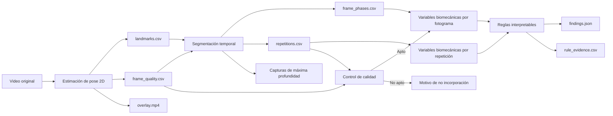

# Uso de los artefactos de salida e integración en una interfaz

## 1. Propósito

Este documento explica para qué sirve cada archivo generado en `data/sentadilla_bilateral/outputs/`, cómo se relaciona con el video overlay y cómo puede presentarse el análisis en una interfaz web o móvil.

Los artefactos no son resultados aislados. En conjunto forman una cadena de evidencia que permite responder cinco preguntas:

1. ¿El sistema pudo estimar la pose de manera suficiente?
2. ¿Cuántas repeticiones detectó y en qué momentos ocurrieron?
3. ¿Qué valores biomecánicos calculó en cada repetición?
4. ¿Qué criterios aplicó para clasificar cada patrón?
5. ¿Qué compensaciones o asimetrías detectó finalmente?

El resultado principal para el usuario será la clasificación de las compensaciones observables. El overlay, las capturas, las gráficas, los CSV y los JSON permitirán explicar y verificar cómo se obtuvo ese resultado.

## 2. Relación general entre los archivos

Todos los archivos de una carpeta de salida pertenecen al mismo caso y se relacionan mediante:

- el identificador del caso;
- el número de fotograma;
- el tiempo en segundos;
- el número de repetición;
- la fase del movimiento.

El overlay muestra visualmente dónde ubicó el sistema los puntos anatómicos. Los CSV conservan los valores detallados utilizados en los cálculos. Los JSON resumen el estado de cada etapa y las decisiones finales. Las imágenes facilitan la revisión humana y la presentación de resultados.

## 3. Inventario y utilidad de los artefactos

### 3.1. Estimación de pose y calidad

| Archivo | Contenido | Utilidad técnica | Representación en interfaz |
|---|---|---|---|
| `overlay.mp4` | Video anonimizado con puntos anatómicos, segmentos corporales y estado del fotograma | Permite verificar visualmente si la pose sigue correctamente el movimiento | Reproductor principal del análisis |
| `landmarks.csv` | Coordenadas X, Y y Z estimada, visibilidad y presencia de cada punto anatómico por fotograma | Fuente primaria para segmentación y cálculos biomecánicos | No se muestra completo por defecto; puede ofrecerse como descarga técnica |
| `frame_quality.csv` | Detección de pose, cantidad de puntos detectados, visibilidad mínima, validez y motivo de invalidez por fotograma | Permite identificar pérdidas temporales de referencias y decidir qué fotogramas pueden analizarse | Línea de calidad sincronizada con el reproductor |
| `pose_summary.json` | Totales y porcentajes de procesamiento, fotogramas con pose, fotogramas válidos y promedio de puntos detectados | Resumen estructurado para la API y las tarjetas de calidad | Tarjeta “Calidad de estimación” |
| `pose_quality.png` | Evolución temporal de la visibilidad mínima y cantidad de puntos detectados | Evidencia visual rápida de estabilidad de pose | Gráfica secundaria o sección técnica |

### 3.2. Segmentación temporal

| Archivo | Contenido | Utilidad técnica | Representación en interfaz |
|---|---|---|---|
| `frame_phases.csv` | Repetición y fase asignada a cada fotograma, junto con la señal de profundidad | Permite sincronizar el video con reposo, descenso, máxima profundidad y ascenso | Línea temporal coloreada debajo del reproductor |
| `repetitions.csv` | Inicio, máxima profundidad, final y duración de cada repetición | Resume los ciclos detectados y permite navegar directamente a cada evento | Selector de repetición y tabla de tiempos |
| `segmentation_summary.json` | Resumen estructurado de las repeticiones detectadas y sus tiempos | Fuente de eventos para una API o reproductor interactivo | Marcadores clicables en la línea temporal |
| `segmentation.png` | Curva suavizada del centro de caderas y máximos de profundidad | Demuestra cómo el sistema separó las repeticiones | Gráfica explicativa de la segmentación |
| `peak_rep_1.png`, `peak_rep_2.png`, `peak_rep_3.png` | Captura del fotograma de máxima profundidad de cada repetición | Facilita la comparación visual en el momento biomecánicamente más relevante | Galería comparativa de repeticiones |

Actualmente se generan capturas de máxima profundidad. A partir de `repetitions.csv` también es posible generar posteriormente capturas del inicio del descenso y del final del ascenso sin modificar el algoritmo de segmentación.

### 3.3. Variables biomecánicas

| Archivo | Contenido | Utilidad técnica | Representación en interfaz |
|---|---|---|---|
| `biomechanical_frame_metrics.csv` | Valores por fotograma de tronco, pelvis, desviación medial de cada rodilla y diferencia bilateral | Permite revisar la evolución completa y detectar en qué fase aumenta cada señal | Gráficas temporales sincronizadas con el video |
| `biomechanical_repetition_metrics.csv` | Valores en máxima profundidad y máximos observados por repetición | Permite comparar consistencia y variabilidad entre las tres repeticiones | Tabla comparativa y barras por repetición |
| `biomechanical_summary.json` | Convenciones, normalización, resúmenes por repetición y rutas de artefactos | Contrato estructurado para consumir resultados desde una API | Fuente de tarjetas y tablas resumidas |
| `biomechanical_metrics.png` | Evolución temporal de las cuatro variables biomecánicas | Evidencia visual conjunta del comportamiento durante el ejercicio | Panel de gráficas avanzadas |

### 3.4. Control de calidad analítica

| Archivo | Contenido | Utilidad técnica | Representación en interfaz |
|---|---|---|---|
| `quality_gate_summary.json` | Estado de aptitud, verificaciones realizadas, valores observados, requisitos, advertencias y motivos de exclusión | Impide calcular compensaciones cuando el registro no cumple los requisitos técnicos implementados | Estado “Apto para análisis” o explicación formal del motivo de no incorporación |

Cuando un video no supera el control de calidad, el pipeline conserva los artefactos generados hasta esa etapa, pero no produce variables biomecánicas ni hallazgos. Esto evita mostrar una clasificación basada en evidencia insuficiente.

Las condiciones de apoyo de los talones y la presencia de soportes externos pertenecen al control manual del protocolo y del Instrumento 1. No forman parte de este control automático.

### 3.5. Criterios interpretables y resultado final

| Archivo | Contenido | Utilidad técnica | Representación en interfaz |
|---|---|---|---|
| `rule_evidence.csv` | Patrón, estado, dirección, métrica, valor agregado, valores por repetición, banda de decisión y fundamento de la regla | Hace trazable la relación entre medición, criterio y resultado | Panel “¿Por qué se obtuvo este resultado?” |
| `findings.json` | Decisiones de los cuatro patrones, hallazgos presentes, resultados no concluyentes, versión del conjunto de reglas y notas | Resultado estructurado principal del análisis | Tarjetas de compensaciones detectadas |

El valor agregado y la distancia respecto al umbral no deben presentarse como una probabilidad ni como un porcentaje de confianza. Los umbrales actuales son provisionales y describen bandas de decisión interpretables, no puntos de corte clínicos.

## 4. Qué aporta el overlay y qué no aporta por sí solo

El overlay es la evidencia visual más comprensible para una demostración, porque permite observar:

- qué puntos anatómicos detectó el sistema;
- si los segmentos siguen el movimiento;
- si el rostro fue anonimizado;
- si un fotograma fue considerado válido;
- si la geometría calculada es visualmente coherente.

Sin embargo, el overlay no demuestra por sí solo:

- cómo se delimitaron las repeticiones;
- qué valor numérico alcanzó cada variable;
- qué umbral se aplicó;
- por qué una salida fue presente, ausente o no concluyente;
- si dos de las tres repeticiones coincidieron;
- si el video superó todos los controles de calidad.

Por ello, su función es complementaria. El overlay permite revisar la detección visual; los CSV permiten reproducir los cálculos; los JSON explican las decisiones; y las gráficas y capturas facilitan su comunicación.

Una explicación breve para el asesor puede formularse así:

> El video overlay permite verificar visualmente que el sistema identificó y siguió los puntos anatómicos utilizados. A partir de esas coordenadas, el sistema segmenta las repeticiones, calcula variables biomecánicas y aplica criterios interpretables. Las gráficas, tablas y archivos estructurados conservan la evidencia numérica que vincula el movimiento observado con la compensación finalmente detectada. De esta manera, el resultado no depende únicamente de una impresión visual ni de una etiqueta opaca, sino de una cadena trazable de procesamiento.

## 5. Propuesta de interfaz por caso

### 5.1. Encabezado del análisis

La primera pantalla debe responder rápidamente qué ocurrió:

- identificador del video;
- estado técnico del análisis;
- cantidad de repeticiones detectadas;
- porcentaje de fotogramas válidos;
- versión del conjunto de reglas;
- advertencia de que los umbrales son provisionales durante el desarrollo.

### 5.2. Resultado principal

La sección principal debe presentar una tarjeta independiente por patrón:

| Patrón | Estados posibles | Información visible |
|---|---|---|
| Inclinación lateral del tronco | Presente izquierda / Presente derecha / Ausente / No concluyente | Estado, dirección, valor y resultado por repetición |
| Desplazamiento lateral de pelvis | Presente izquierda / Presente derecha / Ausente / No concluyente | Estado, dirección, valor y resultado por repetición |
| Valgo dinámico visible | Izquierdo / Derecho / Bilateral / Ausente / No concluyente | Rodilla afectada y valores por lado |
| Asimetría bilateral observable | Presente / Ausente / No concluyente | Magnitud y predominio lateral cuando corresponda |

Un mismo video puede mostrar varias tarjetas positivas. La interfaz no debe obligar a seleccionar una sola compensación.

Ejemplo de salida legible para `dev_valgo_izq_002`:

- valgo dinámico visible izquierdo: presente;
- asimetría bilateral observable: presente;
- desplazamiento lateral de pelvis: no concluyente;
- inclinación lateral del tronco: ausente.

### 5.3. Reproductor sincronizado

El reproductor debe utilizar `overlay.mp4` e incorporar:

- marcadores de inicio, máxima profundidad y final de cada repetición;
- segmentos coloreados para descenso y ascenso;
- botones para saltar a repetición 1, 2 o 3;
- acceso directo al fotograma de máxima profundidad;
- indicación de fotogramas inválidos o con advertencia.

Los tiempos se obtienen de `segmentation_summary.json` o `repetitions.csv`. La línea de calidad se obtiene de `frame_quality.csv`.

### 5.4. Comparación visual de repeticiones

Las tres capturas de máxima profundidad deben mostrarse en paralelo o mediante un carrusel. Cada captura puede incluir debajo:

- tiempo de máxima profundidad;
- porcentaje de fotogramas válidos de la repetición;
- valor de tronco;
- valor de pelvis;
- desviación medial de rodilla izquierda y derecha;
- diferencia bilateral;
- estado de cada patrón en esa repetición.

Esta comparación permite explicar por qué el motor exige concordancia entre repeticiones. También permite evidenciar casos en los que una señal aparece solo una vez y el resultado final permanece no concluyente.

### 5.5. Gráficas recomendadas

#### Vista principal

1. **Barras por repetición y patrón:** compara el valor de las tres repeticiones con las bandas de ausencia, ambigüedad y presencia.
2. **Línea temporal de fases:** muestra reposo, descenso, máxima profundidad y ascenso.
3. **Indicador de calidad:** presenta porcentaje de fotogramas válidos y disponibilidad de puntos anatómicos.

#### Vista avanzada

1. **Serie temporal biomecánica:** utiliza `biomechanical_frame_metrics.csv` y mueve un cursor sincronizado con el video.
2. **Curva de segmentación:** utiliza `frame_phases.csv` y los eventos de `repetitions.csv`.
3. **Comparación izquierda-derecha:** muestra las desviaciones de ambas rodillas en una misma escala.
4. **Evidencia de reglas:** muestra valor por repetición, umbral aplicado y estado resultante.

No conviene mostrar todas las series simultáneamente en la pantalla inicial. La primera vista debe priorizar el resultado y su explicación; el detalle temporal debe quedar disponible en una sección expandible.

### 5.6. Evidencia y exportación

La interfaz puede ofrecer una sección de descarga con:

- overlay;
- capturas de máxima profundidad;
- resumen del análisis en JSON;
- evidencia de reglas en CSV;
- métricas por repetición en CSV;
- reporte final en PDF cuando se implemente.

`landmarks.csv` y los datos por fotograma deben considerarse descargas técnicas avanzadas, porque su volumen y granularidad no son adecuados para un usuario general.

## 6. Adaptación a web y móvil

### 6.1. Interfaz web

La versión web permite una vista de dos columnas:

- izquierda: reproductor y línea temporal;
- derecha: compensaciones detectadas y evidencia de reglas;
- parte inferior: capturas por repetición, gráficas y tabla técnica.

Es la opción más adecuada para demostraciones al asesor, revisión experta y análisis comparativo.

### 6.2. Interfaz móvil

La versión móvil debe usar una secuencia vertical:

1. resultado principal;
2. reproductor;
3. selector de repetición;
4. tarjetas de patrones;
5. capturas comparativas;
6. gráficas simplificadas;
7. detalles técnicos y descargas.

En móvil, las gráficas temporales deben permitir desplazamiento horizontal o mostrar inicialmente solo los valores por repetición.

## 7. Vista de lote para la investigación

Además de la vista individual, una interfaz de investigación puede mostrar un resumen de todos los videos:

- videos procesados, aptos y no incorporados;
- frecuencia de cada patrón detectado;
- cantidad de resultados no concluyentes;
- distribución de fotogramas válidos;
- patrones simultáneos más frecuentes;
- tabla de casos con filtros por estado y compensación;
- comparación posterior entre referencia experta y sistema.

Cuando se disponga de la referencia experta final, esta vista también podrá incluir:

- matriz de confusión por patrón;
- precisión, sensibilidad, especificidad y F1-score;
- concordancia Kappa;
- listado de discrepancias para revisión.

Esta vista corresponde principalmente al análisis de desempeño de la tesis y no debe confundirse con la evaluación individual de una persona.

## 8. Relación con los objetivos específicos

| Evidencia | Objetivo al que contribuye |
|---|---|
| `landmarks.csv`, `frame_quality.csv`, `overlay.mp4` y `pose_quality.png` | Identificación de puntos anatómicos clave y estimación de pose 2D |
| `frame_phases.csv`, `repetitions.csv`, `segmentation.png` y capturas de máxima profundidad | Segmentación habilitadora para calcular variables en fases comparables |
| Métricas por fotograma, métricas por repetición y gráficas biomecánicas | Definición y cálculo de variables biomecánicas observables |
| `rule_evidence.csv` y `findings.json` | Aplicación de criterios biomecánicos interpretables |
| Integración de overlay, segmentación, métricas, reglas y resultados | Implementación del prototipo funcional |
| Comparación experta-sistema y métricas finales | Evaluación del desempeño técnico |

## 9. Relación con las evidencias existentes

Este documento complementa las evidencias ya generadas:

- `evidencia_fase_3_segmentacion_temporal.md` explica el origen de los eventos temporales y de las capturas de máxima profundidad;
- `evaluacion_lote_piloto_fase5.md` documenta la respuesta exploratoria de las variables y la utilidad de los primeros casos controlados;
- `evaluacion_lote_piloto_002_multietiqueta.md` demuestra que un mismo video puede contener varias compensaciones y que cada patrón conserva su propio estado;
- `evidencia_objetivo_4_prototipo_funcional.md` relaciona la integración de todos los artefactos con el prototipo funcional.

Las evaluaciones piloto sustentan el contenido que deberá mostrarse, mientras que este documento define cómo convertirlo en una experiencia comprensible para el asesor, los evaluadores expertos y, posteriormente, un usuario de la aplicación.

## 10. Propuesta de siguiente implementación

Para convertir los artefactos actuales en una demostración coherente, el siguiente incremento debería generar un resumen único por caso.

### 10.1. Contrato agregado recomendado

Crear un archivo `case_report.json` que reúna:

- identificación del caso;
- estado de calidad;
- resumen de pose;
- repeticiones y eventos temporales;
- métricas resumidas por repetición;
- decisiones por patrón;
- rutas relativas del overlay, capturas y gráficas;
- versión del pipeline y del conjunto de reglas.

Este archivo no reemplazaría los CSV ni JSON existentes. Funcionaría como índice para que una API o interfaz local pueda cargar un caso sin reconstruir manualmente todas las relaciones.

### 10.2. Capturas adicionales

Generar por repetición:

- inicio del descenso;
- máxima profundidad;
- final del ascenso.

La información temporal necesaria ya existe en `repetitions.csv`. Esta mejora es principalmente de presentación y trazabilidad visual.

### 10.3. Reporte legible

Generar un reporte por caso que incluya:

1. estado de calidad;
2. compensaciones detectadas;
3. captura de máxima profundidad por repetición;
4. valores biomecánicos resumidos;
5. explicación de las reglas aplicadas;
6. nota sobre el carácter provisional de los umbrales.

La misma estructura podrá reutilizarse posteriormente en una página web, una aplicación móvil o un PDF de evidencia.

## 11. Prioridad recomendada

1. Crear `case_report.json` como contrato único para la interfaz.
2. Generar capturas de inicio, máxima profundidad y final por repetición.
3. Implementar una vista web local de análisis por caso.
4. Sincronizar reproductor, eventos y gráficas.
5. Añadir la vista de lote y la comparación experta-sistema cuando exista la muestra formal.

Esta secuencia aprovecha los artefactos actuales sin cambiar las fórmulas biomecánicas ni los criterios metodológicos aprobados.
